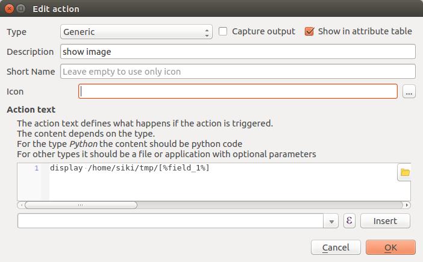
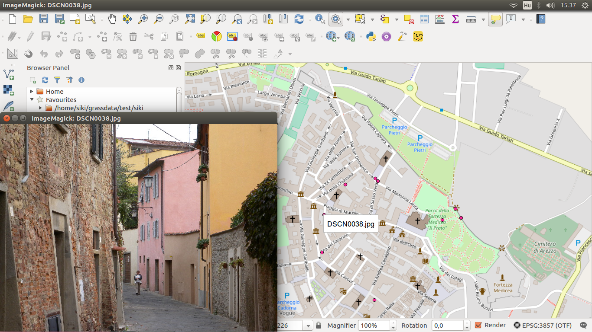

Bulk extract GPS position from images
======================================

Our aim is to extract location information from several photos automaticly.
There are many on-line tools on the Internet to view EXIF data but these can
be used for a single image and the exif data is shown in the browser
(for example see: http://metapicz.com/#landing). We need command line tool to 
write script (in this case a bash script) for bulk processing of several 
images.

About EXIF information
----------------------

JPEG images can contain several metadata which are called EXchangable
Image file Format. Among other information it can contain location if
your device (mobil phone or talet) has GNSS receiver.

Sample EXIF data:

.. code:: 

	ColorSpace=1
	ComponentsConfiguration=1, 2, 3, 0
	Contrast=0
	CustomRendered=0
	DateTime=2008:11:01 21:15:07
	DateTimeDigitized=2008:10:22 16:28:39
	DateTimeOriginal=2008:10:22 16:28:39
	DigitalZoomRatio=0/100
	ExifImageLength=480
	ExifImageWidth=640
	ExifOffset=268
	ExifVersion=48, 50, 50, 48
	ExposureBiasValue=0/10
	ExposureMode=0
	ExposureProgram=2
	ExposureTime=4/300
	FileSource=3
	Flash=16
	FlashPixVersion=48, 49, 48, 48
	FNumber=59/10
	FocalLength=24/1
	FocalLengthIn35mmFilm=112
	GainControl=0
	GPSAltitudeRef=0
	GPSDateStamp=2008:10:23
	GPSImgDirectionRef=
	GPSInfo=926
	GPSLatitude=43/1, 28/1, 281400000/100000000
	GPSLatitudeRef=N
	GPSLongitude=11/1, 53/1, 645599999/100000000
	GPSLongitudeRef=E
	GPSMapDatum=WGS-84   
	GPSSatellites=06
	GPSTimeStamp=14/1, 27/1, 724/100
	...

At the end you can see GPS data.

ImageMagic
----------

ImageMagic (https://www.imagemagick.org/script/index.php) is an open source,
complex image processing tool which has CLI (Command Line Interface). It offers
some executables to handle images. The **identify** command will only be used
from ImageMagic in this tutorial.

Install ImageMagic on your Ubuntu box:

.. code:: bask

	sudo apt-get install imagemagic

The **indentify** command extracts meta information from image. The simplest 
usage:

.. code:: bash

	indentify DSCN0010.jpg 
	DSCN0010.jpg JPEG 640x480 640x480+0+0 8-bit sRGB 162KB 0.000u 0:00.010

To extract EXIF information more parameters have to be specified:

.. code:: bash

	identify -format '%[EXIF:\*]' DSCN0010.jpg
	exif:ColorSpace=1
	exif:ComponentsConfiguration=1, 2, 3, 0
	exif:Contrast=0
	exif:CustomRendered=0
	exif:DateTime=2008:11:01 21:15:07
	exif:DateTimeDigitized=2008:10:22 16:28:39
	exif:DateTimeOriginal=2008:10:22 16:28:39
	exif:DigitalZoomRatio=0/100
	exif:ExifImageLength=480
	...

The '*' in the command means to extract all EXIF information.
If only some EXIF data is interesting, more specific pattern can be
specified:

.. code:: bash

	identify -format '%[EXIF:GPS*]' DSCN0010.jpg 
	exif:GPSAltitudeRef=0
	exif:GPSDateStamp=2008:10:23
	exif:GPSImgDirectionRef=
	exif:GPSInfo=926
	exif:GPSLatitude=43/1, 28/1, 281400000/100000000
	exif:GPSLatitudeRef=N
	exif:GPSLongitude=11/1, 53/1, 645599999/100000000
	exif:GPSLongitudeRef=E
	exif:GPSMapDatum=WGS-84   
	exif:GPSSatellites=06
	exif:GPSTimeStamp=14/1, 27/1, 724/100

The longitude and latitude are given by degree, second and minute as
integer values and a divider. So in the previous example the latitude is
43d28\'2.814\".

Writing scripts
---------------

In our solution ImageMagic **identify** will be used, a bash and a gawk script
will be created.
In the output we would like to get a record for each JPEG image with filename,
latitute and longitude in degrees, date and time.

The shell (bash) script (exif.sh in the code folder):

.. code:: bash

	#!/bin/bash
	for i in $*
	do
		identify -format '%[EXIF:GPS*]' $i | gawk -v fn="$i" -f exif.awk
	done

The first line is the shebang, it will send the script to bash to evaluate.
The second line is the start of a loop which will be executed for each command
line parameters. In the loop body the ASCII EXIF information is extracted by
**identify** for the JPEG file. It is piped to a gawk script.
In the gawk command line a variable is set with the actual image file name
(-v switch). It is necessary to be able to write filename with the coordinates
to the output. gawk has no inforation about the image file, it gets data
from the pipe.

The gawk script (exif.awk in code folder):

.. code:: gawk

	BEGIN { FS = "[=,/]"; }
	/^exif:GPSDateStamp=/ { idate = $2; }
	/^exif:GPSTimeStamp=/ { ihour = $2 / $3; imin = $4 / $5; isec = $6 / $7; }
	/^exif:GPSLatitudeRef=/ { if ($2 == "N") { plat = ""; } else { plat = "-" } }
	/^exif:GPSLongitudeRef=/ { if ($2 == "E") { plon = ""; } else { plon = "-" } }
	/^exif:GPSLatitude=/ { lat = $2 / $3 + $4 / $5 / 60 + $6 / $7 / 3600; }
	/^exif:GPSLongitude=/ { lon = $2 / $3 + $4 / $5 / 60 + $6 / $7 / 3600; }
	END { printf "%s;%s%.6f;%s%.6f;%s %d:%d:%.1f\n",
			fn, plon, lon, plat, lat, idate, ihour, imin, isec; }

Latitute and longitude is change to degrees and a negative sign is set for
longitudes to west and latitutes to south. The collected data printed to the 
standard output.

Sample use of the scripts:

.. code:: bash

	./exif.sh DSC*.jpg
	DSCN0010.jpg;11.885127;43.467448;2008:10:23 14:27:7.2
	DSCN0012.jpg;11.885395;43.467157;2008:10:23 14:28:17.2
	DSCN0021.jpg;11.884538;43.467082;2008:10:23 14:36:47.2
	DSCN0025.jpg;11.881635;43.468365;2008:10:23 14:41:49.0
	DSCN0027.jpg;11.881515;43.468442;2008:10:23 14:42:29.0
	DSCN0029.jpg;11.880172;43.468243;2008:10:23 14:45:20.9
	DSCN0038.jpg;11.879213;43.467255;2008:10:23 14:50:40.9
	DSCN0040.jpg;11.879112;43.466012;2008:10:23 14:54:0.2
	DSCN0042.jpg;11.881478;43.464455;2008:10:23 14:57:41.4

Let's send the output to a CSV file and load it to QGIS.

.. code:: bash

	./exif.sh DSC*.jpg > image_pnt.csv

After loading the CSV file into QGIS, let's create an action to open the image
file.

Let's see the action in QGIS.

.. note::

	*Development tipps*:
	Create a pure bash solution to generate the CSV file.
