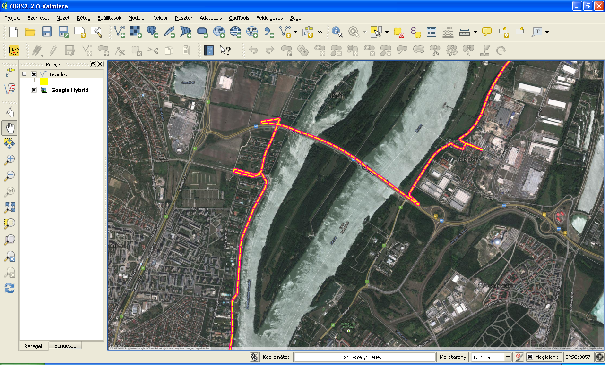

Converting GPX to KML
=====================

*Keywords* : command line vs interactive application

*Data files* : god.gpx

*Program files* : None

Solutions
---------

#.  Open the URL in your favourite browser
    `http://gpx2kml.com/ <http://gpx2kml.com/>`_
    and convert the god.gpx file to KML.

#.  Let's use QGIS open the GPX file and save as KML.

|QGISGPX_png|

#.  Let's use ogr2ogr from gdal utilities package from the command line

.. code:: bash

    ogr2ogr -f KML god.kml god.gpx

Let's compare the three solutions if we have 500 GPX files to convert.
In case of the first two solutions you have to repeat several clicks 500 times.
The third solution can be automatized, let's imagine the GPX files are in the
same directory. You can write a single line command to convert all files in 
one step.

*Windows*

.. code:: bat

    for %%A IN (*.gpx) do ogr2ogr -f KML "%%A".kml "%%A"

*Linux*

.. code:: bash

    for i in *.gpx; do ogr2ogr -f KML ${i}.kml ${i}; done

