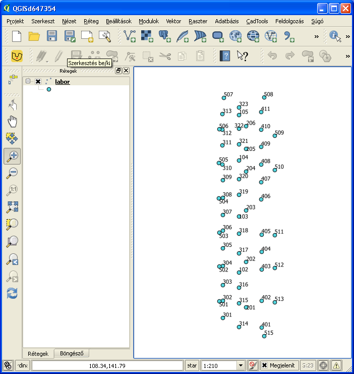
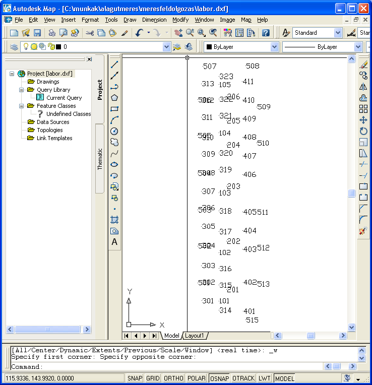

Load coordinates from Leica GSI into AutoCAD or QGIS (fix field widths)
=======================================================================

*keywords*
: text file processing, regular expression, pipe, data formats

*Data file*
: labor.gsi

*Program files*
: gsi2coo.awk, gsi2coo_2.awk, coo2dxf, coo2scr.awk, gsi2coo.m, val.m

Sample data (labor.gsi):

.. code::

    *110001+0000000000000101 81..10+0000000000119197 82..10+0000000000118827 83..10+0000000000120014
    *110002+0000000000000102 81..10+0000000000119192 82..10+0000000000123834 83..10+0000000000120019
    *110003+0000000000000103 81..10+0000000000119191 82..10+0000000000130036 83..10+0000000000120000
    *110004+0000000000000104 81..10+0000000000119196 82..10+0000000000136218 83..10+0000000000119988
    *110005+0000000000000105 81..10+0000000000119199 82..10+0000000000141225 83..10+0000000000119989
    *110006+0000000000000201 81..10+0000000000120000 82..10+0000000000120000 83..10+0000000000120017
    *110007+0000000000000202 81..10+0000000000119997 82..10+0000000000125004 83..10+0000000000120021
    *110008+0000000000000203 81..10+0000000000119998 82..10+0000000000130696 83..10+0000000000120002*
    ...

First step
----------

Filter lines with *grep* for codes 81/82/83 (e.g. east, north and elevation).

.. code:: bash

    grep " 8[123].\{4\}\+" labor.gsi > labor1.gsi

What is *" 8[123].\{4\}\+"*? It is a regular expression (regexp), it defines
a search pattern *81* or *82* or *83*, any four character and a *+*. 
Blackslashes are used to escape special meaning of *{*, *}* and *+* characters.
The *>* will redirect the standard output to the file *labor1.gsi*.

Second step (A variant)
-----------------------

Write coordinates into simple text file using gawk (gsi2coo.awk).

.. code:: gawk

    BEGIN { FS="[ ]"; # field sparator is space
        # for units and decimals
        u[0] = 1000;
        u[1] = 1000 * 3.28;
        u[6] = 10000;
        u[7] = 10000 * 3.28;
        u[8] = 100000;
    }

    /^\*/ { # 16 bytes records
        # point id
        psz = substr($1, 9);
        sub(/^0+/, "", psz) # removing leading zeros
        for (i = 2; i < NF; i++) {  # for each fields
            if (match($i, /^8[123]/)) { # coordinate field
                j = substr($i, 2, 1);  # coordinate code
                s = substr($i, 7, 1) == "+" ? 1 : -1;  # sign
                d = u[substr($i, 6, 1)];  # number of decimals
                w = substr($i, 8, 23);  # coordinate value
                sub(/^0+/, "", w);  # remove leading zeros
                c[j] = w / d * s;
            }
        }
        # print coordinates to standard output
        printf "%s %.3f %.3f %.3f\n", psz, c[1], c[2], c[3]
    }

Second step (B variant)
-----------------------

Write coordinates into simple text file using octave (gsi2coo.m)

.. code:: octave

    % Leica GSI coordinate loader
    % input file
    f = fopen("labor.gsi", "r");
    % output file
    fo = fopen("labor.csv", "w");
    while ((line = fgetl(f)) != -1)  % read input line by line
        x = y = elev = 0;  % default coordinates
        line = strtrim(line);  % remove leading/trailing spaces
        if (line(1) == "*")  % remove * from line start
            line = substr(line, 2);
        endif
        fields = strsplit(line, " ");
        [ncol, nrow] = size(fields);  % number of columns and rows in cell array
        for i = 1:nrow
            field = fields{i};  % element from cell array
            switch (substr(field, 1, 2))
            case "11"  % point number, leading zeros removed
                pid = regexprep(substr(field, 8), "^0+", "");
                if (length(pid) == 0)
                pid = "0";
                endif
            case "81"  % easting
                x = val(field);
            case "82"  % northing
                y = val(field);
            case "83"  % elevation
                elev = val(field);
            endswitch
        endfor
        % write coordinates to stadard output
        fprintf(fo, "%s,%.3f,%.3f,%.3f\n", pid, x, y, elev);
    endwhile
    fclose(f);
    fclose(fo);

Octave function to convert GSI coordinates to real value (val.m)

.. code::

    function w = val(f)
        dd = [1000, 1000 * 3.28, 0, 0, 0, 0, 10000, 10000 * 3.28, 100000];
        d = dd(str2num(substr(f, 6, 1))+1);
        w = str2num(substr(f, 7)) / d;
    endfunction

Third step (A variant)
----------------------

Direct read of text (CSV file) into QGIS. *Layer/Add delimited text* from the 
menu and *Save as...* from the layer's popup menu.

|leica_gsi_1_png|

Third step (B variant)
----------------------

Generating AutoCAD script (coo2scr.awk)

.. code:: gawk

    BEGIN { FS="[ ]";  # field separator is space
    }
    { # for each line of input file
        # point id text
        printf "TEXT %.3f,%.3f\n", $2+0.1, $3-0.25;  # position of text
        printf "0.25 0\n";  # size and angle of text
        printf "%s\n", $1;  # Cannotation text
        printf "POINT %.3f,%.3f,%.3f\n", $2, $3, $4;  # point symbol
    }

Third step (C variant)
----------------------

Creating AutoCAD DXF file (coo2dxf.awk).

.. code:: gawk

    BEGIN { FS="[ ]";
        # minimal DXF header
        print "  0";
        print "SECTION";
        print "  2";
        print "ENTITIES"
    }
    { # for each input line
        print "  0\nTEXT\n  8\nPTEXT\n 10"; # point id text & layer
        print $2 + 0.1;   # text position
        print " 20";
        print $3 - 0.25;
        print " 30\n0.00\n 40\n0.5\n  1";
        print $1
        print " 50\n0.00"
        print "  0\nPOINT\n  8\nPOINT";  # point entity & layer
        print " 10";  # position
        print $2;
        print " 20";
        print $3;
        print " 30";
        print $4
    }
    END {
        # footer for DXF
        print "  0\nENDSEC\n  0\nEOF"
    }

Using pipes to connect commands to do evething in one step.

.. code:: bash

    grep " 8[123].\{4\}\+" labor.gsi | gawk -f gsi3coo_2.awk labor.gsi | gawk -f coo2dxf.awk > labor.dxf

|leica_gsi_2_png|

.. note::

    *Development tipps*:  
    Load coordinates from Trimble M5, SurvCE RW5 formats 

