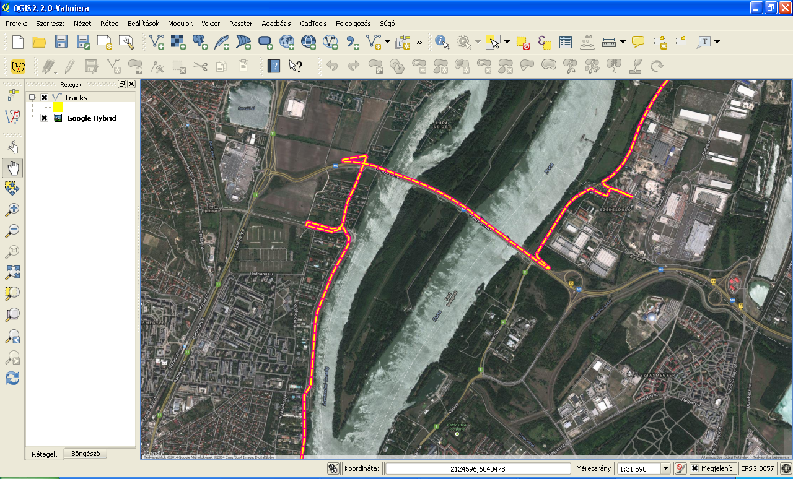

Converting GPX to KML
=====================

*Keywords* : command line vs interactive application

*Data files* : god.gpx

*Program files* : gpx2klm0.py, gpx2kml.py

Solutions
---------

1.  Open the URL in your favourite browser
    `http://gpx2kml.com/ <http://gpx2kml.com/>`_
    and convert the god.gpx file to KML.

2.  Let's use QGIS open the GPX file and save as KML.

|QGISGPX_png|

3.  Let's use ogr2ogr from gdal utilities package from the command line. On Windows from the OSGeo4W Shell you can use ogr2ogr.

.. code:: bash

    ogr2ogr -f KML god.kml god.gpx

4. Let's write a Python program using gdal/ogr Python bindings.
First version step-by-step (gpx2kml0.py).

.. code:: Python

	import sys
	from os import path
	from osgeo import ogr

	inDriver = ogr.GetDriverByName('GPX')   # get driver for gpx files
	if inDriver is None:
		print('GPX drive not found')
		sys.exit()
	outDriver = ogr.GetDriverByName('KML')  # get driver for kml files
	if outDriver is None:
		print('KML drive not found')
		sys.exit()
	for inName in sys.argv[1:]:             # go through input files
		src = inDriver.Open(inName, 0)      # open for read
		outName = path.splitext(inName)[0] + '.kml'
		if path.exists(outName):            # ogr can't overwrite output
			outDriver.DeleteDataSource(outName) # delete !!!! danger
		dst = outDriver.CreateDataSource(outName)   # new output data source
		for i in range(src.GetLayerCount()):    # go through layers of input
			inLayer = src.GetLayerByIndex(i)
			if inLayer.GetFeatureCount():   # copy only non-empty layers
				outLayer = dst.CreateLayer(inLayer.GetName(),
					geom_type=inLayer.GetGeomType())
				for feat in inLayer:        # go through features of input layer
					outLayer.CreateFeature(feat)    # add feature to output layer
		dst = None  # save and close dataset
		scr = None

Second compact version (gpx2kml.py)

.. code:: Python

	import sys
	from os import path
	from osgeo import ogr
	"""
		convert gpx files into kml
		usage: python gpx2kml input.gpx input1.gpx ...
			python gpx2kml *.gpx
	"""
	inDriver = ogr.GetDriverByName('GPX')       # get ogr driver for gpx files
	if inDriver is None:
		print('GPX drive not found')
		sys.exit()
	outDriver = ogr.GetDriverByName('KML')      # get ogr drive for kml files
	if outDriver is None:
		print('KML drive not found')
		sys.exit()
	for inName in sys.argv[1:]:                 # go through input files
		src = inDriver.Open(inName, 0)          # open for read
		outName = path.splitext(inName)[0] + '.kml'
		if path.exists(outName):                # ogr can't overwrite output
			outDriver.DeleteDataSource(outName) # delete !!!! danger
		dst = outDriver.CopyDataSource(src, outName)    # copy to destination

Let's compare the four solutions if we have 500 GPX files to convert.
In case of the first two solutions you have to repeat several clicks 500 times.
The third solution can be automatized, let's imagine the GPX files are in the
same directory. You can write a single line command to convert all files in 
one step.

*Windows*

.. code:: bat

    for %%A IN (*.gpx) do ogr2ogr -f KML "%%A".kml "%%A"

*Linux*

.. code:: bash

    for i in *.gpx; do ogr2ogr -f KML ${i}.kml ${i}; done

*Python*

The Python code was written to handle several input files

.. code:: bash

	python gpx2kml.py *.gpx

