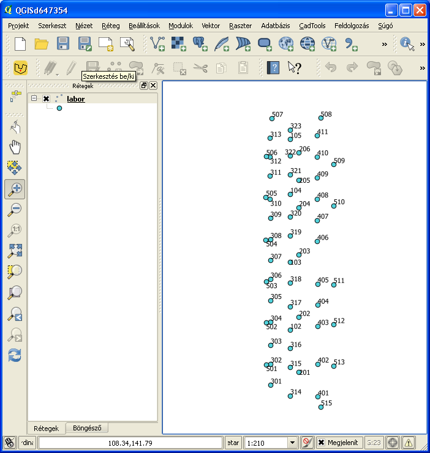
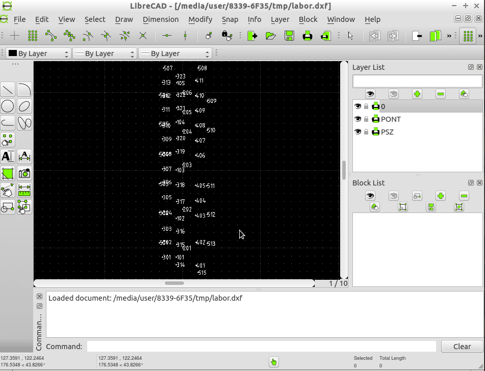

Load coordinates from Leica GSI into AutoCAD or QGIS (fixed field widths)
=========================================================================

*keywords*
: text file processing, regular expression, pipe, data formats

*Data file*
: labor.gsi

*Program files*
: gsi2coo.awk, coo2dxf, coo2scr.awk, gsi2coo.m, val.m, gsi2coo.py coo2scr.py, coo2dxf.py

QGIS is not capable to load directly data from GSI format collected by Leica 
totalstations. Alternative solutions are given in this recipe.

Sample data (labor.gsi):

.. code:: txt

    *110001+0000000000000101 81..10+0000000000119197 82..10+0000000000118827 83..10+0000000000120014
    *110002+0000000000000102 81..10+0000000000119192 82..10+0000000000123834 83..10+0000000000120019
    *110003+0000000000000103 81..10+0000000000119191 82..10+0000000000130036 83..10+0000000000120000
    *110004+0000000000000104 81..10+0000000000119196 82..10+0000000000136218 83..10+0000000000119988
    *110005+0000000000000105 81..10+0000000000119199 82..10+0000000000141225 83..10+0000000000119989
    *110006+0000000000000201 81..10+0000000000120000 82..10+0000000000120000 83..10+0000000000120017
    *110007+0000000000000202 81..10+0000000000119997 82..10+0000000000125004 83..10+0000000000120021
    *110008+0000000000000203 81..10+0000000000119998 82..10+0000000000130696 83..10+0000000000120002
    ...

First step
----------

Filter lines with *grep* for codes 81/82/83 (e.g. east, north and elevation).

.. code:: bash

    grep " 8[123].\{4\}\+" labor.gsi > labor1.gsi

What is *" 8[123].\{4\}\+"*? It is a regular expression (regexp), it defines
a search pattern *81* or *82* or *83*, any four character and a *+*. 
Blackslashes are used to escape special meaning of *{*, *}* and *+* characters.
The *>* will redirect the standard output to the file *labor1.gsi*.

Second step (A variant)
-----------------------

Write coordinates into simple text file using gawk (gsi2coo.awk).

.. code:: gawk

    BEGIN { FS="[ ]"; # field separator is space
        # for units and decimals
        u[0] = 1000;
        u[1] = 1000 * 3.28;
        u[6] = 10000;
        u[7] = 10000 * 3.28;
        u[8] = 100000;
    }

    /^\*/ { # 16 bytes records
        # point id
        psz = substr($1, 9);
        sub(/^0+/, "", psz) # removing leading zeros
        for (i = 2; i < NF; i++) {  # for each fields
            if (match($i, /^8[123]/)) { # coordinate field
                j = substr($i, 2, 1);  # coordinate code
                s = substr($i, 7, 1) == "+" ? 1 : -1;  # sign
                d = u[substr($i, 6, 1)];  # number of decimals
                w = substr($i, 8, 23);  # coordinate value
                sub(/^0+/, "", w);  # remove leading zeros
                c[j] = w / d * s;
            }
        }
        # print coordinates to standard output
        printf "%s %.3f %.3f %.3f\n", psz, c[1], c[2], c[3]
    }

Second step (B variant)
-----------------------

Write coordinates into simple text file using octave (gsi2coo.m)

.. code:: octave

    % Leica GSI coordinate loader
    % input file
    f = fopen('labor.gsi', 'r');
    % output file
    fo = fopen('labor.csv', 'w');
    while ((line = fgetl(f)) ~= -1)  % read input line by line
        x = y = elev = 0;  % default coordinates
        line = strtrim(line);  % remove leading/trailing spaces
        if (line(1) == '*')  % remove * from line start
            line = substr(line, 2);
        end
        fields = strsplit(line, ' ');
        [ncol, nrow] = size(fields);  % number of columns and rows in cell array
        for i = 1:nrow
            field = fields{i};  % element from cell array
            switch (substr(field, 1, 2))
            case '11'  % point number, leading zeros removed
                pid = regexprep(substr(field, 8), '^0+', '');
                if (length(pid) == 0)
                pid = '0';
                endif
            case '81'  % easting
                x = val(field);
            case '82'  % northing
                y = val(field);
            case '83'  % elevation
                elev = val(field);
            end
        end
        % write coordinates to stadard output
        fprintf(fo, '%s,%.3f,%.3f,%.3f\n', pid, x, y, elev);
    end
    fclose(f);
    fclose(fo);

Octave function to convert GSI coordinates to real value (val.m)

.. code:: octave

    function w = val(f)
        dd = [1000, 1000 * 3.28, 0, 0, 0, 0, 10000, 10000 * 3.28, 100000];
        d = dd(str2num(substr(f, 6, 1))+1);
        w = str2num(substr(f, 7)) / d;
    end

Second step (C variant)
-----------------------

Write coordinates to standar output using Python

Third step (A variant)
----------------------

Direct read of text (CSV file) into QGIS. *Layer/Add delimited text* from the 
menu and *Save as...* from the layer's popup menu.

|leica_gsi_1_png|

AutoCAD has no direct function to load CSV files. There is a VBA extension 
`here <http://www.geod.bme.hu/szakm/oop/vba/vba1.htm>`_ or use AutoCAD Civil 
to load coordinate list.

Third step (B variant)
----------------------

Generating AutoCAD script (coo2scr.awk)

.. code:: gawk

    BEGIN { FS="[ ]";  # field separator is space
    }
    { # for each line of input file
        # point id text
        printf "TEXT %.3f,%.3f\n", $2+0.1, $3-0.25;  # position of text
        printf "0.25 0\n";  # size and angle of text
        printf "%s\n", $1;  # Cannotation text
        printf "POINT %.3f,%.3f,%.3f\n", $2, $3, $4;  # point symbol
    }

Third step (C variant)
----------------------

Creating AutoCAD DXF file (coo2dxf.awk).

.. code:: gawk

    BEGIN { FS="[ ]";
        # minimal DXF header
        print "  0";
        print "SECTION";
        print "  2";
        print "ENTITIES"
    }
    { # for each input line
        print "  0\nTEXT\n  8\nPTEXT\n 10"; # point id text & layer
        print $2 + 0.1;   # text position
        print " 20";
        print $3 - 0.25;
        print " 30\n0.00\n 40\n0.5\n  1";
        print $1
        print " 50\n0.00"
        print "  0\nPOINT\n  8\nPOINT";  # point entity & layer
        print " 10";  # position
        print $2;
        print " 20";
        print $3;
        print " 30";
        print $4
    }
    END {
        # footer for DXF
        print "  0\nENDSEC\n  0\nEOF"
    }

Using pipes to connect commands to do evething in one step.

.. code:: bash

    grep " 8[123].\{4\}\+" labor.gsi | gawk -f gsi2coo.awk | gawk -f coo2dxf.awk > labor.dxf

Third step (D variant)
----------------------

Creating AutoCAD script using Python (coo2scr.py)

.. code:: python

    #!/usr/bin/env python
    # -*- coding: utf-8 -*-
    """
        Read coordinates from file or standard input and write AutoCAD
        script to standard output
    """

    from sys import (argv, stdin)

    fp = stdin                      # use standard input or
    if len(argv) > 1:
        fp = open(argv[1], 'r')     # file name from command line
    for line in fp:
        fields = line.split()
        print("TEXT {:.3f},{:.3f}".format(float(fields[1]) + 0.1,
                                         float(fields[2]) -0.25))
        print("0.25 0")         # text size and angle
        print(fields[0])        # text annotation
        print("POINT {},{},{}".format(fields[1], fields[2], fields[3]))

Third step (E variant)
----------------------

Creating AutoCAD DXF using Python (coo2dxf.py)

.. code:: python

    #!/usr/bin/env python
    # -*- coding: utf-8 -*-
    """
        Read coordinates from file or standard input and write AutoCAD
        DXF to standard output
    """

    from sys import (argv, stdin)

    fp = stdin                      # use standard input or
    if len(argv) > 1:
        fp = open(argv[1], 'r')     # file name from command line
    # print mini DXF header
    print("  0\nSECTION\n  2\nENTITIES")
    for line in fp:
        fields = line.split()
        print("  0\nTEXT\n  8\nPTEXT\n 10\n{:.3f}\n 20\n{:.3f}\n 30\n0.0\n 40\n0.5".format(
            float(fields[1]) + 0.1, float(fields[2]) -0.25))
        print("  1\n{}\n 50\n0.0".format(fields[0]))
        print("  0\nPOINT\n  8\nPOINT\n 10\n{}\n 20\n{}\n 30\n{}".format(
            fields[1], fields[2], fields[3]))
    # prinf dxf footer
    print("  0\nENDSEC\n  0\nEOF")

Using pipes to connect commands to do evething in one step.

.. code:: bash

    python3 gsi2coo.py labor.gsi | python3 coo2dxf.py > labor.dxf

|leica_gsi_2_png|

One step solution using QGIS modul or GeoEasy
---------------------------------------------

The SurveyingCalculation plugin of QGIS is able to load coordinates and 
observations from Leica GSI files. The SurveyingCalculation is not a 
standard QGIS plugin first you have to install it using the *Plugins/Manage and 
Install Plugins...* from the menu. Installing and activating 
SurveyingCalculation a new menu and tollbar is displayed.
Select *Surveying Calculation/New coordinate list...* from the menu to create
a new layer for points. Then load the fieldbook using the menu or toolbar
(Import fieldbook). This plugin is available only for QGIS 2.

GeoEasy is an open source software for surveying calculations. It is capable to 
read several different data formats of total stations, among others it can read
Leica GSI files and export coordinates to CSV.

.. note::

    *Development tipps*:  
    Load coordinates from Trimble M5, SurvCE RW5 formats 

