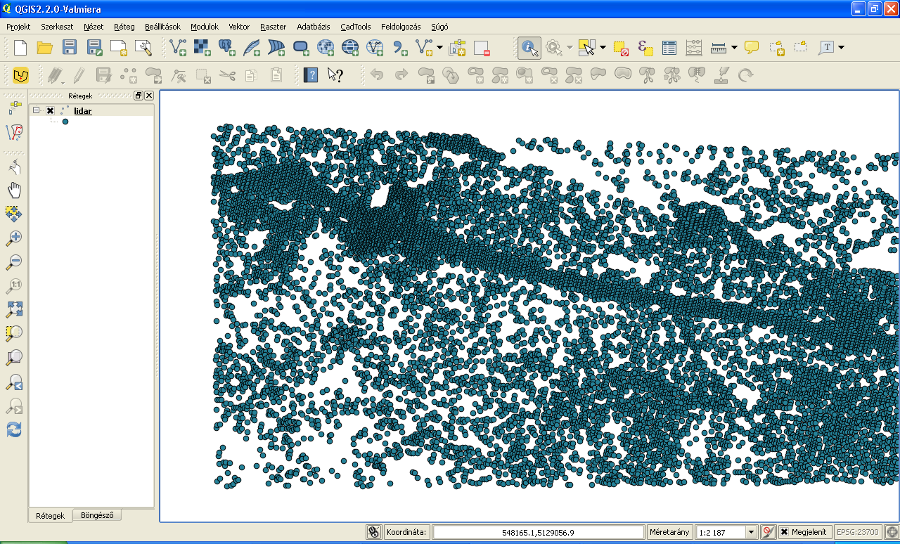
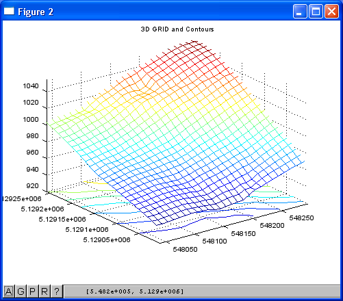
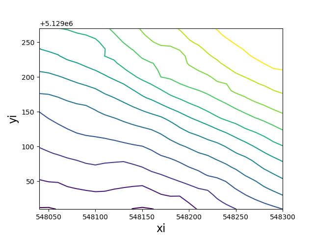
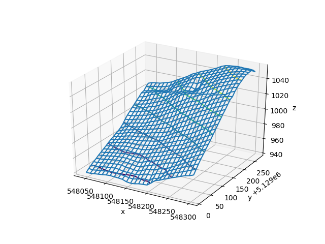

Processing LiDAR data
=====================

*Keywords:* GRID interpolation, surface visualization, contour line, volume calculation, vectorization

*Data file*: lidar.txt

*Program file*: lidarp.m, lidarp.py

Let's calculate the volume above 1000 m from a ASCII point cloud file.

*Sample data* (x, y, z)

.. code:: text

    548025.89,5129282.50,1008.79
    548026.41,5129284.81,1009.49
    548026.81,5129270.56,1005.94
    548027.89,5129275.27,1007.15
    548029.48,5129282.28,1009.18
    548031.57,5129291.52,1011.97
    548032.78,5129290.76,1012.10

Octave solution (lidarp.m)
--------------------------

.. code:: octave

    % LiDAR data processing
    % load input data
    load lidar.txt;
    % data stored in array 'lidar' same as lidar = dlmread('lidar.txt', ',');
    % set window for processing
    xmin = 548040;
    ymin = 5129010;
    xmax = 548300;
    ymax = 5129270;
    dx = 10;    % GRID step
    dy = 10;
    % generate x & y grid
	[x, y] = meshgrid(xmin:dx:xmax, ymin:dy:ymax);
    % grid interpolation for z
    z = griddata(lidar(:,1), lidar(:,2), lidar(:,3), x, y, 'linear');
    figure();    % 3D surface plot
    mesh(x, y, z);    % display mesh in 3D
    title('3D GRID');
    figure();
    meshc(x, y, z);   % display contours
    title('3D GRID and Contours');
    % contour lines
    figure(); contour(x, y, z);
    title('Contours');
    % volume calculation above 1000 m
    vol = 0;
    [r, c] = size(z);
    for ir = 1:r
        for ic = 1:c
            p = z(ir, ic);
            if (p > 1000)
                vol += dx * dy * (p - 1000);
            end
        end
    end
    printf('Volume above 1000m: %.0f m3\n', vol);
    % vectorized solution for volume calculation (much faster)
    vol1 = sum(z(z > 1000) - 1000) * dx * dy;
    printf('Volume above 1000m: %.0f m3 (vectorized)\n', vol1);

.. note:: *Development tipp*
   
	load chunks from the ASCII point cloud file to process huge files, search for extreme values

|lidar1_png|

|lidar2_png|

Python solution (lidarp.py)
---------------------------

The following program uses scipy for interpolation and matplotlib for 
drawings.

.. code:: Python

	import matplotlib.pyplot as plt
	import numpy as np
	from scipy.interpolate import griddata
	from mpl_toolkits.mplot3d import Axes3D

	step = 10   # grid step
	# read scattered points
	a = np.loadtxt('lidar.txt', delimiter=',')
	x = a[:,0]
	y = a[:,1]
	z = a[:,2]
	# bounding box
	xmin = 548040.0
	ymin = 5129010.0
	zmin = round(z.min() + 5.0, -1)
	xmax = 548300.0
	ymax = 5129270.0
	zmax = round(z.max() - 5.0, -1)
	# grid interpolation
	xi = np.arange(xmin, xmax+step, step)
	yi = np.arange(ymin, ymax+step, step)
	xi, yi = np.meshgrid(xi, yi)
	zi = griddata((x, y), z, (xi, yi), method='linear')
	# 2D plot
	fig = plt.figure()
	plt.contour(xi,yi,zi,np.arange(zmin,zmax+step, step))
	#plt.plot(x,y,'k.')
	plt.xlabel('xi',fontsize=16)
	plt.ylabel('yi',fontsize=16)
	plt.savefig('lidar_contour.png',dpi=100)
	plt.close(fig)
	# 3D plot
	fig = plt.figure()
	ax = plt.axes(projection='3d')
	ax.plot_wireframe(xi, yi, zi)
	ax.contour3D(xi, yi, zi, 10)
	ax.set_xlabel('x')
	ax.set_ylabel('y')
	ax.set_zlabel('z')
	plt.savefig('lidar_3dcontour.png',dpi=100)
	plt.close(fig)
	# volume calculation
	vol = sum(zi[zi > 1000] - 1000.0) * step**2
	print('Volume above 1000m: {:.0f} m3'.format(vol))

|lidar1py_png|

|lidar2py_png|

.. note:: 

	Why did we get different result from Octave and Python?

.. note:: *Development tipp*

	Try to use gdal library for grid interpolation.
