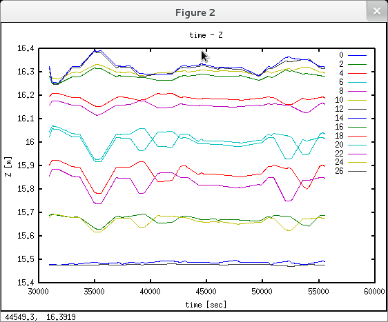

Monitoring data processing
==========================

*Keywords*: text files, line chart

*Data file*: monitoring.csv

*Program file*: monitoring.m

*Sample data* (ID, Y, X, Z, date an time)

.. code:: text

    0;-19.938633245905912;528.909579093519028;15.480858552769629;2013-06-04 08:35:13
    2;-19.724805028581365;506.049982804530771;15.687122963231367;2013-06-04 08:35:13
    4;-19.473233455378782;478.223684337482382;15.903471248537434;2013-06-04 08:35:13
    6;-19.247972131010982;455.43820765401199;16.04372444252337;2013-06-04 08:35:13
    8;-18.983128751529627;427.460528087911996;16.158813793559911;2013-06-04 08:35:13
    10;-18.714142232763237;396.857189584510706;16.302059666602279;2013-06-04 08:35:13
    12;-18.449956787820135;369.796735208971938;16.319886066161285;2013-06-04 08:35:13
    14;-18.238509879801839;346.080012598614701;16.324073938394037;2013-06-04 08:35:13
    16;-17.987596387959975;319.481142908813183;16.282975613729533;2013-06-04 08:35:13
    18;-17.724567097868331;288.912863484923889;16.194213945368045;2013-06-04 08:35:13
    20;-17.463650629252967;261.051093392044436;16.02492483286543;2013-06-04 08:35:13
    22;-17.254914717746431;238.441566362461543;15.855662662980325;2013-06-04 08:35:13
    24;-17.005498359269176;211.644064475818482;15.67934602314137;2013-06-04 08:35:13
    26;-16.748430584153468;186.718700654785721;15.476764284970359;2013-06-04 08:35:13
    200;11.432899793941964;-41.61010852086541;-0.07423599824218;2013-06-04 08:35:13
    0;-19.783575414349251;528.917206055803831;15.478569158101745;2013-06-04 08:40:08
    2;-19.583558260865537;506.063569844691585;15.694933532008932;2013-06-04 08:40:08
    4;-19.333945026514478;478.235611597386139;15.923626830602119;2013-06-04 08:40:08
    6;-19.115290308679356;455.44931499712402;16.070135581243452;2013-06-04 08:40:08

*Octave program* (monitoring.m):

.. code:: octave

    #!/usr/bin/octave
    args = argv();    % command line arguments
    % load all coordinates
    if (length(args))
        fp = fopen(args{1}, 'r');
    else
        fp = fopen('monitoring.csv', 'r');
    end
    % read data in goups of ten values, nn total number of items read
    [points, nn]=fscanf(fp, '%d;%f;%f;%f;%d-%d-%d %d:%d:%d', [10, Inf]);
    fclose(fp);
    points = points';    % transpose
    n=numel(points(:,1));  % number of rows
    % different point numbers
    pnums=sortrows(unique(points(:,1)));
    % number of points
    npnums=numel(pnums);
    % change time to seconds
    points(:,5)=points(:,8)*3600+points(:,9)*60+points(:,10);
    % graph for time - Z
    % point series
    point_serie=sortrows(points,1);
    % set up intervalts by point numbers
    i1 = zeros(npnums);
    i2 = zeros(npnums);
    actp = pnums(1);
    j = 1;
    i1(j) = 1;
    for i = 2:n
        if (actp ~= point_serie(i,1))
            % point number changed
            i2(j) = i - 1;
            j++;
            i1(j) = i;
            actp = point_serie(i,1);
        end
    end
    i2(npnums) = n;
    for i = 1:14 %npnums-1
        plot(point_serie(i1(i):i2(i),5),point_serie(i1(i):i2(i),4));
        hold all
    end
    title('time - Z');
    xlabel('time [sec]');
    ylabel('Z [m]');
    % save figure to file
    saveas(1, 'img1.png');
    % cleate legend labels, point numbers as string
    legend(strsplit(strtrim(sprintf('%d ', pnums(1:14))), ' '));

|chart_png|

.. note:: *Development tipps*:

    Display all points measured at the same time in X-Z section .

