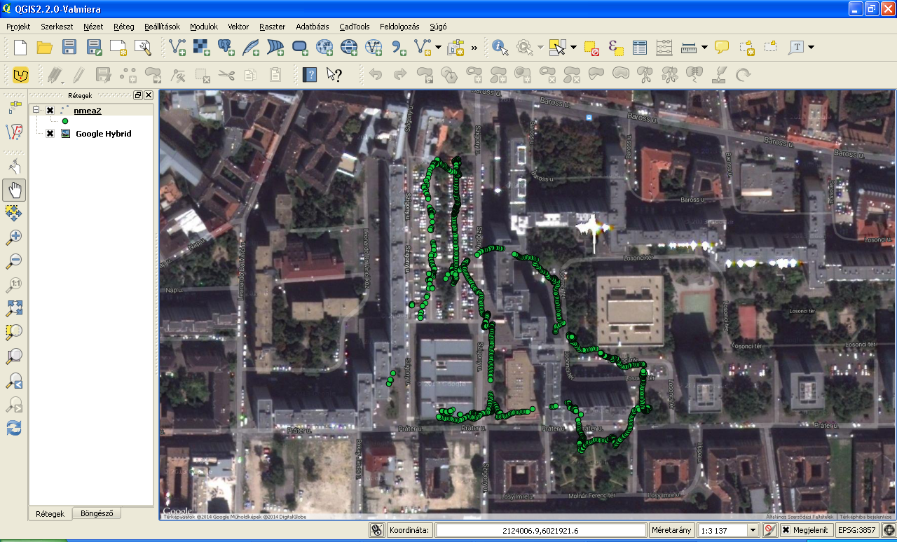

NMEA message processing and display
===================================

*Keywords*: text file input/output, free format text file

*Data files*: nmea1.txt, nmea2.txt

*Program files*: nmea.m, nmea2deg.m, nmea.awk, nmea.py

*Octave solution* (nmea.m)

.. code:: octave

    % NMEA parser
    f = fopen('nmea1.txt', 'r');
    fo = fopen('nmea1.out', 'w');
    while (! feof(f))
        buf = fgetl(f);
        bufa = strsplit(buf, ',');
        %checksum bitxor(a,b)
        bufascii = double(buf(2:strcmp(buf, '*')));
        cs = double(buf(2));
        for c = buf(3:end-3)
            cs = bitxor(cs, double(c));
        end
        if (sprintf('%X', cs) ~= buf(end-1:end))
            printf('checksum error\n');
            continue;
        end
        switch (bufa{1})
            case {'$GPGGA','$GNGGA'}
                % GGA, time, lat, N/S, lon, E/W, fixq, sats, hdop, height, M, undulation,M,empty,empty,checksum
                if (str2num(bufa{7}) == 1)
                    % use only GPS fix
                    lat = nmea2deg(bufa{3});
                    if (bufa{4} == 'S')
                        lat = -lat;
                    end
                    lon = nmea2deg(bufa{5});
                    if (bufa{6} == 'W')
                        lon = 360.0 - lon;
                    end
                    height = str2num(bufa{10});
                    fprintf(fo, '%.6f,%.6f,%.2f\n', lat, lon, height);
                end
        end
    end
    fclose(f);
    fclose(fo);

(nmea2deg.m)

.. code:: octave

    function deg = nmea2deg(w)
        % convert NMEA dddmm.mmm angle to decimal degree
        p = index(w, '.');
        deg = sscanf(w(1:p-3),'%d') + sscanf(w(p-2:end), '%f') / 60.0;
    end

*AWK solution* (nmea.awk)

.. code:: awk

    # function to convert angles from dddmm.mmmm to decimal degrees
    function nmea2deg(w) {
        p = index(w, ".");
        return substr(w, 1, p-3) + substr(w, p-2, length(w)) / 60.0;
    }
    BEGIN { FS="[,]"; }     # set field separator
    /^\$GPGGA,/ {
        if ($7 == 1) {      # fix position?
            lat = nmea2deg($3);
            if ($4 == "S") {
                lat = -lat;
            }
            lon = nmea2deg($5);
            if ($6 == "W") {
                lon = 360 - lon;
            }
            height = $10;
            print lat, lon, height;
        }
    }

|nmea_png|

*Python solution* (nmea.py)

.. code:: python

	""" Simple NMEA processing to create a text file with coordinates
	"""

	import sys
	import os
	import re

	def checksum(buf):
		""" check nmea checksum on line """
		cs = ord(buf[1])
		for ch in buf[2:-3]:
			cs ^= ord(ch)
		ch = '0' + re.sub('^0x', '', hex(cs))
        return ch[-2:].upper()

	def nmea2deg(nmea):
		""" convert nmea angle (dddmm.ss) to degree """
		w = nmea.rstrip('0').split('.')
		return int(w[0][:-2]) + int(w[0][-2:]) / 60.0 + int(w[1]) / 3600.0
		
	if len(sys.argv) > 1:
		fin = sys.argv[1]   # get input file from command line
        fi = open(fin, 'r') # input file
        fo = open(os.path.splitext(fin)[0] + '.out', 'w') # output file
    else:
        fi = sys.stdin
        fo = sys.stdout
	for line in fi:
		line = line.strip()
		if checksum(line) != line[-2:]:
			print("Chechsum error: " + line)
			continue
		if re.match('\$..GGA', line):
			gga = line.split(',')
			if gga[6] == '1':  # use only fix
				lat = nmea2deg(gga[2])
				if gga[3].upper() == 'S':
					lat \*= -1
				lon = nmea2deg(gga[4])
				if gga[5].upper() == 'W':
					lon = 360 - lon
				height = float(gga[9])
				fo.write('{:.6f},{:.6f},{:.2f}\n'.format(lat, lon, height))
	fo.close()
	fi.close()

.. note:: *Development tipps*:

    Get more columns from GGA sentences. Process more MNEA sentence types.
	Modify Octave and gawk code to read not only GPS satellite GGA sentences.

