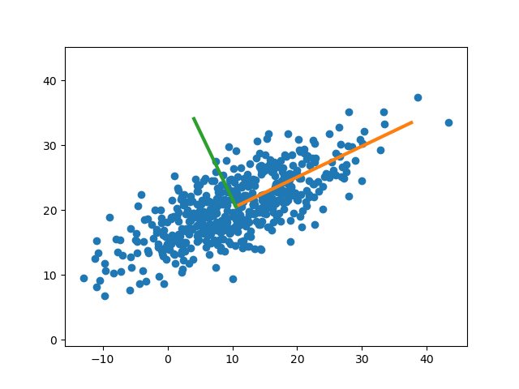

Principal Componenet Analysis (PCA)
===================================

*Keywords:* Python, numpy, matplotlib, Octave

*Program file:* pca.py

How can we find the main axis of a 2D polygon or a set of 2D points?
The PCA can help.

The principal orthogonal directions will be the eigenvectors of the
variance-covariance matrix
to the weight point of the point set. Numpy has all the basic functions for PCA
calculations.

Python solution
---------------

.. code:: python

    import numpy as np
    import matplotlib.pyplot as plt
    from math import (sin, cos, atan2, pi)
    # generating normal distribution 2D point set with mean (0,0)
    X = np.random.multivariate_normal([0, 0], [[10, 5], [5, 100]], 500)
    # transform points (rotate and shift)
    alpha = -pi / 3.
    rot = np.array([[cos(alpha), sin(alpha)], [-sin(alpha), cos(alpha)]])
    X = X.dot(rot) + np.array([10, 20])
    means = np.mean(X, 0)   # mean of coordinates
    Xd = X - means          # differences from mean point
    cov = Xd.T.dot(Xd)      # variance covariance matrix
    eig_values, eig_vectors = np.linalg.eig(cov)
    # principal direction is the first eigenvector
    direction = atan2(eig_vectors[0][0], eig_vectors[1][0]) * 180 / pi # bearing
    print('weight point: {}'.format(means))
    print('direction [degree]: {:.1f}'.format(direction))
    # plot points and axles
    X1 = np.array([means[0], means[0] + eig_vectors[0][0] * 30.])
    Y1 = np.array([means[1], means[1] + eig_vectors[1][0] * 30.])
    X2 = np.array([means[0], means[0] + eig_vectors[0][1] * 15.])
    Y2 = np.array([means[1], means[1] + eig_vectors[1][1] * 15.])
    plt.plot(X[:,0], X[:,1], 'o')
    plt.plot(X1, Y1, linewidth=3)
    plt.plot(X2, Y2, linewidth=3)
    plt.axis('equal')
    plt.show()

|pca_png|

The scikit-learn modul has direct PCA solution and has extra functionalities.

.. code:: python

    from sklearn.decomposition import PCA
    pca = PCA(n_components=2)
    pca.fit(X)
    print(pca.mean_)        # weightpoint
    print(pca.components_)  # eigenvectors

Octave solution
---------------

GNU Octave has also the necessary mathematical functions to make the calculation
step by step.

.. code:: octave

    % find principal components
    points = dlmread('pca.txt');
    % step by step solution
    means = mean(points);
    Xd = points - means;
    cov = Xd' * Xd;
    [eig_vectors, eig_values] = eig(cov);
    direction = atan2(eig_vectors[0][0], eig_vectors[1][0]) * 180 / pi;
    printf("weight point: %.2f, %.2f\n", means(1), means(2))
    printf("direction: %.1f\n", direction)

The statistical module of Octave has a direct function for PCA.
The statistical module have to be installed separetly.

.. code:: bash

    sudo apt-get install octave-statistics

.. code:: octave

    % find principal components
    pkg load statistics
    points = dlmread('pca.txt');
    % eigen vectors & rotated, shifted points (b)
    [eig_vectors, b, eig_values] = princomp(points);
    % shift of points
    x0 = mean(points(:, 1)) - mean(b(:, 1));
    y0 = mean(points(:, 2)) - mean(b(:, 2));
    % rotational angle
    direction = atan2(eig_vectors(1, 1), eig_vectors(2, 1)) * 180. / pi();
    printf("weight point: %.2f, %.2f\n", x0, y0)
    printf("direction: %.1f\n", direction)
    plot(points(:,1), points(:, 2), 'o');
    hold on
    plot(x0, y0, 'x')
    plot([x0-eig_vectors(1,1)*10; x0; x0+eig_vectors(1,1)*10], ...
         [y0-eig_vectors(2,1)*10; y0; y0+eig_vectors(2,1)*10])

.. note::

    *Develeopment tips:*
    Extend the solution to 3D point clouds.

