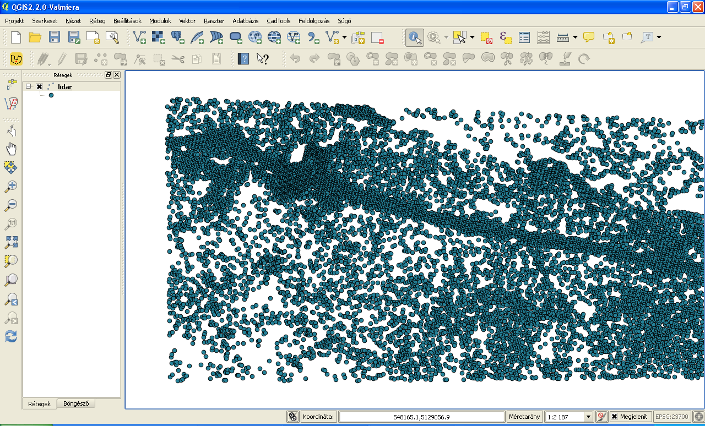
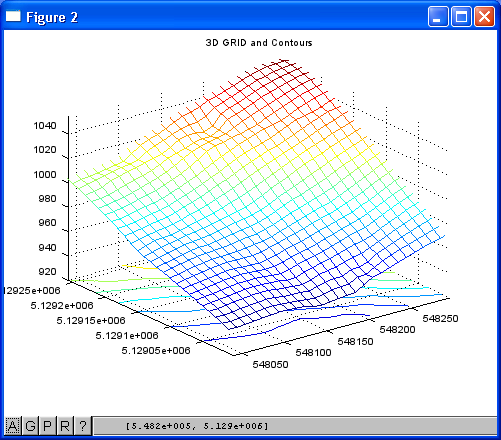

Processing LiDAR data
=====================

*Keywords:* GRID interpolation, surface visualization, contour line, volume calculation, vectorization

*Data file*: lidar.txt

*Program file*: lidarp.m

*Sample data* (x, y, z)

.. code:: text

    548025.89,5129282.50,1008.79
    548026.41,5129284.81,1009.49
    548026.81,5129270.56,1005.94
    548027.89,5129275.27,1007.15
    548029.48,5129282.28,1009.18
    548031.57,5129291.52,1011.97
    548032.78,5129290.76,1012.10

*Octave program*: (lidarp.m)

.. code:: octave

    % LiDAR data processing
    % load input data
    load lidar.txt;
    % data stored in array "lidar"
    %lidar = dlmread("lidar.txt", ",");
    % set window for processing
    xmin = 548040;
    ymin = 5129010;
    xmax = 548300;
    ymax = 5129270;
    dx = 10;
    dy = 10;
    % generate x & y grid
   [x, y] = meshgrid(xmin:dx:xmax, ymin:dy:ymax);
    % grid interpolation for z
    z = griddata(lidar(:,1), lidar(:,2), lidar(:,3), x, y, "linear");
    % 3D surface plot
    figure();
    mesh(x, y, z);
    title("3D GRID");
    figure();
    meshc(x, y, z);
    title("3D GRID and Contours");
    % contour lines
    figure(); contour(x, y, z);
    title("Contours");
    % volume calculation above 1000 m
    vol = 0;
    [r, c] = size(z);
    for ir = 1:r
        for ic = 1:c
            p = z(ir, ic);
            if (p > 1000)
                vol += dx * dy * (p - 1000);
            endif
        endfor
    endfor
    printf("Volume above 1000m: %.0f m3\n", vol);
    % vectorized solution for volume calculation
    vol1 = sum(z(z > 1000) - 1000) * dx * dy;
    printf("Volume above 1000m: %.0f m3 (vectorized)\n", vol1);

.. note:: *Development tipp*
   
    search for extreme values

|lidar1_png|

|lidar2_png|

