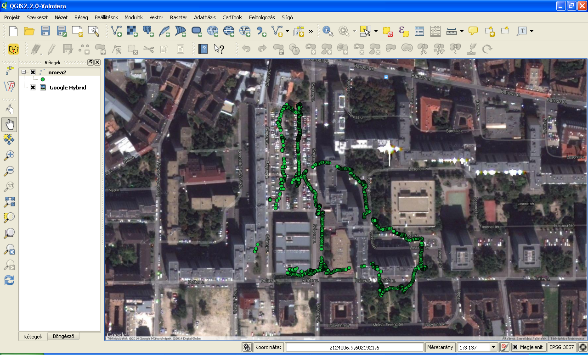

NMEA message processing and display
===================================

*Keywords*: text file input/output, free format text file

*Data files*: nmea1.txt, nmea2.txt

*Program files*: nmea.m, nmea2deg.m, nmea.awk

*Octave megoldás*

.. code:: octave

    % NMEA parser
    f = fopen('nmea1.txt', 'r');
    fo = fopen('nmea1.out', 'w');
    while (! feof(f))
        buf = fgetl(f);
        bufa = strsplit(buf, ',');
        %checksum bitxor(a,b)
        bufascii = toascii(buf(2:strmatch(buf, '*')));
        cs = toascii(buf(2));
        for c = buf(3:end-3)
            cs = bitxor(cs, toascii(c));
        endfor
        if (sprintf('%X', cs) ~= buf(end-1:end))
            printf('checksum error\n');
            continue;
        endif
        switch (bufa{1})
            case '$GPGGA'
                % GGA, time, lat, N/S, lon, E/W, fixq, sats, hdop, height, M, undulation,M,empty,empty,checksum
                if (str2num(bufa{7}) == 1)
                    % use only GPS fix
                    lat = nmea2deg(bufa{3});
                    if (bufa{4} == 'S')
                        lat = -lat;
                    endif
                    lon = nmea2deg(bufa{5});
                    if (bufa{6} == 'W')
                        lon = 360.0 - lon;
                    endif
                    height = str2num(bufa{10});
                    fprintf(fo, '%.6f,%.6f,%.2f\n', lat, lon, height);
                endif
        endswitch
    endwhile
    fclose(f);
    fclose(fo);

*nmea2deg.m*

.. code:: octave

    function deg = nmea2deg(w)
        % convert NMEA dddmm.mmm angle to decimal degree
        p = index(w, '.');
        deg = sscanf(w(1:p-3),'%d') + sscanf(w(p-2:end), '%f') / 60.0;
    endfunction

*AWK megoldás*

.. code:: awk

    # function to convert angles from dddmm.mmmm to decimal degrees
    function nmea2deg(w) {
        p = index(w, ".");
        return substr(w, 1, p-3) + substr(w, p-2, length(w)) / 60.0;
    }
    BEGIN { FS="[,]"; }     # set field separator
    /^\$GPGGA,/ {
        if ($7 == 1) {      # fix position?
            lat = nmea2deg($3);
            if ($4 == "S") {
                lat = -lat;
            }
            lon = nmea2deg($5);
            if ($6 == "W") {
                lon = 360 - lon;
            }
            height = $10;
            print lat, lon, height;
        }
    }

|nmea_png|

.. note:: *Development tipps*:

    Get more columns from GGA sentences. Process more MNEA sentence types.

