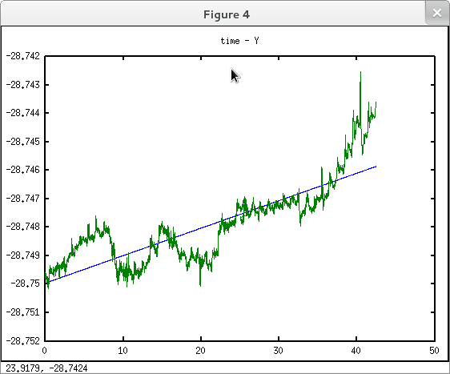
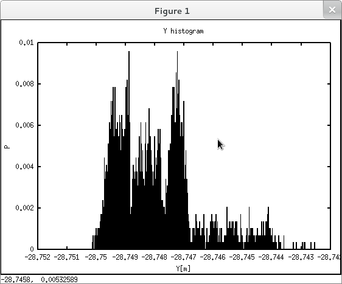

Processing observations for a moving point
==========================================

A automatic monitoring system collects observations to a text file.
Let's draw a line chart and statistical analysis.

*Keywords*: text file, statistical features, histogram, regression

*Data file*: egyp.txt

*Program file*: egyp.m

sample data (date, time, bearing, zenith angle, distance):

.. code::

    2011-03-06 00:02:34.187 5.54266738793405 1.13841322413106 46.93235
    2011-03-06 00:04:52.853 5.54266468109955 1.13840774850708 46.9323
    2011-03-06 00:31:20.097 5.54267260637532 1.13840844286026 46.93235
    2011-03-06 01:02:05.280 5.54266827516265 1.13841044813025 46.9323
    2011-03-06 01:04:22.220 5.54266516687251 1.13841161605504 46.9323
    2011-03-06 01:31:29.253 5.54267010086911 1.13840956842266 46.93225
    2011-03-06 02:02:53.310 5.54266769002174 1.13840997870482 46.9323
    2011-03-06 02:05:15.473 5.54266769060621 1.13841043973132 46.93235
    2011-03-06 02:31:21.573 5.54266680743297 1.13840298239231 46.9323
    2011-03-06 03:02:17.600 5.54266543668323 1.13841134855137 46.9323
    2011-03-06 03:04:33.853 5.54266535605359 1.13841299369957 46.9322

*Octave solution*

.. code:: octave

    % process observation data for a point
    % input file format: yyyy-mm-dd hh:mm:ss.sss WCB VA SD
    f = fopen('egyp.txt', 'r');
    % read data into a matrix
    [data, n] = fscanf(f, '%d-%d-%d %d:%d:%f %f %f %f', [9, Inf]);
    fclose(f);
    data = data';   % transpose input matrix
    [rows, cols] = size(data);
    for i=1:rows
        % convert date-time to unix seconds
        ts.year = data(i, 1);
        ts.mon = data(i, 2);
        ts.mday = data(i, 3);
        ts.hour = data(i, 4);
        ts.min = data(i, 5);
        ts.sec = round(data(i, 6));
        if (i == 1)     % first observation
            st = mktime(ts);     % start epoch seconds
        endif
        data(i, 1) = (mktime(ts) - st) / (3600 * 24);    % day units
        % calculate coordinates
        data(i, 2) = data(i, 9) * sin(data(i, 8)) * sin(data(i, 7));  % Easting
        data(i, 3) = data(i, 9) * sin(data(i, 8)) * cos(data(i, 7));  % Northing
        data(i, 4) = data(i, 9) * cos(data(i, 8));                    % Elevation
        data(i, 5) = 0;
        data(i, 6) = 0;
    endfor
    % basic statistics
    y = mean(data(:, 2));   % average
    x = mean(data(:, 3));
    z = mean(data(:, 4));
    my = std(data(:, 2));   % standard deviation
    mx = std(data(:, 3));
    mz = std(data(:, 4));
    printf(' Y[m] X[m] Z[m] my[mm] mx[mm] mz[mm] skew\n');
    printf('%8.4f %8.4f %8.4f %6.2f %6.2f %6.2f %6.2f %6.2f %6.2f\n', \
    y, x, z, my * 1000, mx * 1000, mz * 1000, skewness(data(:,2)), \
    skewness(data(:,3)), skewness(data(:,4)));
    % normality
    figure();
    hist(data(:,2),500,1);
    title('Y histogram');
    xlabel('Y[m]');
    ylabel('P');
    figure();
    hist(data(:,3),500,1);
    title('X histogram');
    xlabel('X[m]');
    ylabel('P');
    figure();
    hist(data(:,4),500,1);
    title('Z histogram');
    xlabel('Z[m]');
    ylabel('P');
    % correlations
    cy = cov(data(:,1), data(:,2)) / std(data(:,1)) / std(data(:,2));
    cx = cov(data(:,1), data(:,3)) / std(data(:,1)) / std(data(:,3));
    cz = cov(data(:,1), data(:,4)) / std(data(:,1)) / std(data(:,4));
    cyx = cov(data(:,2), data(:,3)) / std(data(:,2)) / std(data(:,3));
    cyz = cov(data(:,2), data(:,4)) / std(data(:,2)) / std(data(:,4));
    cxz = cov(data(:,3), data(:,4)) / std(data(:,3)) / std(data(:,4));
    printf('\nCorrelations\n');
    printf(' Y X Z\n'); 
    printf('time %5.3f %5.3f %5.3f\n', cy, cx, cz);
    printf(' Y - %5.3f %5.3f\n', cyx, cyz);
    printf(' X - - %5.3f\n', cxz);
    % looking for linear trend
    py = polyfit(data(:,1), data(:,2), 1);
    px = polyfit(data(:,1), data(:,3), 1);
    pz = polyfit(data(:,1), data(:,4), 1);
    ty = py(1) * data(:,1) + py(2);
    tx = px(1) * data(:,1) + px(2);
    tz = pz(1) * data(:,1) + pz(2);
    figure();
    plot(data(:,1), ty);
    hold all;
    plot(data(:,1), data(:,2));
    title ('time - Y');
    figure();
    plot(data(:,1), tx);
    hold all;
    plot(data(:,1), data(:,3));
    title ('time - X');
    figure();
    plot(data(:,1), tz);
    hold all;
    plot(data(:,1), data(:,4));
    title ('time - Z');

.. note::

    *Develeopment tipp*:
    Statistical test for normal distribution

|histogram_png|

|y_png|

