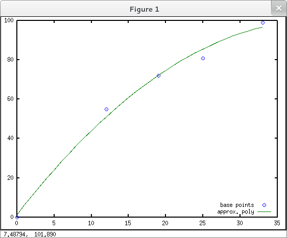

Polynom interpolation
=====================

*Keywords*: interpolation, polynom

*Data file*: parabola.csv

*Program files*: parabola.m, parabola1.m, parabola_lsm.m

Let's fit a parabola through three points. First we create a program using the
traditional c/Java logic, in a second solution the more effective vetorization
method is used.

*Traditional solution* (parabola1.m):

.. code:: octave

    % coordinates of points
    xp = [0; 21; 30];
    yp = [0; 55; 75];
    % set up equations
    A = zeros(3, 3);
    l = zeros(3, 1);
    for i=1:3
        A(i,1) = 1;
        A(i,2) = xp(i);
        A(i,3) = xp(i)^2;
        l(i) = yp(i);
    end
    x = inv(A) * l
    printf('Check\n')
    for i=1:3    % substitute original coordinates
      A(i,:) * x - yp(i)
    end

*Results*:

.. code:: text

    x =
       0.00000
       2.89683
      -0.01323

    Check
    ans = 0
    ans =  1.4211e-14
    ans =  1.4211e-14

*Vectorized solution* (parabola.m):

.. code:: octave

    % coordinates of points
    xp = [0; 21; 30];
    yp = [0; 55; 75];
    % set up equations
    A = zeros(3, 3);
    l = zeros(3, 1);
    A(:,1) = ones();
    A(:,2) = xp;
    A(:,3) = xp.^2;
    l = yp;
    x = A \ l
    printf('Check\n')
    polyval(flipud(x), xp)

Vectorization means that matrix operations are used instead of loop. This way
we get more compact, faster and more readble program.

*Result*:

.. code:: text

    x =
       0.00000
       2.89683
      -0.01323

    Check
    ans =
       0
       0
       0

Let's extend our solution to read points from data file and use a least squares
estimation for the parameters of the parabola. (parabola_lsm.m)

.. code:: octave

    % command line arguments
    args = argv();
    % open input file
    if (length(args))
        fp = fopen(args{1}, 'r');
    else
        fp = fopen('parabola.csv', 'r');
    end
    % load all coordinates
    points = sortrows(fscanf(fp, '%f;%f', [2, Inf])');
    n = rows(points);
    if (n < 4 )
        printf('Few points in input file\n');
    else
        A = zeros(n, 3);
        l = zeros(n, 1);
        A(:, 1) = ones();
        A(:, 2) = points(:, 1);
        A(:, 3) = points(:, 1) .^ 2;
        l = points(:, 2);
        x = A \ l
        rms = sqrt(sum((polyval(flipud(x), points(:, 1)) - points(:, 2)) .^ 2) / n);
        printf('RMS = %.3f\n', rms);
        plot(points(:, 1), points(:, 2), 'o');
        hold all;
        plot(points(1, 1):1:points(n, 1), polyval(flipud(x), points(1, 1):1:points(n, 1)), '-');
        legend('base points', 'approx. poly', 'location', 'southeast');
        hold off;
    end

|parabola_png|

.. note:: *Development tipps*:

    Use higher order polynom, the order be an input
    Beautify plot, title, grid, etc.
