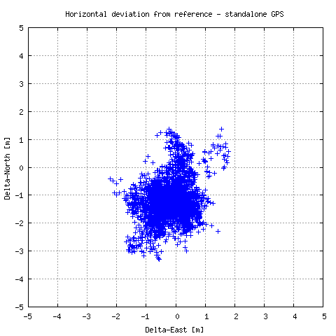

RTKLIB programmal meghatározott pozíciók és a permanens állomás ismert pozíciójának eltérése
============================================================================================
*szerző: Takács Bence (takacs.bence@epito.bme.hu), BME Általános- és Felsőgeodézia Tanszék.*

Az `előzőekben <https://github.com/OSGeoLabBp/tutorials/blob/master/hungarian/gps/04_rtklib.rst>`_ permanens állomás nyers méréseit dolgoztuk fel RTKLIB szoftverrel, abszolút helymeghatározásként. Tekintettel arra, hogy a permanens állomások pontos pozíciója ismert, így kiszámolthatjuk az abszolút helymeghatározással meghatározott pozíciók valódi hibáit. Erre most egy awk szkriptet mutatunk be. Az awk linux operációs rendszer alatt elérhető. Windows operációs rendszer alá is telepíthető. Az egyik egyszerű megoldás `osgeo4w <https://trac.osgeo.org/osgeo4w/>`_ programcsomag telepítése, majd az awk programot ennek parancssorából tudjuk meghívni.

Az RTKPOST programmal végzett feldolgozás eredményállománya fejlécből és adatokból áll. A fejléc sorok elején % jel található:: 

  % program   : RTKPOST ver.2.4.2
  % inp file  : E:\tantargyak\alagutmeres\2016\bute1520.15o
  % inp file  : E:\tantargyak\alagutmeres\2016\brdc1520.15n
  % obs start : 2015/06/01 00:00:00.0 GPST (week1847  86400.0s)
  % obs end   : 2015/06/01 23:59:30.0 GPST (week1847 172770.0s)
  % pos mode  : single
  % elev mask : 15.0 deg
  % ionos opt : broadcast
  % tropo opt : saastamoinen
  % ephemeris : broadcast
  %
  % (lat/lon/height=WGS84/ellipsoidal,Q=1:fix,2:float,3:sbas,4:dgps,5:single,6:ppp,ns=# of satellites)
  %  GPST                  latitude(deg) longitude(deg)  height(m)   Q  ns   sdn(m)   sde(m)   sdu(m)  sdne(m)  sdeu(m)  sdun(m) age(s)  ratio
  2015/06/01 00:00:00.000   47.480954411   19.056534073   181.7826   5   9   2.1245   1.9103   3.7333   0.1328   0.9211   1.1049   0.00    0.0
  2015/06/01 00:00:30.000   47.480954070   19.056535216   181.9513   5   9   2.1242   1.9099   3.7485   0.1344   0.9274   1.1219   0.00    0.0
  2015/06/01 00:01:00.000   47.480953632   19.056538036   182.0809   5   9   2.1240   1.9095   3.7639   0.1361   0.9338   1.1387   0.00    0.0
  2015/06/01 00:01:30.000   47.480953699   19.056541652   182.2652   5   9   2.1238   1.9091   3.7793   0.1378   0.9403   1.1553   0.00    0.0
  2015/06/01 00:02:00.000   47.480954424   19.056541015   182.3033   5   9   2.1236   1.9087   3.7949   0.1395   0.9468   1.1718   0.00    0.0

Az adatrész könnyen olvasható, minden sorban egy mérési epochához tartozó eredmények, azaz dátum, idő, meghatározott koordináták, magasság, meghatározás módja, műholdak száma, középhibák található.

Awk szkriptünk elején adjuk meg permanens állomásunk ismert koordinátáit! Majd számítsuk ki, hogy a földrajzi koordinátákban 1 másodperc eltérés topocentrikus koordinátarendszerben közelítően hány méternek felel meg! A földrajzi szélességben ez 31 méter körüli, a földrajzi hosszúságban ez a szélességtől függ, Budapest területén kb. 21 méter. Meg kell adjuk a Föld sugarának közelítő értékét, valamint a pi konstansra is szükségünk lesz. Az eredményt a print paranccsal irathatjuk ki, erre később nem lesz szükség::

  BEGIN {
  #know position of station
  	fi0=47+28/60+51.39769/3600;
  	la0=19+03/60+23.50719/3600;
  	h0=180.808;
  
  #geographical and topocentric change
  	R=6380000;
  	pi=3.1415926535898;
  	dfi=1/3600*pi/180*R;
  	dla=dfi*cos(fi0/180*pi);
  	print dfi, dla
  }

Tehát ezeket a sorokat másoljuk egy fájlba, a fájl kiterjesztése *.awk* legyen, majd az osgeo4w ablakból a futtatás a következő lesz::

  awk -f pos_error.awk bute1520.pos

Ezután csak az adatszekció sorait fogjuk beolvasni, azaz minden olyan sort, ami nem '%' karakterrel kezdődik. Ezt a ^[^%] mintával adhatjuk meg::

  BEGIN {
  #know position of station
  	fi0=47+28/60+51.39769/3600;
  	la0=19+03/60+23.50719/3600;
  	h0=180.808;
  
  #geographical and topocentric change
  	R=6380000;
  	pi=3.1415926535898;
  	dfi=1/3600*pi/180*R;
  	dla=dfi*cos(fi0/180*pi);
  	#print dfi, dla
  } /^[^%]/ {
  	
  }

Minden beolvasott sorból kivesszük a földrajzi koordinátákat, kiszámoljuk ezek eltérést az ismert koordinátáktól, majd a valódi hibákat átváltjuk topocentrikus rendszerbe. A végén 3 tizedesjegy élesen kiírjuk a hibákat. Később szükségünk lesz még a dátumra és az idpőontra is, ezért ezeket is változatlan formában kiírjuk::

  BEGIN {
  #know position of station
  	fi0=47+28/60+51.39769/3600;
  	la0=19+03/60+23.50719/3600;
  	h0=180.808;
  
  #geographical and topocentric change
  	R=6380000;
  	pi=3.1415926535898;
  	dfi=1/3600*pi/180*R;
  	dla=dfi*cos(fi0/180*pi);
  #	print dfi, dla
  } /^[^%]/ {
  #latitude, longitude and height are 3rd, 4th, 5th elements
  	fi = $3;
  	la = $4;
  	h = $5;
  
  #calculate east, north and height error
  	dn = (fi0 - fi)*3600*dfi;
  	de = (la0 - la)*3600*dla;
  	dh = h0 - h;
  	
  	printf("%s %s %.3f %.3f %.3f\n", $1, $2, dn, de, dh);
  }

A futtatás során a kimenenet érdemes egy fájlba átirányítani::

  awk -f pos_error.awk bute1520.pos > pos_error.txt

Az eredményfájl első néhány sora a következő lesz::

  2015/06/01 00:00:00.000 -1.181 -0.323 -0.975
  2015/06/01 00:00:30.000 -1.143 -0.409 -1.143
  2015/06/01 00:01:00.000 -1.095 -0.622 -1.273
  2015/06/01 00:01:30.000 -1.102 -0.894 -1.457
  2015/06/01 00:02:00.000 -1.183 -0.846 -1.495
  2015/06/01 00:02:30.000 -1.248 -0.757 -1.503

A vízszintes pozíciók valódi hibáit bemutató grafikon a következő gnuplot szkripttel állítható elő::

  set grid lt 0
  set yrange [-5:+5]
  set ytics 1
  set xrange [-5:+5]
  set xtics 1
  set xlabel "Delta-East [m]"
  set ylabel "Delta-North [m]"
  set title "Horizontal deviation from reference - standalone GPS" 
  set terminal png small size 480,480 enhanced
  set output 'pos_error.png'
  plot 'pos_error.txt' using 4:3 notitle with points lc 'blue'

A szkript futtatása::

  gnuplot pos_error.plt
  
Az eredményeket bemutató ábra:

