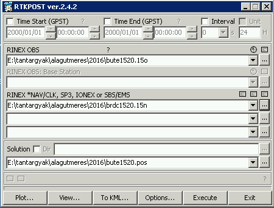

GPS adatok feldolgozása RTKLIB szoftverrel
==========================================
*szerző: Takács Bence (takacs.bence@epito.bme.hu), BME Általános- és Felsőgeodézia Tanszék. utolsó módosítás: 2016. január 7.*

Az előzőekben permanens GPS állomás, illetve navigációs üzenetek adatait töltöttük le, tömörítettük ki. Most azt mutatjuk meg, hogyan lehet az ingyenes RTKLIB szoftverrel az adatokat feldolgozni. Először a grafikus felületen történő feldolgozást, azután pedig a parancssorból végzett feldolgozást mutatjuk be.

Először is az RTKLIB szoftvert le kell tölteni, alkalmas könyvtárba (pl. C:\\rtklib_2.4.2) kitömöríteni. Az adatok utófeldoglozása az RTKPOST programmal történik. Ennek grafikus felülete indítható az C:\\rtklib_2.4.2\\bin alkönyvtárban az rtkpost.exe futtatható fájlra történő kattintással is, de indítható a főprogramból (C:\\rtklib_2.4.2\\rtklaunch.exe) is a megfelelő ikonra kattintva. Az RTKPOST programban a grafikus felületen adjuk meg a rinex mérési és navigációs fájlt a képen látható módon:

A beállításokat hagyjuk későbbre!
