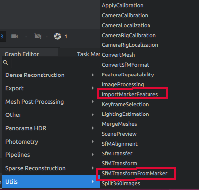
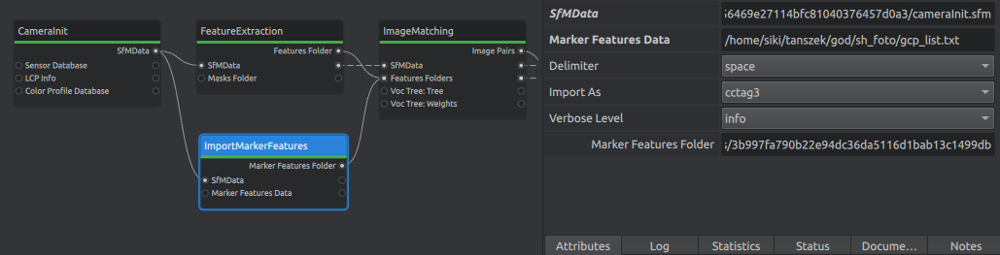
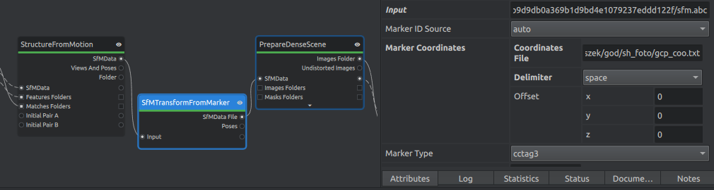

ArUco illesztőpontok használata Meshroommal
===========================================

Bár a Meshroom képes CCTag és AprilTag 16h5 jelek felismerésére, a tapasztalatok
alapján ez nem használható minden körülmények között. Lásd Nagy Zoltán (2021) és
Janurik Zalán (2023) TDK dolgozatát.

Janurik Zalán egyrészt kibővítette az ODM (OpenDroneMap) programhoz készült
automatizált illesztőpont keresést, hogy a Meshroom programmal is használható legyen, valamit két Python feldolgozó elemet készített a munkafolyamatba
illesztéshez. Ezek használatát írjuk le ebben a dokumentumban.

Komponensek telepítése
----------------------

Az illesztőpontok automatikus megkereséséhez a képeken az ODM program
FindGCP kiegészítőjét kell telepítenie. A megtalált illesztőpontok 
felhasználásához a Meshroom programhoz két kiegészítő modult kell telepíteni.

FindGCP telepítése
~~~~~~~~~~~~~~~~~~

A FindGCP egy nyílt forráskódú bővítmény az ODM/WebODM fotogrammetriai
programokhoz (https://opendronemap.org/findgcp/). A használatához Python
3.6 vagy újabb verziót és az OpenCV, OpenCV-contrib, numpy, matplotlib
Python modulokat telepíteni kell előzőleg.

A FindGCP telepítéséhez keresse fel a projekt GitHub oldalát
(https://github.com/zsiki/Find-GCP). Nyomja meg a zöld **<> Code** gombot és
a megjelenő listából válassza a *Download ZIP* elemet a felbukkanó listából.
Tömörítse ki a letöltött zip fájl.

Meshroom kiegészítők telepítője
~~~~~~~~~~~~~~~~~~~~~~~~~~~~~~~

Janurik Zalán két kiegyészítő modulját az alábbi GitHub oldalakon találhatja 
meg:

ImportMarkerFeatures: https://raw.githubusercontent.com/MrClock8163/MeshroomGCPMarkerAdditions/main/GCPMarkerAdditions/ImportMarkerFeatures.py

SfMTransformFromMarker: https://raw.githubusercontent.com/MrClock8163/MeshroomGCPMarkerAdditions/main/GCPMarkerAdditions/SfMTransformFromMarker.py

A fenti két oldal felkeresése után a szövegfájlként megjelenített kódba
kattintson jobb egérgombbal és
válassza az oldal mentését. A fájlokat a Meshroom telepítési könyvtárában
található lib/meshroom/nodes/aliceVision alkönyvtárba mentse el.

Az alábbi GitHub oldalon további angol nyelvű információt találhat a Meshroom
bővítményről:

https://github.com/MrClock8163/MeshroomGCPMarkerAdditions/tree/main

Telepítés ellenőrzése
~~~~~~~~~~~~~~~~~~~~~

Nyisson meg egy parancsablakot (Windows esetén CMD).
Lépjen be a FindGCP könyvtárába és adja ki az alábbi parancsot:

.. code:: bash

    python gcp_find -h

Erre a következő üzenetet kell kapnia:

.. code:: bash

    usage: gcp_find.py [-h] [-d DICT] [-o OUTPUT] [-t {ODM,VisualSfM,Meshroom}]
                       [-i INPUT] [-s SEPARATOR] [-v] [--debug] [-l] [--epsg EPSG]
                       [-a] [--markersize MARKERSIZE] [--markerstyle MARKERSTYLE]
                       [--markerstyle1 MARKERSTYLE1] [--edgecolor EDGECOLOR]
                       [--edgewidth EDGEWIDTH] [--fontsize FONTSIZE]
                       [--fontcolor FONTCOLOR] [--fontcolor1 FONTCOLOR1]
                       [--fontweight FONTWEIGHT] [--fontweight1 FONTWEIGHT1]
                       [--limit LIMIT] [--aruco_params ARUCO_PARAMS]
                       [--thres THRES] [--winmax WINMAX] [--winmin WINMIN]
                       [--winstep WINSTEP] [--maxiter MAXITER]
                       [--refinement REFINEMENT] [--minacc MINACC]
                       [--refwin REFWIN] [-r] [--correctionrate CORRECTIONRATE]
                       [--borderbits BORDERBITS] [--error ERROR]
                       [--maxrate MAXRATE] [--corner CORNER]
                       [--borderdist BORDERDIST] [--markerdist MARKERDIST]
                       [--lengthratio LENGTHRATIO] [--minrate MINRATE]
                       [--otsu OTSU] [--ignore IGNORE] [--persp PERSP]
                       [--poly POLY] [--aruco3]
                       [file_names ...]
    ...

Indítsa el a Meshroom programot, a Graph Editor mezőben (alul) egy üres 
területen nyomja meg a jobb egérgombot. Húzza rá az egeret a *Utils* 
menüpontra. A felbukkanó menüben látnia kell a két letöltött Python fájl nevét
(ImportMarkerFeatures és SfmTransformFromMarker).

Minta projekt
-------------

A fényképek elkészítése előtt nyomtassa ki az ArUco jeleket, a fényképezési
távolság függvényében A4 vagy A3 méretet használjon. Az ArUco jeleket
az *aruco_make.py* program segítségével állíthatja elő, mely a FindGCP 
projektben található.
Például az első hat 4x4-es ArUco jel előállítása:

.. code:: bash

    python aruco_make.py --start 0 --end 5

A fenti parancs eredményeként hat *png* kép jön létre az aktuális könyvtárban.
Nyomtassa ki a jeleket. A fényképek elkészítése előtt helyezze ki a jeleket
a modellezendő objektumra úgy, hogy semelyik három ne essen egy térbeli 
egyenesre és lehetőleg ne legyenek egy síkban.  Általában 4-6 jel elhelyezése
elegendő. Valamilyen geodéziai módszerrel mérje be a jelek középpontját, 3D-ben.

Készítse el a fényképeket, úgy hogy az ArUco jelek jól látszanak. Nem kell
minden képen szerepelnie ArUco jelnek.

Az ArUco jelek azonosítóját és koordinátáit írja be egy szövegfájlba,
ArUco azonosító, Y, X, Z sorrendben. 

Egy minta a koordinátafájl tartalmára:

.. code:: 

    0 544.828 514.298 104.215
    1 552.086 521.011 104.129
    2 546.305 521.605 104.217
    3 534.729 526.552 104.267
    4 542.850 532.382 104.165
    5 553.513 514.344 104.169

.. note:: Fontos

    Amennyiben EOV koordinátái vannak az illesztőpontokra, akkor ne vigye be
    a teljes koordinátát, mert a Meshrommban problémát okoznak a több
    százezres koordináták. Vágja le az Y és X koordináták első két vagy három
    jegyét.

Futtassa a *gcp_find.py* programot.

.. code:: bash

    python gcp_find.py -o gcp_list.txt -t Meshroom -i gcp_coo.txt *.jpg

A fenti parancsnál feltételeztük, hogy a program, az illesztőpontok koordinátái
tartalmazó fájl és a feldolgozandó képet az aktuális könyvtárban vannak. Ettől
eltérő esetben a fájlok neve előtt a megfelelő elérési utat is meg kell adni.
A továbbiakban a *gcp_list.txt* fájlt használjuk.

Részlet az eredmény fájlból:

.. code:: txt

    2323 2455 DSC04997.JPG 2 15.5081
    1040 2286 DSC04997.JPG 0 25.0200
    2707 2313 DSC04997.JPG 3 12.0104
    564 1480 DSC05000.JPG 0 27.0185
    1938 1713 DSC05000.JPG 2 15.5000
    3329 1592 DSC05000.JPG 6 12.0000
    2321 1598 DSC05000.JPG 3 12.5000

Az első két oszlop az ArUco marker képkoordinátáit, a harmadik a képfájl nevét,
a negyedik az ArUco jel kódját, az ötödik pedig a fél jelméretet.

Indítsa el a Meshroom programot és alakítsuk át a munkamenetet, az ArUco jelek
kezeléséhez. Első lépésben a *gcp_find.py* programmal készült eredmény fájlt
alakítjuk át, hogy a Meshroomnak megfelelő formátumú legyen. Ehhez
adjuk hozzá a munkafolyamathoz az **ImportMarkerFeatures** modult és illesszük
be a *CameraInit* és *ImageMatching* elemek közé a *FeatureExtraction* elemmel
párhuzamosan. Az *ImportMarkerFeatures* elem attribútumai között állítsa
be a *Marker Feature Data* értékét a *gcp_find.py* programmal előállított
fájlra, és állítsa be a *Delimiter* értékét. A *FeatureExtraction* és
*FeatureMatching* elemek között törölje a *Desciber Types* közötti összekötés.
Ezt az összeköttetést törölje a *FeatureMatching* és a
*StructureFromMotion* elemek között is. Manuálisan állítsuk be a 
*Desriber Types* attribútumot a *FeatureMatching* és 
*StructureFromMotion* elemeknél a *dspsift* és *cctag3* legyen kiválasztva.
Ellenőrizze, hogy a *FeatureExtraction* elem attribútumai között a
*tag16h5*, *cctag3* és *cctag4* ne legyen bekapcsolva a *Describer Types* 
csoportban.

A másik módosítás az *SfmTransformFromMarker* beillesztése a 
*StructureFromMotion* és a *PrepareDenseScene* közé. Törölje ki a 
*StructureFromMotion* és *PrepareDenseScene* elemek *SfmData* mezőinek 
összekötését. Az összeköttetést az *SfmTransformFromMarker* elemen keresztül
hozza létre. Az *SfmTransformFromMarker* attribútumai között adja meg az
ArUco jelek koordinátáit tartalmazó fájl nevét. A *Marker Type* legyen *cctag3*.

