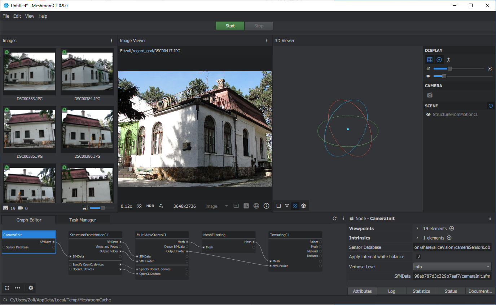
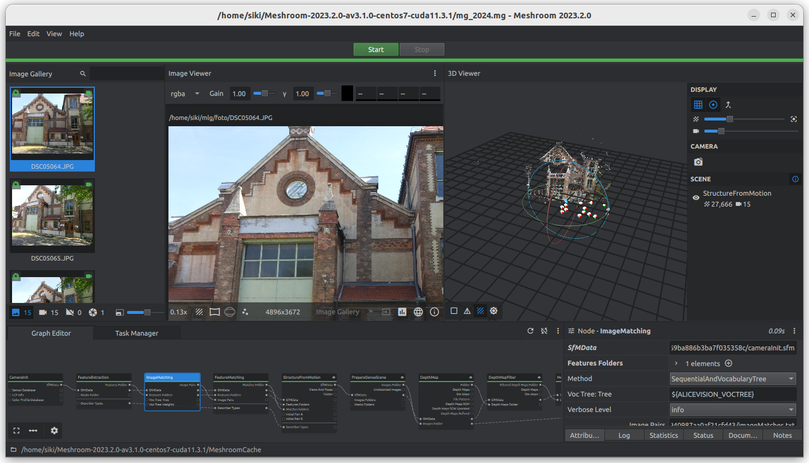
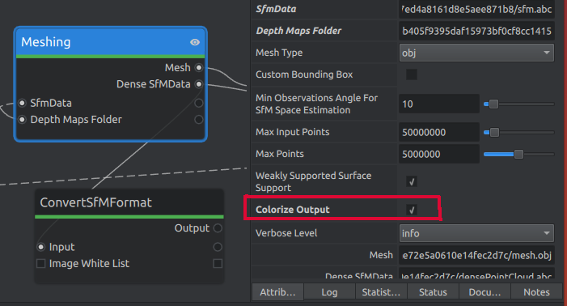
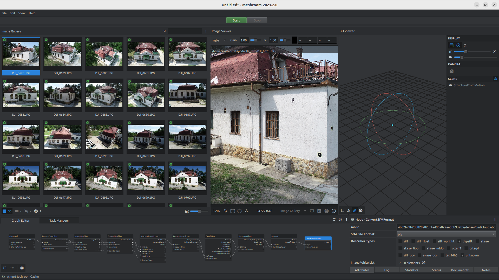
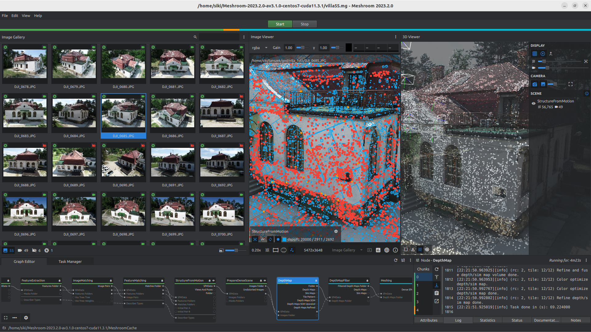
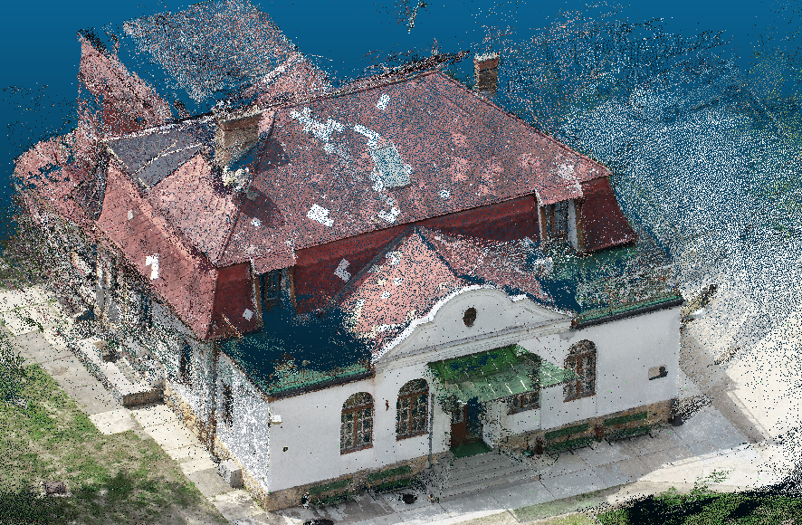

Bevezetés a Meshroom használatába
=================================

A `Meshroom <https://alicevision.org/>`_ egy nyílt forráskódú
fotogrammetriai feldolgozószoftver, melyet elsősorban objektum modellezésre,
3D-s háromszöghálók (mesh) létrehozására készítettek. Mind a kezdő, mind a
profi felhasználók céljaira megfelelő. A kezdő felhasználók egy előkészített
munkafolyamatot (pipeline) használhatnak, bedobják a képeiket és
elindítják a feldolgozást. A haladóbb felhasználók saját feldolgozási 
folyamatot hozhatnak létre, a folyamat egyes lépéseit paraméterezhetik.

A Windows felhasználók két változat közül választhatnak. Amennyiben van
a számítógépükben nVidia grafikus kártya, akkor az `AliceVision oldaláról
<https://www.fosshub.com/Meshroom.html?dwl=Meshroom-2023.3.0-win64.zip>`_
letölthető CUDA változatot célszerű telepíteni. Profi grafikus kártyával nem 
rendelkező gépek esetén a
`Meshroom CL <https://github.com/openphotogrammetry/meshroomcl/releases>`_
változat telepíthető (ez jóval lassabb feldolgozást biztosít, de működik
AMD, Intel, stb. grafikus kártyák esetén is).

Linux operációs rendszert használók csak CUDA 11 kompatibilis grafikus kártya
esetén tudják használni a programot.

A telepítés a letöltött *zip* fájl egy üres könyvtárba kibontásával történhet
meg. Windows esetén a Microsoft Visual C++ Redistributeable Package 
telepítésére is szükség van, ha korábban ez nem történt meg.
A munkát a *Meshroom* program indításával kezdheti meg. Ez legegyszerűbben a
program asztalon található ikonjával történhet.

Ismerkedés a felhasználói felülettel
------------------------------------

A Meshroom CL felhasználói felülete:

A Meshroom CUDA felhasználói felülete:

A CL és a CUDA változat felhasználói felülete teljesen azonos, eltérés
az alapértelmezett munkafolyamatban és a feldolgozás sebességében van.

Viszonylag egyszerű menüsor található az ablak felső sorában (File, Edit, View, Help).

A **File** menüben találhatók a projekt mentéséhez és betöltéséhez, fényképek
importálásához és eltávolításához szükséges menüpontok. Az **Edit**
menüben a műveletek visszavonása (Undo) és újra végrehajtása (Redo)
mellett a munkafolyamat egyes elemeinek vágólapon keresztüli 
másolásához szükséges műveletek vannak. A **View** menü segítségével a
grafikus felhasználói felület egyes elemeinek a megjelenítését kapcsolhatjuk
be illetve ki. A **Help** menüből az online dokumentációt és a program 
névjegyét érheti el.

A menü alatt találhatók a **Start** és **Stop** nyomógombok és egy 
előrehaladás jelző. A **Start** gomb megnyomásával indíthatjuk el a 
grafikus szerkesztőben összeállított munkafolyamat végrehajtását. Amennyiben
részben már megtörtént a feldolgozás, akkor a még nem futtatott elemek
végrehajtása történik meg. Az előrehaladás jelzőn arányosan láthatjuk, hol tart
a feldolgozásunk, a befejezett részfeladatok zöld, a folyamatban lévő 
narancssárga, a még nem végrahajtottak pedig piros színnel jelennek meg.

Az előrehaladás jelző alatt három blokk található, az kép galéria (Image
Gallery), a kép nézegető (Image Viewer) és a 3D nézegető (3D Viewer).

A kép galéria tartalmazza a feldolgozásba bevonandó fényképeinket. Képeket
a **File** **Import Images** menüponttal adhatunk a galériához vagy a
fájlkezelőben kijelölt képeket áthúzhatjuk ide. A Meshroom képes különböző
kamerákkal készített képek feldolgozására is.
A galéria alatti állapotsorban a képek számát, az ismert kamerákkal készült
képek számát és az azonosított kamerák számát láthatja illetve a galériában 
megjelenő képek nagyítását állítatja be egy csúszkával. A galériában
látható kis képre jobb gombbal kattintva egy menü jelenik meg, melyben mások
mellett a kép eltávolítása is megtalálható. Csak azokat a képeket tölti be a
program, melyek a szükséges EXIF információkat tartalmazza, a bal felső 
sarokban zöld ikon látható.

A kép nézegető ablakban a galériában bal egérgombbal kijelölt kép jelenik meg.
Itt az egérgörgővel belenagyíthatunk a képbe, illetve a görgő nyomvatartásával
tologathatjuk a képet az ablakban. A kép felett egy információs sávban 
kiválasthatjuk, hogy a többsávos képek esetén melyik sáv tartalmát látom. Az
egeret a képen mozgatva itt láthatjuk az aktuális RGBA értékeket. Az A (alfa
csatorna) az átlátszóságot tartalmazza. A kép alatti eszközsorban láthatja az
aktuális nagyítás értékét és különböző információkat kaphat a képről, többségét
akkor, ha sikerült a feldolgozási folyamatot hibátlanul végrehajtani.

A 3D nézegetőben a ritka pontfelhőt és a kamera pozíciókat láthatjuk, ha a
feldolgozásban ezek az adatok előálltak már. A pontfelhőt forgatni a bal 
egérgombbal, nagyítani és mozgatni az egér görgővel tudja.
A 3D nézegető jobb oldalán a
*Display* felirat alatti három ikonnal be vagy kikapcsolhatjuk a megjelenő
elemeket. A két pótméterrel pontok és a kamerák méretét állíthatjuk.
A *CAMERA* alatti fényképezőgépre kattintva a 3D nézegető a kép nézegetőben
látható kép készítési helyéről nézzük a pontfelhőt és a háttérben megjelenik 
a fénykép is. A kép galériában másik képet választva a kép nézegető és a 3D
nézegető tartalma is megváltozik. Ilyenkor a fényképezőgép ikon mellett 
egy másik ikon is megjelenik, mellyel a háttérben lévő képet ki lehet
kapcsolni, a mellette levő pótméterrel a fénykép átlátszóságát változtathatja
meg.

Színezett pontfelhő kinyerése
-----------------------------

A Meshroom a feldolgozás során *abc* formátumú, szineket nem tartalmazó 
pontfelhőt állít elő, melyet kevés program képes betölteni. 
Például a CloudCompare programban használható 
pontfelhő elkészítéséhez az alapértelmezett munkafolyamatot módosítanunk kell.

Kattintson a **Meshing** elemre a *Graph Editor* mezőben és az Attrib fülön
kapcsolja be a *Colorize Output* opciót, hogy színezett pontfelhőt kapjunk.

Addjon hozzá egy új feldolgozási elemet a *Graph Editor* mezőben. Kattintson
egy üres területre a jobb egérgombbal és a felbukkanó menüben válassza ki a 
*ConvertSfmFormat* elemet az *Utils* csoportból. A *Meshing* elem *DenseSfmData*pontját húzzuk rá a *ConvertSfmFormat* elem *Input* pontjára. A 
*ConvertSfmFormat* attribútumait módosítsuk. Az *SfM File Format* legyen *ply*.
A *Describer Types* csoportban válassza ki az *unknown* jelölőnégyzetet. Az
*output* mezőben megnézheti illetve módosíthatja a létrehozott fájl nevét.

Egy feldolgozás bemutatása
--------------------------

Egy villa épületről készült felvételek feldolgozását mutatjuk be a
következőkben. Ötvenöt felvételt használunk fel a feldolgozás során.
A CL változat esetén a lassabb futási idő miatt nem érdemes 10 képnél többet
feldolgozni.
Csak a pontfelhőt szeretnénk előállítani, így a térháló szűrését 
(MeshFiltering) és a textura létrehozását (Texturing) kitörölhetjük a
munkafolyamatból (a jobb gomb menüből **Remove node(s)**),
viszont a színezett pontfelhő előállításához szükséges lépést hozzáadtuk.

A munkafolyamat kialakítása és a képek hozzáadása után mentsük el a projektet.
Ez azért szükséges, hogy az előállított adatállományokat a futás után is
megtaláljuk a *MeshroomCache* könyvtárban.

A **Start** gomb megnyomása után várakozzunk a munkafolyamat befejezésére.
A munka megszakítható a **Stop** gombbal, és újraindítható.
Egy 32 MB RAM, SSD lemez, NVidia Quadro P3200 GPU gépen 45 percbe telt az 
55 kép feldolgozása, a sűrű pontfelhő 1.5 millió pontot tartalmaz.

A feldolgozás közben nyomon követhetjük a munkát. Válassza ki a *Graph Editor*
mezőben az aktuális műveletet és a *Log* fület, a program üzenetei 
folyamatosan megjelennek. Ahogy a feldolgozás 
előrehalad a ritka pontfelhő megjelenik a *3D view* mezőben.

A munkafolyamat során létrejött adatállományok a *MeshroomCache* könyvtár
alkönyvtáraiban jönnek létre. A *MeshroomCache* könyvtár a Meshroom 
telepítési könyvtárban található. A pontfelhőnket (*sfm.ply*) 
*ConvertSfmFormat* alatt találjuk meg. Itt minden futtatásnál létrejön egy 
a futtatás azonosítónak megfelelő nevű alkönyvtár (hosszú hexadecimális kód).
Legkönnyebben úgy találhatja meg a pontfelhőjét, ha a *Graph Editor* mezőben 
kiválasztja *ConvertSfmFormat* elemet és az attribútumai közül kikeresi az 
*Output* mező értéket. Az fájlok könyvtára közvetlenül is megnyitható a
fájlkezelőben, ha a megfelelő feldolgozási lépés paraméterei felett, jobb 
oldalon található három pontra kattint és a menüből kiválasztja az
*Open Cache Folder* opciót.

A létrejött pontfelhő mérete nem lesz helyes és egy ismeretlen 
koordináta-rendszerben lesznek a koordinátái. Ezt egy másik programban,
például a CloudCompareben tudjuk elvégezni.

.. note::

    A Meshroom program speciális jelekkel megjelölt illesztőpontok esetén képes     automatikusan egy ismert koordináta-rendszerbe transzformálni a pontfelhőt,
    a térhálót.

