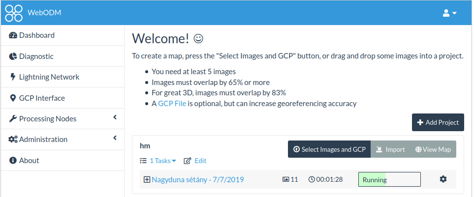
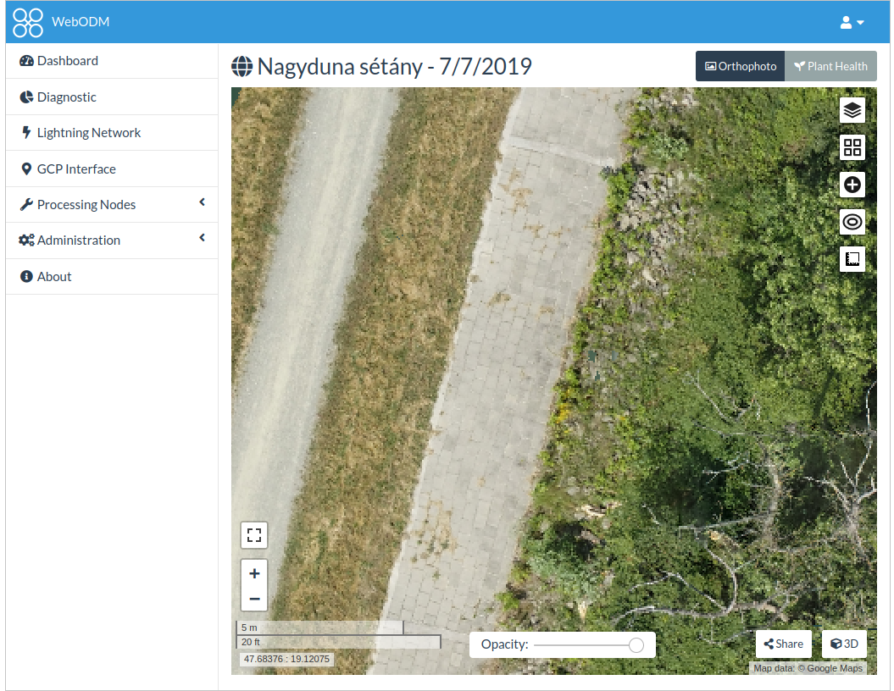

ODM és WebODM használata Linux-on
=================================

Az `OpenDroneMap <https://www.opendronemap.org/>`_ (ODM) egy dinamikusan
fejlődő, nyílt forráskódú UAV felvételek feldolgozására alkalmas szoftver.
Többféle felhasználói interfésszel rendelkezik, ezek közül a webes (WebODM) és
a parancssori (CLI) felhasználással foglalkozunk ebben a leírásban.

Az ODM illetve WebODM használatához már kisebb projektek esetén is 16 GB 
memória szüksége. Ennek nem kell feltétlenül fizikai memóriának lennie,
kevesebb memória esetén a swap fájl(ok) méretét kell megnövelni.

ODM
---

Az ODM Pythonban írt parancssori szoftver, mely változatosan paraméterezhető.
Az ajánlott telepítési módja a docker konténer, de Linux operációs rendszeren
közvetlenül is telepíthető. A jpeg, tiff képekből és az illesztőpontokból
ortofotót, osztályozott pontfelhőt, domborzat modellt és felszínmodellt 
hozhatunk létre.

Telepítés
~~~~~~~~~

A docker konténerbe telepítés néhány egyszerű parancs kiadásával lehetséges 
például Ubuntu/debian Linux disztribúciókon.
A parancsokhoz rendszergazda jog kell (sudo).

.. code:: bash

    sudo apt update
    curl -fsSL https://get.docker.com -o get-docker.sh
    sh get-docker.sh
    sudo apt install -y git python python-pip
    sudo pip install docker-compose

Ha rendszergadza jog nélkül szeretnénk futtatni az ODM-et, akkor adjuk hozzá
a felhasználót a *docker* felhasználói csoporthoz.

.. code:: bash

    sudo usermod -aG docker <felhasználónév>

Ahhoz, hogy a fenti csoport módosítás érvénybe lépjen, ki kell jelentkeznie
és be kell jelentkeznie.

ODM használata
~~~~~~~~~~~~~~

Az ODM docker konténer telepítése az első indítás során történik meg. Számítsunk
arra, hogy az első indításnál ez pár percig tarthat. Ezt legegyszerűbben a
program verziószámának  lekérdezésével tehetjük meg:

.. code:: bash

    docker run -it --rm opendronemap/odm --version

A fenti parancsra az *ODM 2.4.1* választ kapjuk ezen dokumentáció irásakor.

Az ODM használatához célszerű olyan könyvtárszerkezetet kialakítani, ahol 
projektenként külön alkönyvtárkat hozunk létre. Ennek a projekt könytárnak fix
nevű alkönytáraiba helyezzük el az input képeket és illesztőpont (GCP) fájlt, 
illetve ennek alkönyvtáraiban kapjuk meg az eredményeket.
Célszerű a bejelentkezési könyvtárunkban egy *odm* könyvtárat létrehozni és
ennek alkönyvtárai legyenek a projektek.

.. code:: txt

        |-- projekt
            |-- images/
                |-- img-1234.jpg                # input képek
                |-- ...
                |-- gcp_list.txt                # illesztőpontok adatai
            |-- opensfm/
                |-- see mapillary/opensfm repository for more info
            |-- odm_meshing/
                |-- odm_mesh.ply                # 3D háló
            |-- odm_texturing/
                |-- odm_textured_model.obj      # texturázott háló
                |-- odm_textured_model_geo.obj  # georeferált texturázott háló
            |-- odm_georeferencing/
                |-- odm_georeferenced_model.laz # LAZ formatumú pontfelhő
            |-- odm_orthophoto/
                |-- odm_orthophoto.tif          # Ortofotó GeoTiff

A futtatás előtt másoljuk be a képeinket az *images* könyvtárba, ha 
illesztőpontokat használtunk, akkor azok állományát is másoljuk be az *images*
könyvtárba. A feldolgozást a projekt könyvtárból indítsuk el a következő 
paranccsal:

.. code:: bash

    docker run -it --rm \
        -v "$(pwd)/images:/code/images" \
        -v "$(pwd)/odm_orthophoto:/code/odm_orthophoto" \
        -v "$(pwd)/odm_texturing:/code/odm_texturing" \
        -v "$(pwd)/odm_report:/code/odm_report" \
        opendronemap/odm --gcp ./images/gcp_list.txt

A *docker run* egy konténerben elhelyezett alkalmazás indítását jelenti, a
a *-it* kapcsolók egy pseudo terminált terminált rendelnek a futtatáshoz és
standard inputot nyitva tartják, azaz a konténerben futó program üzeneteit 
a terminál ablakban láthatjuk. A *--rm* kapcsolóval futás végén a futás
közbeni az utólagos hibakereséshez hasznos adatokat kitakarítjuk (ez nem
történik meg automatikusan).
A *-v* kapcsolókkal kapcsolatot teremtünk fájlrendszerünk és a konténerben futó 
program fájlrendszere között. A kettőspont előtt szereplő alkönyvtárakat a
futtatás előtt létre kell hozni.
Az *opendronemap/odm* a futtatandó konténer neve. A *--gcp* kapcsoló után az
illesztópontok állományát adhatjuk, ez elmaradhat, olyankor a képek exif
adatai alapján végzi el a georeferálást a program. Ebben az esetben a texturált modell és az ortofotó jön létre. Amennyiben DTM-et, DSM-et is szeretnénk
létrehozni, akkor a *--dtm* illetve *--dsm* kapcsolókat is meg kell adnunk. 
Alternatív megoldásként csak a projekt könyvtárat is megadhatjuk a docker-nek:

.. code:: bash

    docker run -it --rm -v /home/siki/odm:/datasets opendronemap/odm --project-path /datasets bme_mini

A fenti példában a */home/siki/odm/* a projektjeimnek a fő könyvtára, a 
*bme-mini* az egyik projekt (alkönyvtár) neve. Ebben az esetben az ODM
létrehozza automatikusan a szükséges alkönyvtárakat.

Az *odm_report* könyvtárban PDF és JSON formátumú fájlokban kapunk 
összefoglaló eredményt a projekt feldolgozásáról. Részlet a 
jelentésből:

.. code:: text

    Dataset Summary
    Date 06/02/2021 at 08:15:15
    Area Covered 0.000832 km2
    Processing Time 4.0m:3.0s

    Processing Summary
    Reconstructed Images 11 over 11 shots (100.0%)
    Reconstructed Points (Sparse) 4944 over 8232 points (60.1%)
    Reconstructed Points (Dense) 1,921,588 points
    Average Ground Sampling Distance (GSD) 1.0 cm
    Reconstructed Components 1 component
    Detected Features 11,438 features
    Reconstructed Features 1,190 features
    Geographic Reference GPS and GCP
    GPS / GCP errors 1.93 / 0.06 meters

A bemutatott parancs többszöri futtatása esetén csak a még nem létező eredmény 
állomámnyokat hozza létre. A mennyiben módosítjuk a bemenő adatokat, újra 
el akarjuk készíteni az összes állományt, akkor a *--rerun-all* kapcsolót
adjuk meg.

Az ODM feldolgozás menetét több tucat kapcsolóval befolyásolhatjuk. Ezekről 
részletesebb információt az `ODM dokumentációban <https://docs.opendronemap.org/arguments.html>_` találhatunk.

Az ODM-el előállított állományok megtekintésére, kezelésére más nyílt
forráskódú szoftvereket használhatunk:

+-----------------+----------------------------+
| kitejesztés     | kezelő program             |
+-----------------+----------------------------+
| tif             | QGIS, GRASS GIS, SAGA      |
+-----------------+----------------------------+
| laz, ply        | CloudCompare               |
+-----------------+----------------------------+
| obj, ply        | MeshLab                    |
+-----------------+----------------------------+

WebODM
------

a WebODM az ODM böngészőből elérhető változata. Egyszerű grafikus felhasználói
felületet biztosít az interneten keresztül. A WebODM esetén a feldolgozás a
szerveren történik, az input állományokat a szerverre fel kell tölteni és az
eredmény állományok is ott jönnek létre. A saját gépen csak egy böngésző
programra van szükség. A WebODM az állományok megjelenítését is biztosítja 
más nyílt forráskódú programok segítségével (Leaflet, Potree).

Telepítés
~~~~~~~~~

A telepítést a szerver számítógépen kell elvégezni!
Ubuntu/debian disztribúciókon először az ODM-t kell telepíteni (lásd az ODM
fejezetet). Lépjen be abba a könyvtárba, melynek alkönytárába telepítjük a
WebODM-et. A telepítés történhet a saját bejelentkezési könyvtárunkba a
szerveren, ha csak mi akarjuk használni.
Ezután a WebODM GitHub oldaláról csak le kell tölteni a programot:

.. code:: bash

    git clone https://github.com/OpenDroneMap/WebODM

Szerver indítása
~~~~~~~~~~~~~~~~

A szerveren lépjen be a **WebODM** könyvtárába, majd írja be a következő
parancsot:

.. code:: bash

    ./webodm.sh start

A fenti parancs kiadása után több üzenet jelenik meg a terminál ablakunkban.

.. code:: text

    Checking for docker...   OK
    Checking for git...   OK
    Checking for docker-compose...   OK
    Starting WebODM...

    Using the following environment:
    ================================
    Host: localhost
    Port: 8000
    Media directory: appmedia
    SSL: NO
    SSL key:
    SSL certificate:
    SSL insecure port redirect: 80
    Celery Broker: redis://broker
    Default Nodes: 1
    ================================
    Make sure to issue a ./webodm.sh down if you decide to change the environment.

    docker-compose -f docker-compose.yml -f docker-compose.nodeodm.yml start || docker-compose -f docker-compose.yml -f docker-compose.nodeodm.yml up --scale node-odm=1
    Starting db       ... done
    Starting node-odm ... done
    Starting broker   ... done
    Starting worker   ... done
    Starting webapp   ... done

Alapértelmezésben a webODM a 8000-es porton várja a felhasználók csatlakozását.

Indítson el egy böngészőt a saját gépén nyissa meg a szerver 8000-es portját.s
Az első indításnál az adminisztrátor felhasználó nevét és jelszavát be kell
állítania.

|webodm1_png|
WebODM felhasználói felülete

|webodm2_png|
Ortofotó megjelenítés WebODM-ben

