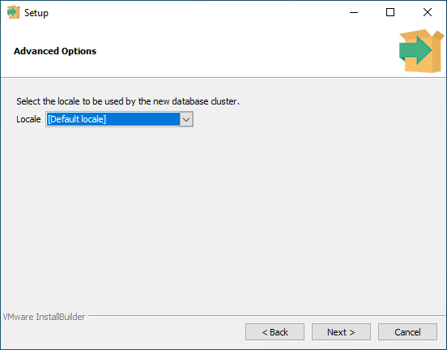
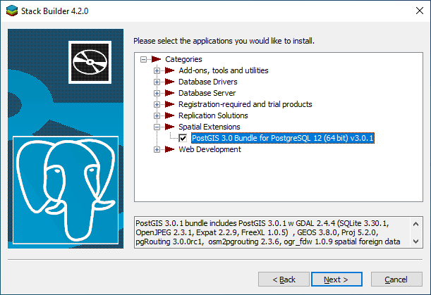
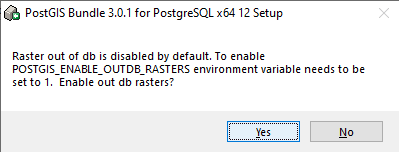

PostgreSQL és PostGIS telepítése
================================

**Összeállította: dr. Siki Zoltán**

**FIGYELEM**

        A dokumentum készítése óta eltelt időben a honlapok elrendezése megváltozott!

Telepítés Windows operációs rendszeren
--------------------------------------

A Windows operációs rendszeren a telepítést egy varázsló segítségével egyszerűen
végrehajthatjuk. A böngésző programunkban nyissuk meg a 
https://www.postgresql.org/download/windows/ oldalt.

        PostgreSQL honlap

Az ábrán pirossal bekeretezett linkre kattintva nyissuk meg a letöltő oldalt.
A megjelenő táblázatból válasszuk ki az operációs rendszerünknek meglefelelő 
legmagasabb verziót.

        Telepítő kiválasztása

A használt böngésző beállításának megfelelően megjelenhet egy a letöltést
megerősítő ablak. Például FireFox esetén a következő.

        Telepítő mentése a gépre

Keressük meg a letöltött telepítő fájlt és indítsuk el.
A telepítés két részre bontható. Az első részében a PostgreSQL objektum-relációs
adatbázis.kezelőt telepítjük, majd utána a PostGIS kiegészítőt.

PostGIS telepítése
~~~~~~~~~~~~~~~~~~

A telepítő program elindítása után egy szokásos telepítő varázsló segít minket.
Jellemzően elegendő a Next (tovább) gombot megnyomnunk.

A nyitó képernyőn csak egy üdvözlő szöveg jelenik meg.

        Telepítő üdvözlő oldala

A kövekező ablakban a telepítés cél könyvtárát állíthatjuk be, ha nincs különösebb
indokunk más könyvtár használatára, fogadjuk el a telepítő által felkínált
alapértelmezett mappát.

        Telepítés cél mappája

Ezután a telepítendő komponenseket választhatjuk ki. Az adatbázis szervert
csak akkor nem szükséges, ha csak távoli adatbázisokhoz akarunk csatlakozni.
A **pgAdmin 4** egy grafikus felhasználói felületet (GUI) ad az adatbázisaink
kezeléséhez. A **Stack Builder** a kiegészítő csomagok telepítését teszi
egyszerűvé. Ezt fogjuk használni a **PostGIS** telepítése során. A 
parancssori eszközök (Command Line Tools) segítségével a parancs ablakban a
megfelelő utasítások beírásával kezelhetjük az adatbázisunkat, a pgAdmin 
alternatívája.

        Telepítendő komponensek kiválasztása

A varázsló következő lépésében az adatbázis adminisztrátor jelszavát adhatjuk
meg. Jól jegyezze meg a megadott jelszót! Ez a telepítés során automatikusan
létrehozott *postgis* felhasználó jelszava lesz. A *postgis* felhasználó
rendelkezik a rendszergazda jogosultsággal az adatbázis-kezelőben.

        Jelszó megadása

A következő lépésben az adatbázis portját adhatjuk meg. Célszerű az 
alapértelmezett 5432 értéket elfogadni.

        Port kijelölés

Ezután a helyi beállításokat módosíthatjuk, ez az ékezetes magyar
karakterekhez használt kódlapot is jelenti. Az alapértelmezett helyi beállítás
magyar nyelvű Windows esetén nem biztos, hogy célszerű, ha nemzetközi
környezetben akarjuk az adatokat használni, közzétenni. Ilyen esetekben az
UTF-8 célszerűbb. Ez csak egy alapértelzett értéket jelent később az egyes
adatbázisok, adattáblák létrehozása során ezt felülbírálhatjuk.

        Helyi beállítások

Ezzel a telepítéshez szükséges beállítások végére értünk. A megjelenő
párbeszédablakban a beállítások összesítését tekinthetjük át.

        Telepítési beállítások összesítése

Végül még egy megerősítést kér a varásló a telepítés elindítása előtt.

        A telepítés indítása

A telepítés során nyomon követhetjük a megjelenő ablakban az aktuális
műveletet. A telepítés több percig tart. 

        A telepítés folyamata

A telepítés befejezése után a varázsló felkínálja a **Stack Builder**
indítását. Erre szükségünk lesz a **PostGIS** telepítéséhez.
Nyomjuk meg a **Finish** gombot Postgis telepítésének befejezéséhez és a 
**Stack Builder** indításához.

PostGIS telepítése
~~~~~~~~~~~~~~~~~~

**Stack Builder**  nyitó ablakában először ki kell választanunk azt a
PostgreSQL példányt, melyhez bővítő csomagokat szeretnénk telepíteni.
Ez az előző lépésben telepített adatbázis kezelő lesz, nem egy távoli
adatbázis. A proxy szerver beállításoknak csak távoli szerver esetén van 
jelentősége.

        Adatbázis-kezelő példány kiválasztása

A várázsló második lépésében a lehetséges bővítmények közül választhatunk.
Most nem tekintjük át az összes lehetséges bővítményt. A térinformatikai
adatok tárolásához szükséges PostGIS bővítményt telepítjük csak.
Ezt a térbeli bővítmények között találhatjuk meg. A **Stack Builder**-t 
később is elindíthatjuk és módosíthatjuk a telepített bővítményeket.

        PostGIS bővítmény kiválasztása

Ezután egy összesítő ablakban tekinthetjük át a kiválasztott bővítményeket.

.. figure:: images/sb3.png
        :align: center

        Telepítendő bővítmények áttekintése

Végül a telepítés indítása előtt még egy megerősítés kér a varázsló.

        Telpítés indítása

A PostGIS letöltése után a telepítésének első lépésében a licenc szerződést 
el kell fogadnunk az **I Agree** gomb megnyomásával.

        Licenc szerződés elfogadása

A telepítés következő lépésében a telepítendő komponenseket választhatjuk ki.
Célszerű egy téradatbázist már a telepítés során létrehozni (Create spatial
database).

        Postgis komponensek kiválasztása

A kiválasztott komponensek telepítéséhez egy adatbázis adminisztrátor joggal
rendelkező felhasználó nevét, jelszavát és az adatbázis-kezelő portját 
meg kell adnunk. A frissen telepített adatbázisban létjön egy *postgres*
nevű felhasználó, melynek jelszavát a PostgreSQL telepítése során állítottunk
be.

        bejelentkezési adatok az adatbázishoz

A telepítés következő lépésében a létrehozandó téradatbázis nevét kell 
megadnunk, az adatbázis nevében ne használjunk szóközt, ékezetes betűket vagy
speciális karaktereket.

        Téradatbázis nevének beállítása

A telepítés (Install) gomb megnyomása után indul a telepítés, melynek 
folyamatát myomonkövetjhetjük.

        A telepítés folyamata

A telepítés során a raszteres adatok kezelésére vonatkozó beállítások
megerősítése történik meg. Fogadjuk el az alapértelmezett beállításokat, ha
később raszteres adatokat is szeretnénk az adatbázisunkban tárolni.

A telepítés végén nyomjuk meg a lezár (Close) gombot. 

        A telepítés befejezése

Végül a Stack Builder ablakát zárjuk a le a Finish gombbal.

        Kilépés a Stack Builder-ből

Telepítés utáni hasznos beállítások
~~~~~~~~~~~~~~~~~~~~~~~~~~~~~~~~~~~

A PostgreSQL parancssori eszközei a telepítési könyvtár *bin* alkönyvtárába 
kerülnek (pl. *C:\Program Files\PostgrSQL\12\bin*). Ezt a könyvtárat célszerű 
hozzáadni a *PATH*-hoz. Ezt a rendszer környezeti változók vagy a felhasználói
környezeti változók módosításával adhatjuk meg. Adjuk a *PATH* változó
tartalmához a PostgreSQL *bin* könyvtárát. Ezután egy parancs (cmd) ablakból is 
használhatjuk a *psql*, *pg_dump*, stb. parancsokat. FIGYELEM a *PATH* 
módosítása csak egy újbóli bejelentkezés után lép életbe. Jelentkezzen ki és
jelentkezzen be a módosítás után vagy indítsa újra a gépet.

Ha nem napi rendszerességgel használja a PostgreSQL-t, akkor nem célszerű,
hogy állandóan fusson és a gépünk erőforrásait használja. A parancssorból
leállíthatja az adatbázis-kezelőt:

.. code:: bash

        pg_ctl -D "C:\Program Files\PostgreSQL\12\data" stop

Elindíthatja azt:

.. code:: bash

        pg_ctl -D "C:\Program Files\PostgreSQL\12\data" start

Vagy újraindíthatja:

.. code:: bash

        pg_ctl -D "C:\Program Files\PostgreSQL\12\data" restart

Alternatív megoldásként használhatja a *services.msc* programot a leállításra,
elindításra. Itt az telepítéskor beállított automatikus indítást is átállíthatja
manuálisra.

Telepítés Ubuntu/Debian operációs rendszeren
--------------------------------------------

Ubuntu illetve Debian Linux disztribúciók esetén legegyszerűbben a 
parancssorból telepíthetjük a PostgreSQL adatbázis-kezelőt.

.. code:: bash

        sudo apt update
        sudo apt install postgresql postgresql-contrib
        
A PostGIS telepítése következhet ezután.

.. code:: bash

        sudo apt install postgis

pgAdmin3 telepítése.

.. code:: bash

        sudo apt install pgadmin3

Az adatbázis-kezelő leállítása, indítása és újraindítása

.. code:: bash

        sudo services postgresql stop
        sudo services postgresql start
        sudo services postgresql restart

Első lépések
------------

Az adatbázis-kezelő használatát a PgAdmin program segítségével kezdjük el.
Célszerű egy új felhasználót létrehozni a *postgres* felhahasználó mellett.
Nem célszerű teljes jogú felhasználóként dolgozni, mert egy kisebb hiba is
végzetes lehet az adatbázisunkra.

A PgAdmin első indításánál megadhatunk egy mester jeszót a programon belül 
elmentett jelszavak védelmére. Erre nincs szükségünk, ha nem mentünk el 
jelszavakat, hanem azokat mindig beírjuk.

A PgAdmin 4 verziótól a böngéző programban fut. A bal oldalon megjelenő
**Servers** elemet nyissuk szét és válasszuk a PostgreSQL 12 helyi szervert.
Itt meg kell adnunk a *postgres* felhasználó jelszavát. Nyissuk szét az
adatbázisokat. Itt kláthatjuk, hogy a telepítésnél megadott *postgis* 
adatbázis mellett van egy *postgres* nevű adatbázisunk is, mely minden 
PostgreSQL adatbázis-kezelő telepítésénél automatikusan létrejön.

        Adatbázisok listája

Első tevékenységként hozzunk létre egy új, normál jogú felhasználót.
Kattintsunk jobb egérgombbal a *Login/Group Roles* elemre a bal oldali fában és
a felbukkanó menüből válasszuk a **Create/LoginGroup Role...** menüpontot.
A megjelenő párbeszédablak *General* fülén a név mezőben adjuk meg az új
felhasználó nevét, csak az angol ABC betűit használjuk.
A *Definition* fülön adjuk meg az új felhasználó jelszavát. A *Privileges*
fülön engedélyezzük a bejelentkezést (Can login?) és az adatbázis létrehozását (Create databases?) privilégiumokat. Az SQL fülön megtekinthetjük azt az SQL utasítást, melyet az adatbázis-kezelő végre fog hajtani. Végül a **Save**
gombbal hozzuk létre az új felhasználót.

        Új felhasználó nevének beállítása

        Új felhasználót létrehozó SQL utasítás

Az új felhasználónak adjuk át a *postgis* adatbázis tulajdon jogát.
Kattintsunk jobb egérgombbal az adatbázisok között a *postgis* adatbázisra.
A felbukkanó menüben válasszuk a tulajdonságok (Properties) menüpontot.
A megjelenő párbeszédablakban a *General* fülön a tulajdonost (Owner)
módosítsuk az előbb létrehozott felhasználóra és nyomjuk meg a ment (Save)
gombot.

        Adatbázis tulajdonos módosítása

Ezután már az új felhasználóként is bejelentkezhetünk és a *postgis* 
adatbázisban új táblákat hozhatunk létre, melyek téradatok tárolására
is alkalmasak.
