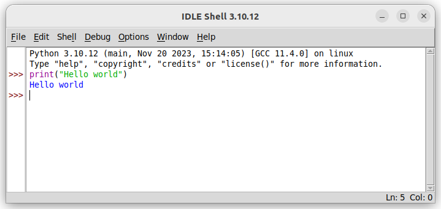
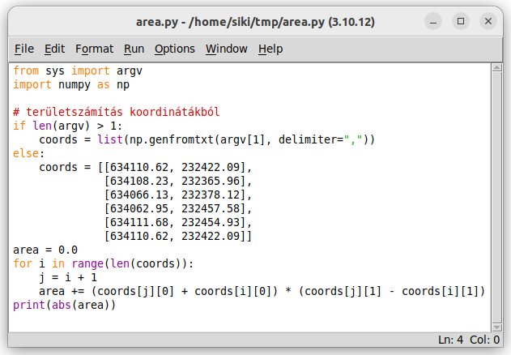
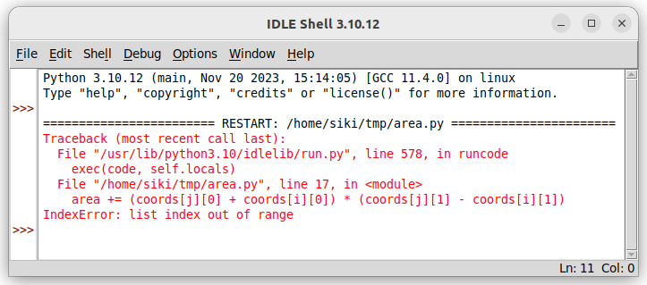
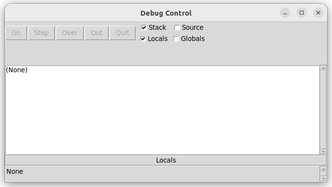
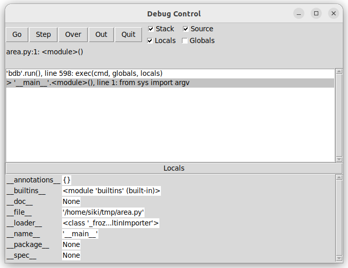
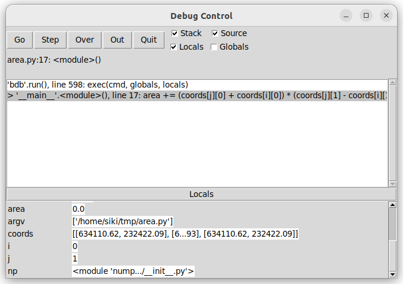
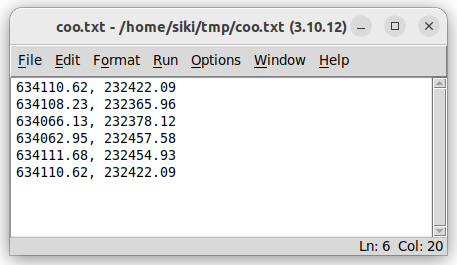
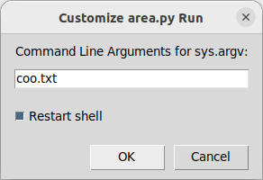

**IDLE**

**Python programok írása és hibakeresése**

Összeállította: Siki Zoltán

A Python programok készítői jellemzően egy integrált fejlesztői
környezetet (IDE) használnak, melyben szövegszerkesztő, környezet függő
súgó és hibakereső lehetőségek is megtalálhatók. Ezek közül a
legegyszerűbb az *idle*, melyet Python-ban írtak meg. Emellett több
szabadon felhasználható IDE létezik (pl. PyCharm, Spyder, Eclipse, Eric,
Visual Studio, pydb).

   **Megjegyzés**

   Az *idle* és az *eric* fejlesztőkönyezet a nevét Eric Idle-ről, a
   Monty Python csoport egyik tagjáról kapta.

Az *IDLE* 100%-ban Python nyelven készült, a *tkinter* grafikus könyvtár
felhasználásával. Az *IDLE* elindítása után az *IDLE Shell* ablak
jelenik meg, melyben Python parancsokat adhatunk ki a Python promt után.
Például írja be a promptnál a::

   print("Hello world")

prancsot és nyomja meg az *Enter* billentyűt. Az ablakban a színek
segítenek az információk értelmezésében.

|image1|

IDLE Shell interaktív használata

Emellett az *IDLE* tartalmaz egy Python nyelvhez igazított
szövegszerkesztőt, melyet a **File** menüben található **New File** és
**Open** menüpontok kiválasztásával nyithatunk meg. Az egy Shell ablak
mellett egy időben több szerkesztő ablak is nyitva lehet.

Egy konkrét egyszerű feladat megoldása során insmerkedjünk meg az *IDLE*
használatával. Ez a feladat legyen a koordinátákból történő
területszámítás. Az alábbi összefüggést használjuk:

A fenti képlet a koordinátatengelyek és a zárt sokszög olalai által
alkotott derékszügű trapézok területeit összegzi.

Nyissunk egy új ablakot a **File/New File** menüpont segítségével és
írjuk be vagy másoljuk át a következő rövid programot::

    from sys import argv
    import numpy as np
    # területszámítás koordinátákból
    if len(argv) > 1:
        coords = list(np.genfromtxt(argv[1], delimiter=","))
    else:
        coords = [[634110.62, 232422.09],
                  [634108.23, 232365.96],
                  [634066.13, 232378.12],
                  [634062.95, 232457.58],
                  [634111.68, 232454.93],
                  [634110.62, 232422.09]]
    area = 0.0
    for i in range(len(coords)):
        j = i + 1
        area += (coords[j][0] + coords[i][0]) \* (coords[j][1] - coords[i][1])
    print(abs(area))

|image2|

A program a szövegszerkesztő ablakban

A programunk elemei különböző színekkel jelennek meg, mely az
olvashatóságok segíti. Erre több más szövegszerkesztő program is képes,
például a *notepad++*. A szövegszerkesztő ablak **Run/Run Module**
menüpontjával futtathatjuk a bevitt programunkat. A Shell ablakban piros
üzenet jelenik meg, ez valamilyen hibára utal. A programunk 17. sorában
index hibát talált a program.

|image3|

Hibaüzenet a *Shell* ablakban

Próbáljuk meg a *debugger* segítségével kideríteni a hiba okát. A
*Shell* ablakban a **Debug/Debugger** menüpont kiválasztása után egy
újabb ablak jelenik meg a képernyőn:

|image4|

A *debugger* ablak

Ha nyitva van a debugger ablak, akkor a program futtatása eltérő módon
működik. Nem fut le a programunk, hanem megáll a végrehajtása a kódunk
első sorában, erre a debugger ablakban megjelenő sor utal:

>’__main__’.<module>(), line 1: from sys import argv

|image5|

A debugger ablak a programunk elindítása után

A *debugger* ablak alsó részén a *Locals* rész kibővült változók nevével
és értékével.

   **Megjegyzés:**

   A két aláhúzással kezdődő és végződő változókat a Python rendszer
   használja, számunkra most különösebben nem érdekesek.

Kapcsolja be a *Source* jelölőnégyzetet, a végrehajtásban aktuális sor
kiemelten jelenik meg a szövegszerkesztő ablakban. Ezt célszerű
bekapcsolva hagyni.

A debugger ablakban a nyomógomb sor (Go/Step/Over/Out/Quit) aktívvá
vált.

+-----------+-------------------------------------------------------------+
| **Go**    | A program futtatása a következő töréspontig                 |
+-----------+-------------------------------------------------------------+
| **Step**  | A program következő utasításának végrehajtása és megállás   |
+-----------+-------------------------------------------------------------+
| **Over**  | A program aktuális sorának végrehajtása és megállás a       |
|           | következő soron                                             |
+-----------+-------------------------------------------------------------+
| **Out**   | Az aktuális függvény futtatása és megállás a függvény hívás |
|           | utáni soron                                                 |
+-----------+-------------------------------------------------------------+
| **Quit**  | A program futtatásának megszakítása                         |
+-----------+-------------------------------------------------------------+

Próbálja meg többször megnyomni az *Over* gombot amíg a hibaüzenetben
szereplő 17. sorba nem érünk. Figyelje meg az egyes ablakokban
bekövetkezett változásokat.

|image6|

A *Debugger* és szövegszerkesztő ablak hibakeresés közben

A hibaüzenet arra utal, hogy az *i* vagy a *j* változó értéke a *coords*
listán kívülre mutat. A *coords* lista hossza 6, az indexek 0 és 5
között változhatnak, azaz jelenleg nincs index probléma. A tövábbiakban
ne lépésenként hajtsuk végre a programot, hanem egy megjelölt sorig. Ezt
a töréspont (breakpoint) beállításával érhetjük el. A szövegszerkesztő
ablakban kattintson jobb egérgombbal és válassza a felbukkanó menüből a
**Set Breakpont** opciót. Ezután nyomja meg a *Go* gombot, a program a
következő töréspontig fut.

Nyomjuk meg többször a *Go* gombot és figyeljük az *i* és *j* változók
értékét, amíg a *j* értéke eléri a 6-ot. Itt a probléma, nincs 6. elem a
listában. Nyomjuk meg az Over gombot és megjelenik a hibaüzenet és a
program futása megszakad.

Hogyan tudjuk kijavítani a hibát? A számítási képletünket úgy kell
értelmezni, hogyha az i+1 érték a pontok számánál nagyobb lenne akkor az
első pontot kell használni. Vegyük észre, hogy a koodinátalistában a
kezdőpont és a végpont megegyezik, így elegendő az *i* változóval
vezérelt ciklust eggyel kevesebbszer lefuttatni. Módosítsuk a 15. sort::

   for i in range(len(coords)-1):

Szüntessük meg a töréspontot, jobb egérgomb kattintás a töréspont során
és **Clear Breakpoint** a menüből. Majd futtassuk újra a programot és a
*Bebugger* ablakban nyomjuk meg a *Go* gombot. Most már lefut a
programunk az eredmény 7670 közeli érték. Hátradölhetünk? Nem meg kell
győződnünk több különböző mintaadatokon, hogy helyes-e az eredmény. A
coords listában szereplő pontok által alkotott zárt sokszög területe
3835.-höz közeli érték. Mi okozza a hibát?

Vegyük észre, hogy a képlet a kétszeres területre vonatkozik,
elfelejtettük kettővel osztani a ciklus végére kialakuló értéket.
Módosítsuk az utolsó sort!::

    print(abs(area / 2))

Majd ellenőrizzük, hogy helyes eredményt ad-e a program! Próbálja meg
más adatokkal is ellenőrizni a programot. Próbáljuk egy a parancssorban
megadott adatfájllal futtatni a programot. Hozzunk létre egy új fájlt,
(**File/New File** a menüből), másoljuk át a koordináta listát a
szögletes zárójelek nélkül, majd mentsük el a *coo.txt* kiterjesztésű
fájlba.

|image7|

Minta adatfájl

Az IDLE-ben a parancssorban megadandó paramétereket a
**Run/Run...Customized** menüpont kiválasztása után adhatjuk meg.

|image8|

Parancssori paraméterek megadása

A debuggerel ellenőrizzük, hogy jól működik-e a fájl beolvasás és helyes
eredményt kapunk-e.

Vegye észre, hogy a programunk csak akkor ad helyes területet, ha
koordináta lista első és utolsó eleme azonos koordinátákat tartalmaz.
Alakítsuk át a kódunkat, hogy akkor is helyesen működjön, ha a
kezdőpontot nem ismételjük meg.

Ha nem ismételjük meg az első pontot, akkor a ciklusunkat a lista
hosszáig el kell engednünk, de az utolsó pont esetén a *j* értékét
nullára kell állítanunk. Kitörölhetjük a megismételt kezdőpontot a
koordinátalistából.

A javított kód::

    from sys import argv
    import numpy as np
    # területszámítás koordinátákból
    if len(argv) > 1:
        coords = list(np.genfromtxt(argv[1], delimiter=","))
    else:
        coords = [[634110.62, 232422.09],
                  [634108.23, 232365.96],
                  [634066.13, 232378.12],
                  [634062.95, 232457.58],
                  [634111.68, 232454.93]]
    area = 0.0
    for i in range(len(coords)):
        j = i + 1 if i < len(coords) - 1 else 0
        area += (coords[j][0] + coords[i][0]) \* (coords[j][1] - coords[i][1])
    print(abs(area/2))

Tesztelje, hogy a program utolsó változata akkor is helyes eredményt ad,
ha megismétli a kezdőpontot a lista végén.

Fedezze fel az ablakok menüit!

   **Megjegyzés**

   Az IDLE kisebb, néhány forrás fájlból álló program fejlesztéséhez
   megfelelő. Nagyobb projektek esetén professzionálisabb
   fejlesztőeszközt célszerű használni (pl Pycharm).

