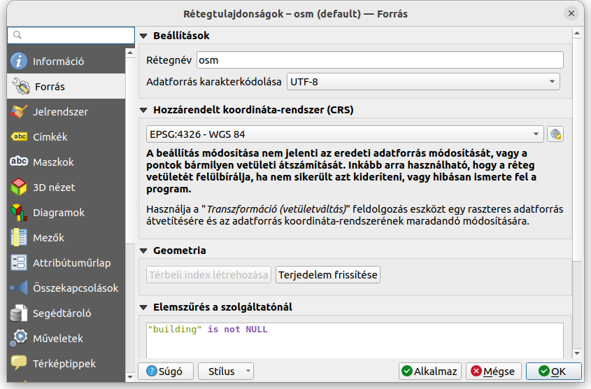
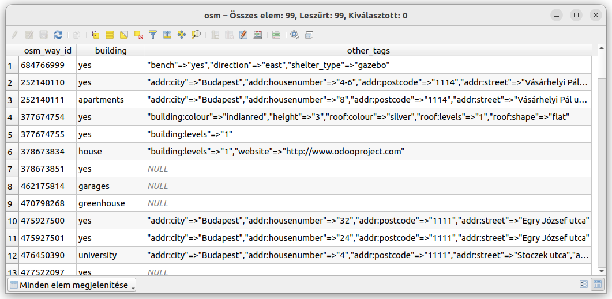

2.5D megjelenítés
=================

QGIS 3.8+

**Összeállította: dr. Siki Zoltán**

A QGIS tematikus megjelenítés egy speciális fajtája a 2.5 nézet. Ezzel 3D-s
hatást tudunk elérni a sima térkép ablakban egy magasság és egy irány
megadásával.

Használjuk az OSM adatokat, melyben az épületek többségéhez a szintek száma
ismert adat. Én a Műegyetek környékét kérdeztem le az OSM adatokból az
*OSMDownloader* modul segítségével. A modul telepítése után egy új ikon
jelenik meg az eszközeink között, mellyel egy téglalapot jelölhetünk ki az
OSM letöltéséhez. A letöltött adatokat három rétegben (pontok, törtvonalak,
felületek) és három nagyítási szintnek megfelelő tematikával jeleníti meg.
Ezen adatok közül mi csak az épületeket szeretnénk használni, melyek a
felülettel bíró elemek között találhatók.

A pontokat és vonalakat tartalmazó rétegeket kapcsoljuk ki vagy akár el is 
távolíthatjuk a projektünkből.
A felületeket tartalmazó réteget szűkítsük le csak azokra az elemekre, melyre
a *Building* OSM taget beállították, a réteg tulajdonságok ablakban a 
**Forrás** fülön az elemszűréshez írjuk be:

.. code::

    "building" is not NULL

Az OSM adatokban a *building* többnyire az épület típusára vonatkozó 
szöveges adatot találunk (pl. apartments, church, garage, hotel, stb.), de
a *yes* szó is előfordul. Az OSM és a QGIS eltérő adattárolási logikát alkalmaz. 
Az OSM nem tábláztos szerkezetet alkalmaz, minden elemhez tetszőleges
számú *teget* rendelhetünk hozzá, mely egy kulcsszóból és egy értékből áll.
Ezeket a QGIS-ben táblázatos tárolásra kell átalakítani. Bizonyos *tegeket*
az *OSMDownloader* modul oszlopokba emel ki, az össze többit pedig egy
*other_tags* nevű oszlopba teszi be *"kulcs1=>"érték1","kulcs2"=>"érték2",...*
alakban. Ezek közül mi a *buildings:levels* (szintek száma) értéket fogjuk használni.

    
A fenti ábrán látható táblázat részletből azt a következtetést vonhatjuk le,
hogy nincs minden épülethez szintek száma adat. Néhány esetben a *height*
taget is láthatunk, de ez még kevesebb esetben található meg. A tökéletes 
eredményhez az adatokat ki kellene egészítenünk.

Ezután a jelrendszer fülön a *Szabály alapú* megjelenítés helyett válasszuk
a *2.5 D* megjelenítést. A magasság mező beállításához az OSM *other_tags*
mezőjéből ki kell nyernünk a szintek számát az egyes épületek magasságának 
beállításához. Egy összetett kifejezéssel először az *other_tags* mezőben 
lévő több adat közül a *regexp_substr* fügvénnyel kivesszük a *building:levels*
mező tartalmát, majd ebből csak a szintek számát őrizzük meg a *replace* fügvénnyel,
végül megszorozzuk egy konstanssal, hogy a szintek számából magasságot kapjunk.

.. code::

    replace(regexp_substr( "other_tags", '(building:levels"=>"[0-9]+)'), 'building:levels"=>"', '') * 0.0001

A használt konstans értéke azért ilyen kicsi, mert az OSM adataink fokokban
vannak. A *Szög* határozza meg, hogy milyen irányból nézzük az épületeket.

A *Bővített* beállítások között állítsuk be a színeket, árnyékot.

A réteg tulajdonságok ablak bezárása után az épületek térhatású megjelenítését
kapjuk. Háttér rétegként még a QMS modullal az OSM térkép hozzáadtam a 
projekthez.

Az eredmény ábrán is láthatjuk, hogy nem minden épület emelkedik ki. Ennek
az  az oka, hogy a *building* vagy a *building:level* tag nincs beállítva.
Regisztráljon OSM szerkesztőnek és javítsa a hibákat!

2023. április 11.

