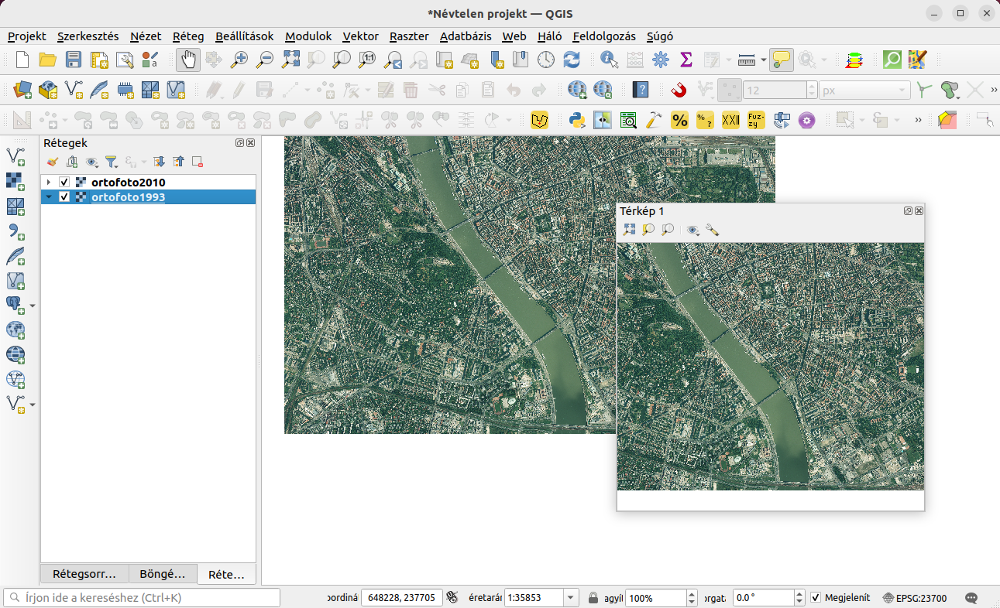
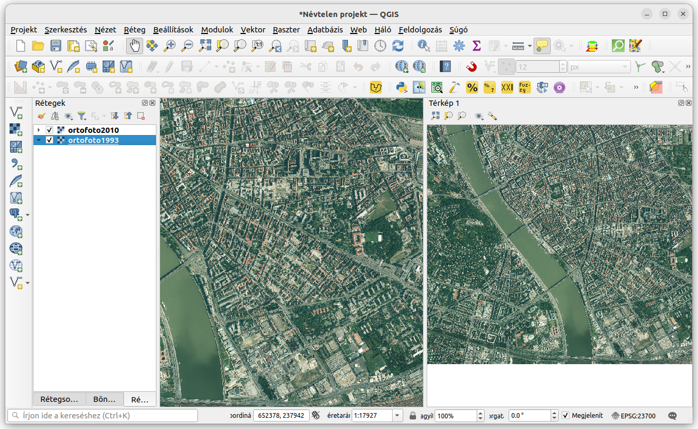
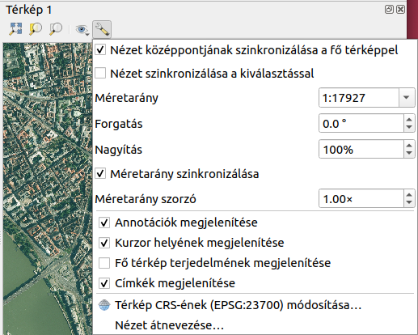
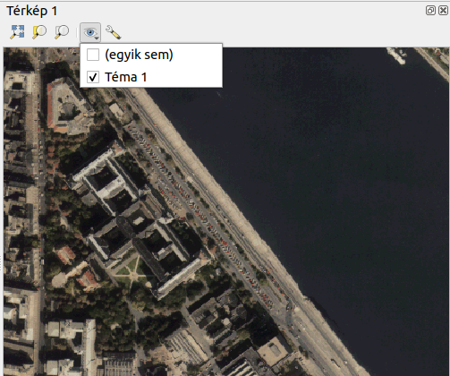
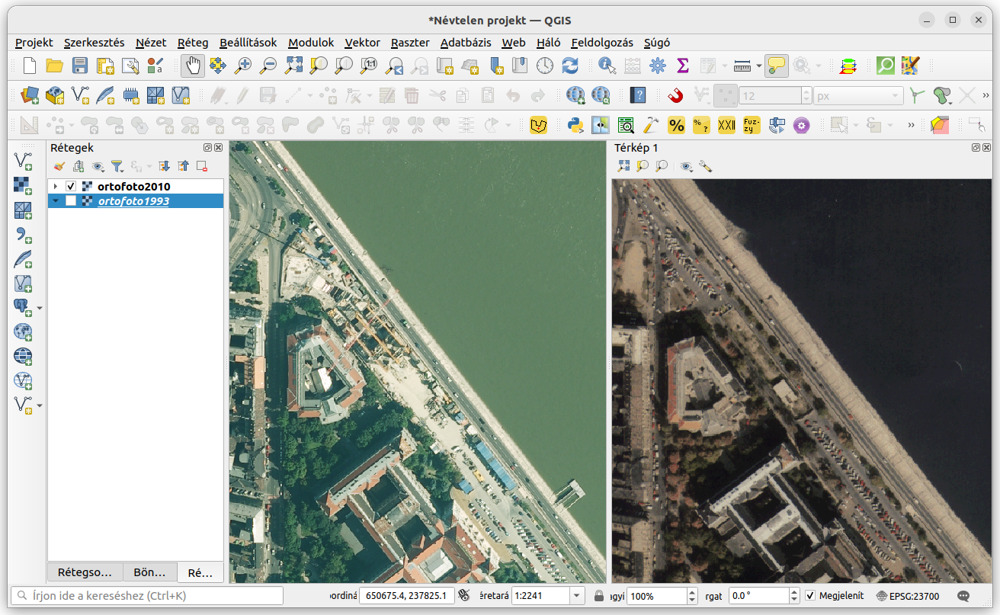

2D nézetek használata QGIS-ben
==============================

QGIS 3.8+

Összeállította: dr. Siki Zoltán

Ebben a leckében arra mutatunk példát, hogy két 2D nézetet összehangoltan 
mozgatunk, nagyítunk úgy, hogy eltérő rétegtartalmat látunk bennük.
Ez a megoldás hasonlít a `Hasznos modulok <https://github.com/OSGeoLabBp/tutorials/blob/master/hungarian/qgis/docs/useful_plugins.rst>_` 
leckében leírt *Map Swipe Tool* modulhoz.

A BME területét ábrázoló két eltérő időpontban készült ortofotót adtam a QGIS
projektemhez. A célunk az, hogy két egymás melletti 2D-s nézet ablakban
ugyanazt a területet lássuk, de az egyikben a korábbi, a másikban az újabb 
ortofotó látszódjon.

Először hozzunk létre egy második 2D-s nézetet a **Nézet/Új térkép nézet**
menüponttal. Egy *Térkép 1* új ablakot kapunk a QGIS fő ablak felett.

Mozgassuk a *Térkép 1* ablakot a fejlécét megragadva a fő ablak jobb széléhez,
hogy a "lebegő" ablakot a fő térkép ablak mellé helyezzük (dokkoljuk).

Mint a fenti képen is láthatjuk a két nézet tartalma megegyezik, a réteglistában
egyes rétegek kikapcsolása mindkét ablakra vonatkozik, a két ablak tartalma
egymástól függetlenül nagyítható, eltolható. Először állítsuk be, hogy a
*Térkép 1* ablak tartama ugyanaz legyen mint a fő ablaké, hely és nagyítás
szempontjából. A *Térkép 1* nézet beállításait módosítsuk, kattintsunk a
a *Térkép 1* nézet eszközsorában a csavarkulcsra (Nézet beállításai). 
Szinkronizáljuk a nézet középpontját és a méretarányát a fő térképpel.

A fő térkép nagyítása és eltolása a *Térkép 1* nézetet is módosítja.
**Vigyázat**, ha a Térkép 1 nézetben a nagyítást módosítjuk, azt nem követi a
fő térkép. A szinkronizált nagyításhoz visszatéréshez a **Nézet beállításai**
ablakban a méretarányt vissza kell állítani egyre!

Végül állítsuk be, hogy a két térkép nézetben eltérő rétegeket lássunk. Ehhez
új térkép témát kell létrehoznunk. Egy térkép téma a rétegek be- kikapcsolt
állapotát képes megőrízni és azt a térkép ablakokhoz hozzárendelhetjük.
Kapcsoljuk ki a felső raszter réteget.
A *Rétegek* panel eszközsorában kattintsunk
a szem ikonra (Térképtémák kezelése) és válasszuk a **Téma hozzáadása...**
menüpontot és hozzunk létre egy *Téma 1* témát.

A *Térkép 1* nézet eszközsorában is megtalálható szem ikonra kattintva
rendeljük a nézethez a létrehozott *Téma 1* témát.

Végül a fő ablakban kapcsoljuk vissza a felső raszter réteget. Ezzel 
megvalósítottuk a célunkat.

A témák segítségével több rétegre vonatkozó láthatósági beállításokat
őrizhetünk meg és sokkal változatosabb térkép megjelenítéseket érhetünk el 
az egyes térkép ablakokban.

2023. május 1.
