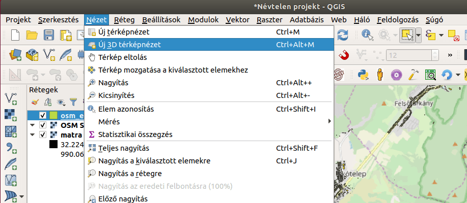
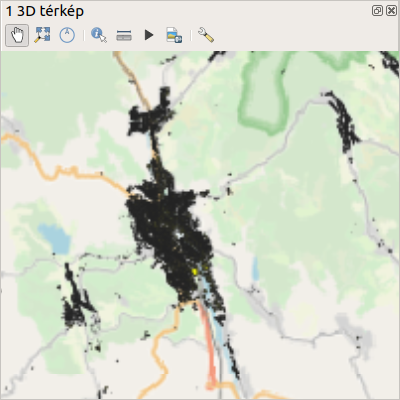
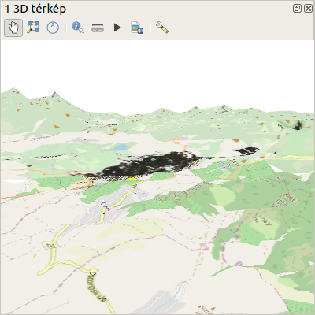
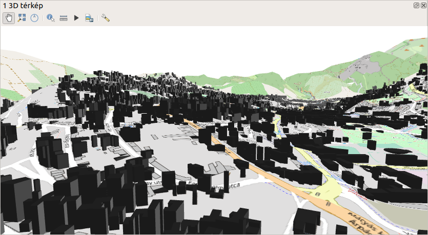

3D nézet
========

**QGIS 3.4+**

**Összeállította: Siki Zoltán**

A QGIS 3 verziójában megjelent a 3D-s megjelenítés. Egy raszter adatként tárolt DEM-re feszíthetjük rá a 2D-s rétegeinket, az épületek alaprajzaiból és az épület magasságokból LOD 1 modellt készíthetünk, cityGML modelleket is megjeleníthetünk.

A
`http://www.agt.bme.hu/ftp/foss/mo.zip <http://www.agt.bme.hu/ftp/foss/mo.zip>`_
címen található minta állományok közül a

*   matra.tif – az Északi-Középhegység egy részének domborzatmodellje (DEM)
*   osm_epulet – a DEM területése eső épületek az OSM-ből (forrás Geofabrik)

rétegeket használjuk valamint az OSM csempéit.

Hozzunk létre egy új projektet és adjuk hozzá a matra.tif, az osm_epulet
és az OSM csempéit (lásd QSM modul). A
**Nézet/Új 3D térkép nézet**
menü segítségével nyissunk egy új térkép nézet ablakot.

|3dview1_png|

A megjelenő új ablakban válasszuk ki a csavarkulcs eszközt.

|3dview3_png|

A 3d konfiguráló ablakban a terep típusát állítsuk DEM-re, a magasságok forrása legyen a
*matra*
réteg. A függőleges méretarányt növeljük meg, hogy látványosabb legyen
a domborzat. Az beállítások lezárása után a 3D nézetben az egér görgő nyomva tartásával és az egér mozgatásával dönthetjük és forgathatjuk a modellt. Az OSM csempéket a QGIS a domborzatmodellre feszíti rá.

|3dview3_png|

Az épületek függőleges kihúzásához
nyissuk meg az épületek réteg tulajdonságok ablakát. Válasszuk a
*3D nézet* fület, felül állítsuk be *Egy szimbólum*
szerinti megjelenítésre és a kihúzás értékét állítsuk a
*mag*
oszlopra. Ehhez a kihúzás mezőtől jobbra lévő ikonra kell kattintani és a
**Mező típus**
listából válasszuk a
**Mag**
oszlopot (ebben az oszlopban nem az épületek valódi magassága szerepel, hanem véletlen számmal generált értékek). Ezután a 3D nézetben az épületeket függőlegesen kihúzza a QGIS, a magasság oszlopban tárolt értéknek megfelelően.

|3dview4_png|

Budapest, 2020. február 16 .

