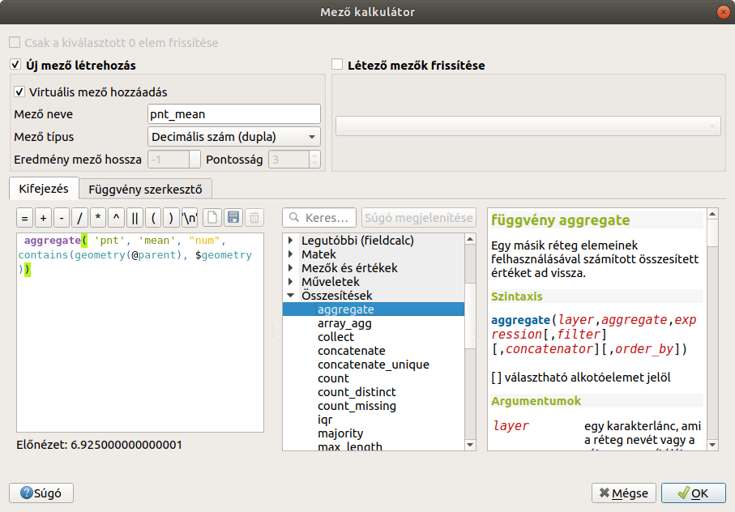
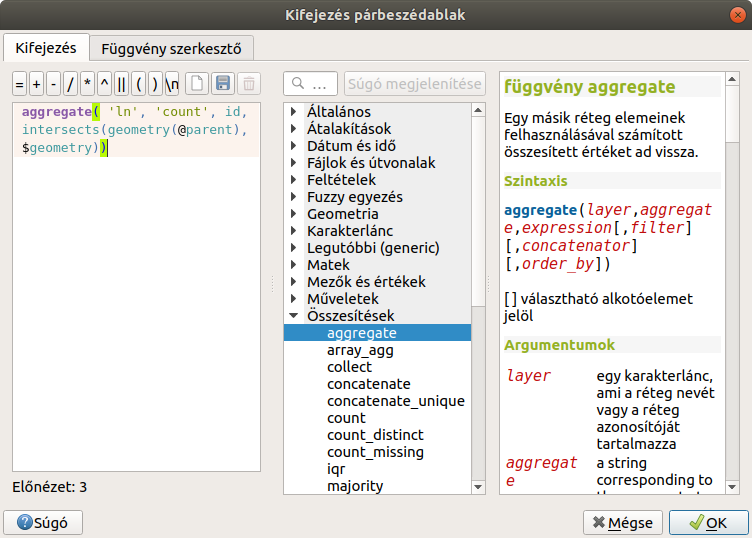
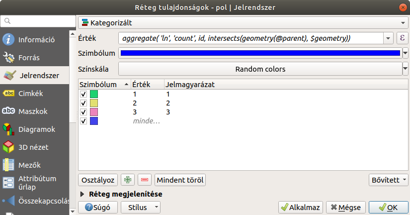
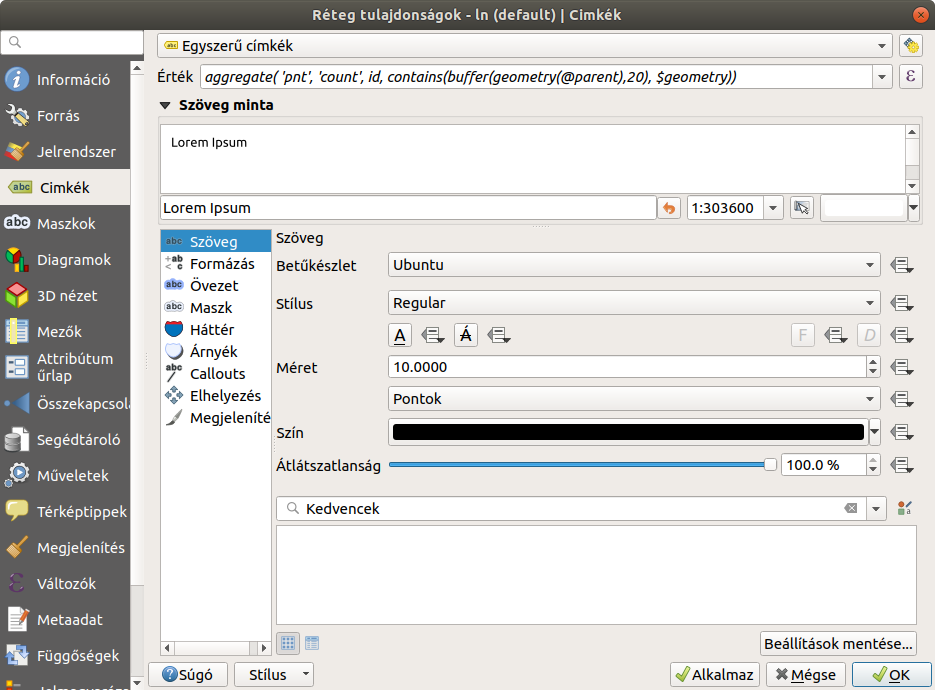
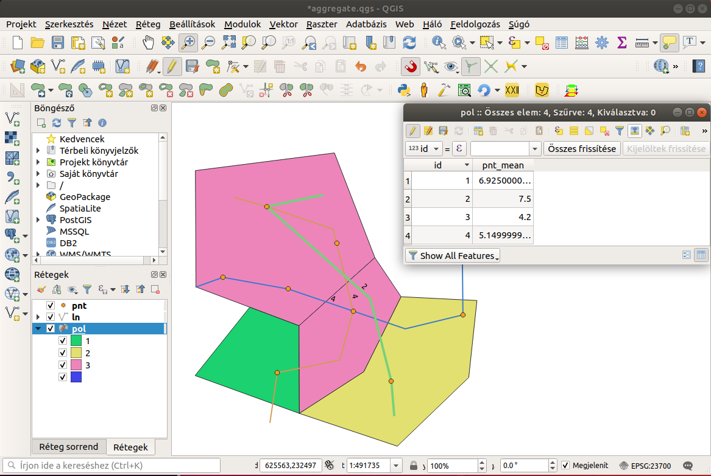

Aggregátor függvények alkalmazása a kifejezés szerkesztőben
===========================================================

**QGIS 3.x**

**Öszeállította: **dr. Siki Zoltán**

Az aggregátor függvények több adatrekordból összegyűjtött adatokból
származtatnak egy újabb adatot, ilyen például a darabszám, összeg, minimum,
maximum. Ilyeneket az SQL lekérdezésekben is alkalmazhatunk.

A QGIS kifejezés szerkesztőben az *Összesítések* csoportban találjuk az *aggregate*, *array_agg* és *relation_aggregate* függvényeket. Ebben az anyagban csak az *aggregate* függvénnyel foglalkozunk.

Az aggregate függvénnyel egy másik rétegből gyűjthetünk adatokat egy
szűrőfeltétellel. A függvény az aktuális réteg minden elemére lefut,
használhatjuk a réteg attribútumainak feltöltésére, a stílusok beállításánál
a tematikus csoportok kialakításánál, a címke feliratok előállításánál.

A függvény általános alakja:

	aggregate(réteg, agg_függvény, oszlop_kifejezés, szűrő)

A réteg neve helyett a réteg QGIS azonosítóját is megadhatjuk.
Az adatok összegyűjtésénél több mint 10 összesítő függvényt (agg_függvény)
használhatunk. A fontosabbakat összefoglaljuk:

+---------+---------------------------------+
| Név     |        Leírás                   |
+---------+---------------------------------+
| count   | Az elemek száma                 |
+---------+---------------------------------+
| min     | Minimum                         |
+---------+---------------------------------+
| max     | Maximum                         |
+---------+---------------------------------+
| mean    | Számtani közép                  |
+---------+---------------------------------+
| median  | Medián, sorrenben középső       |
+---------+---------------------------------+
| stdev   | Szórás                          |
+---------+---------------------------------+
| range   | Maximum és minimum különbsége   |
+---------+---------------------------------+

A *count* kivételével a fenti függvények numerikus adatokra használhatjuk.

A megadot oszlopot vagy kifejezés értékét gyűjti össze a függvény, melyeket
az agg_függvény kap meg. A réteg sorai közül egy szűrő feltétellel
válogathatunk. A szűrés vonatkozhat a geometriai elemre vagy az attribútumokra.
Nagyobb adatmennyiség és geometriai szűrőfeltételek esetén célszerű mindkét
rétegre térbeli indexet létrehozni (Tulajdonságok/Forrás/Térbeli index
létrehozás).

A következőben néhány példán mutatjuk be az összesítések alkalmazását. Ehhez
három réteget fogunk használni:

* pnt - pontok, attribútumok: id (egész), num (valós)
* ln - törtvonal, attribútumok: id (egész)
* pol - felületek, attribútumok: id (egész)

Virtuális oszlop feltöltése
---------------------------

Készítsünk egy virtuális oszlopot *pol* réteghez az egyes felületekbe eső *pnt*
elemek *num* oszlopának átlagával, Nyissuk meg a *pol* réteg attribútum tábláját
és válasszuk az abakusz ikont (Mező kalkulátor) és a következő kifejezést
állítsuk össze:

	aggregate('pnt', 'mean', "num", contains(geometry(@parent), $geometry))

A fenti kifejezés azt jelenti, hogy a *pol* réteg minden egyes elemére
gyűjtsük össze a *pnt* réteg azon elemeit, melyek az akuális *pol* elembe 
esnek (contains szűrő) és a *num* oszlop átlagát számítsa ki.

	Virtuális mező hozzáadása

Tematikus megjelenítés beállítása
---------------------------------

A felület réteg elemeinek megjelenítését attól függően állítsuk be, hogy az *ln*
réteg hány eleme metszi azt. A *pol* réteg Jelrendszerében állítsuk be a
*Kategorizált* megjelenítést. Az *Érték* mező jobb oldalán lévő *E* gombra
kattintva hozzuk elő a kifejezés szerkesztőt és a következő kifejezést
állítsuk össze:

	 aggregate( 'ln', 'count', id, intersects(geometry(@parent), $geometry))	

	Metsző elemek összeszámolása

Ezután az osztályozással hozzuk létre a tematikus csoportokat:

	Tematikus csoportok a számított érték alapján

Címkefelirat a közelben lévő pontok számával
--------------------------------------------

A vonalas réteghez állítsunk be címke feliratokat, melyek a vonal 20 méteres
közelében található pontok számát tartalmazza. Az *ln* réteg tulajdonságait
megnyitva válasszuk a Címkék fület. Állítsuk be az egyszerű címkézést és az
érték mező jobb oldalán található *E* gombot megnyomva a következő kifejezést
vigyük be:

	aggregate('pnt', 'count', id, contains(buffer(geometry(@parent),20), $geometry))

A fenti kifejezésben annyiban bővült az eddigiekhez képest, hogy vonalas
réteg elemeihez egy 20 méteres zónát készítettünk, a beleesés vizsgálatához.

	Címke felirat beállítás

	Az eredmény
