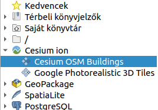
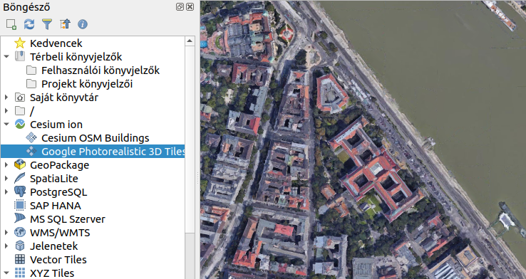
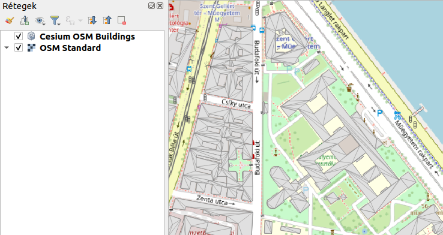
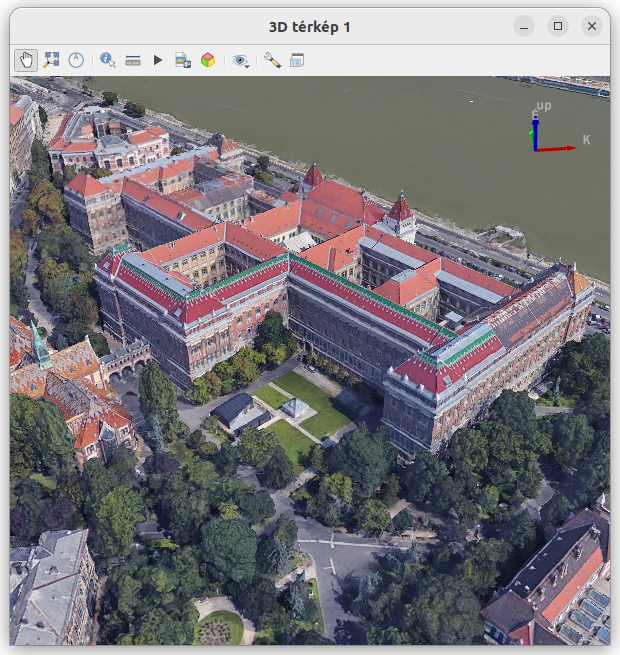
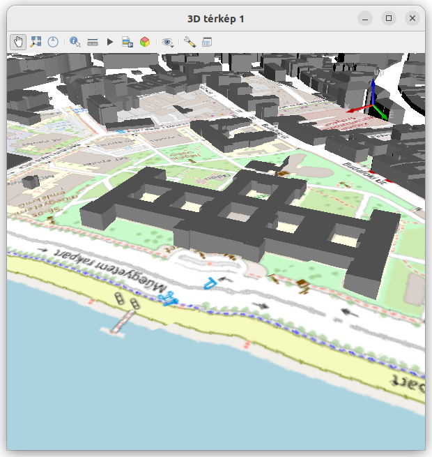

Cesium ion modul
================
QGIS 3.34 verzió

Összeállította: Siki Zoltán

.. note::

   Az anyag elkészítéséhez a következő videót használtam fel:
   https://www.youtube.com/watch?v=-xRTlj7aj7w&t=25s

A Cesium 3D csempék megjelenítésére kidolgozott program. A Cesium ion modul 
lehetővé teszi az interneten elérhető 3D csempék megjelenítését a QGIS-ben
a 3.34 verziótól.

Az alkalmazás feltételei
------------------------

Egy ingyenes regisztráció szükséges az ion.esium.com oldalon.

A QGIS-ben be kell állítani egy hitelesítési mester jelszót, mert a Cesium ion
a QGIS hitelesítési adatbázis használja.
Ha eddig nem hozott létre mester jelszót, akkor a Cesium ion telepítése után.

.. note::

    Vigyázat az elfelejtett mester jelszó esetén nincs lehetőség a 
    hitelesítési adatok eléréséhez csak az összes hitelesítés törlésére
    a jelszó háromszori hibás megadása esetén. Ezután új jelszót adhat meg.

A modul telepítése
------------------

A szokásos módon telepítse a Cesium ion modult a hivatalos QGIS modul tárházból.
A modul telepítése után, ha hitelesítési probléma lenne, akkor egy üzenet 
jelenik meg a térképvászon felett, ahonnan elérheti a hitelesítés adatokat és 
beállíthat egy mester jelszót.

A modul használata
------------------

Az adatforgalom csökkentése érdekében az aktuális projektjében állítsa be azt
a terjedelmet, melyben a 3D csempéket használni szeretné. Ezt a
**Projekt/Tulajdonságok** menüpont kiválasztása után a **Nézet beállításai**
fülön teheti meg. Minél kisebb területet állít be, annál hatékonyabb lesz a
3D adatok megjelenítése.

A Cesium ion modul telepítés után a QGIS böngésző panelben megjelenik a
*Cesium ion* csomópont, melynek első kibontásakor a QGIS hozzájárulást kér a
Cesium ion eléréséhez, ezt engedélyezze (Allow gomb).

Ezután legalább két elem jelenik meg a böngészőben a Cesium ion alatt:

- Cesium OSM Buildings
- Google Photorealistic 3D Tiles

Húzza be a térkép vászonra az önnek megfelelő témát. Ezután a Cesium token 
kiválasztás ablak jelenik meg. Ebben válassza az létező token használatát
(Use existing token), az alaértelmezett tokennel (Default token). Ezután
indul el a kijelölt terjedelemre az adatok letöltése (a terület nagyságától 
függően ez hosszabb időt vehet igénybe. A 2D nézetben csak egy felülnézetet
kapunk.

Nyissunk meg egy 3D nézetet a QGIS-ben és élvezzük a 3D-s látványt!

A zökkenőmentes megjelenítés érdekében várhatóan meg kell növelnie a
**Beállítások/Beállítások** menüpont kiválasztása után a **3D** fülön a
térképrétegenként engedélyezett memória méretét, ennek alacson volta esetén a 
QGIS figyelmeztetést küld.

Saját 3D csempék használata
---------------------------

Az interneten elérhető 3D csempe szolgáltatások adatait a Cesium ion modul 
nélkül is meg lehet jeleníteni. Az Adatforrás-kezelőben (**Réteg/Adatforrás kezelő** a menüből) a *Jelenet* fület válassza ki (A *Jelenetek* megtalálható a
böngésző panelen is). Egy új 3D csempe szolgáltatáshoz egy URL szükséges és
ehhez tartozó tetszőleges megnevezés.

Két nyilvános 3D csempe szolgáltatás URL-je:

- Melbourne https://vic.digitaltwin.terria.io/api/v0/data/038d699f-9167-4dbc-9920-cb9b2c24786c/v2/tileset.json
- Sunshine Coast https://qld.digitaltwin.terria.io/api/v0/data/6af0925e-e8dc-496f-b5b5-496b39862ec7/3DTiles_UM_Maroochydore_17/tileset.json

Fényképekből az ODM illetve WebODM programmal is létrehozhatunk saját 3D 
csempéket.

Budapest, 2023.11.18.
