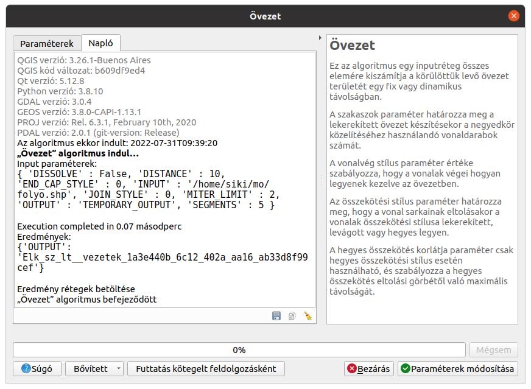

QGIS használata parancssorból
=============================
3.14+ verzió

Összeállította: Siki Zoltán

A grafikus felhasználói interfészek (GUI), mellyel a QGIS felhasználók először
találkoznak, nem ideálisak előre tervezhető, többször megismétlendő 
műveletsorok végrehajtására. Az emberek gyakran hibáznak, elgépelik egy
paraméter értékét vagy nem a megfelelő sorrendben alkalmazzák a lépéseket.
Ezeken a problémákon átléphetünk saját feldolgozó modul készítésével a
Feldolgozás menüben található Grafikus modellezőjével vagy a Python konzolból
futtatható Python szkripttel. Azonban ezekben az esetekben is a felhasználónak
el kell indítania a QGIS, a megfelelő menüpontra kell kattintania, stb.

A QGIS újabb verzióiban egy külön parancssori programot hoztak létre 
*qgis_process* névvel, a teljes automatizálás megvalósítására. A *qgis_process*
segítségével a parancssorból használhatjuk a Feldolgozás eszköztár elemeit,
szkripteket illetve a Grafikus modellezőben létrehozott modelljeinket.

A qgis_process elindítása
-------------------------

Különböző operáciős rendszereken (Linux, Windows) kicsit eltérő módon kell 
elindítani a parancssori feldolgozást.

Linux
~~~~~

A *qgis_process* parancs a QGIS telepítése után bekerül a rendszer PATH-ban
szereplő könyvtárba, így a parancsot csak be kell írni egy terminál ablakba.

.. code bash::

    qgis_process

Windows
~~~~~~~

Windows-os telepítő egy *qgis_process-qgis.bat* vagy 
*qgis_process-qgis-ltr.bat* fájlt tesz fel a gépünkre. Ezeket OSGeo4W telepítő
használata esetén a *c:\\OSGeo4W\\bin* könyvtárban találhatjuk meg. Ez a 
parancsfájl a futtatáshoz szükséges környzete is beállítja (PATH, 
környezeti változók).

Paraméterek nélkül kiadva a prancsot a használatra vonatkozó segítséget
kapunk, ugyanezt kapjuk, ha a -h vagy --help kapcsolót használjuk.

.. code bash::

    QGIS Processing Executor - 3.26.1-Buenos Aires 'Buenos Aires' (3.26.1-Buenos Aires)
    Usage: /usr/bin/qgis_process.bin [--help] [--version] [--json] [--verbose] [--no-python] [command] [algorithm id, path to model file, or path to Python script] [parameters]

    Options:
        --help or -h		Output the help
        --version or -v		Output all versions related to QGIS Process
        --json		Output results as JSON objects
        --verbose	Output verbose logs
        --no-python	Disable Python support (results in faster startup)
    Available commands:
        plugins		list available and active plugins
        plugins enable	enables an installed plugin. The plugin name must be specified, e.g. "plugins enable cartography_tools"
        plugins disable	disables an installed plugin. The plugin name must be specified, e.g. "plugins disable cartography_tools"
        list		list all available processing algorithms
        help		show help for an algorithm. The algorithm id or a path to a model file must be specified.
        run		runs an algorithm. The algorithm id or a path to a model file and parameter values must be specified. Parameter values are specified after -- with PARAMETER=VALUE syntax. Ordered list values for a parameter can be created by specifying the parameter multiple times, e.g. --LAYERS=layer1.shp --LAYERS=layer2.shp
                Alternatively, a '-' character in place of the parameters argument indicates that the parameters should be read from STDIN as a JSON object. The JSON should be structured as a map containing at least the "inputs" key specifying a map of input parameter values. This implies the --json option for output as a JSON object.
                If required, the ellipsoid to use for distance and area calculations can be specified via the "--ELLIPSOID=name" argument.
                If required, an existing QGIS project to use during the algorithm execution can be specified via the "--PROJECT_PATH=path" argument.

A parancssorban kapcsolókat (- vagy -- karakterrel kezdődő), parancsot és annak 
paramétereit adhatjuk meg.

A kapcsolók:

* **--help** vagy **-h** a fenti segítő üzenetet adja
* **--version** vagy **-v** a QGIS feldolgozáshoz kapcsolódó verziószámokat írja ki (többek között QGIS, Qt, Python, GDAL, stb. verziókat)
* **--json** eredmények JSON objektumként kapjuk meg
* **--verbose** részletes napló outputot kapunk
* **--no-python** letiltja a Python támogatást (gyorsabb indítást eredményez)

A parancsok:

* **plugins** az elérhető modulok listája, melyek a feldolgozás szolgáltatót implementálják
* **plugins enable** *modul_név* engedélyez egy telepített modult, pl. plugins enable grassprovider
* **plugins disable** *modul_név* letilt egy telepített modult, pl. plugins disable otbprovider
* **list** kilistázza az összes elérhető feldolgozás algoritmust
* **help** *id* vagy *path* A megadott algoritmus vagy modell súgóját listázza, pl. help qgis:boxplot
* **run** *id* vagy *path* a megadott algoritmust fájlt futtatja, utána az algoritmus paramétereit lehet megadni --PARAMETER=VALUE formában, pl. run native:buffer --INPUT=/home/siki/mo/folyo.shp --DISTANCE=1000 --OUTPUT=/home/siki/mo/folyo_buf.shp

Az egyes feldolgozás algoritmusok paramétereit legegyszerűbben a feldolgozás
eszköztárban futtatás után a *Napló* fülön találhatjuk meg (input paraméterek) 
illetve a **Feldolgozás/Előzmények** menüpontban. Az utóbbi esetben az 
algoritmus azonosítóját is láthatjuk a paraméterekkel együtt. A legkényelmesebb 
megoldás az algoritmus ablak alsó részén található **Bővített** lista lenyitása
és a **Másolás qgis_process parancsként** elem kiválasztása és terminál ablakba
bemásolása (ez a lehetőség 3.24+ verziókban érhető el).
Nem  minden paraméter megadása kötelező, elhagyásuk esetén az alapértelmezett
értékeket használ az algoritmus.

|cli_1_png|

Néhány egyszerű példa
---------------------

Övezet generálás:

.. code:: bash

    qgis_process run qgis:buffer --INPUT=/home/siki/mo/folyo.shp --DISTANCE=1000 --OUTPUT=/home/siki/mo/folyo_buf.shp

vagy rövidebben:

.. code:: bash

    qgis_process run qgis:buffer -- INPUT=/home/siki/mo/folyo.shp DISTANCE=1000 OUTPUT=/home/siki/mo/folyo_buf.shp

Új mező hozzáadása az attribútum táblához:

.. code:: bash

    qgis_process run native:addfieldtoattributestable --INPUT=/home/siki/mo/folyo.shp --FIELD_NAME=hossz --FIELD_TYPE=0 --FIELD_LENGTH=6 --FIELD_PRECISION=0 --OUTPUT=/home/siki/mo/folyo_hsz.shp

Mező kalkulátor használata:

.. code:: bash

    qgis_process run native:fieldcalculator --INPUT=/home/siki/mo/folyo_hsz.shp --FIELD_NAME=hossz --FIELD_TYPE=1 --FIELD_LENGTH=6 --FIELD_PRECISION=0 --FORMULA='$length' --OUTPUT=/home/siki/mo/folyo_hsz1.shp

Statisztika egy mezőre:

.. code:: bash

    qgis_process run qgis:basicstatisticsforfields --INPUT_LAYER=/home/siki/mo/folyo_hsz1.shp --FIELD_NAME=hossz --OUTPUT_HTML_FILE=/home/siki/mo/stat.html

