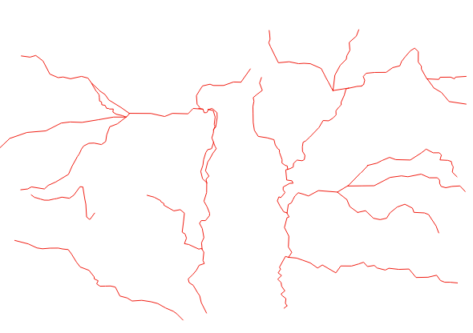
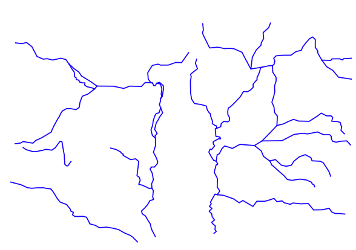
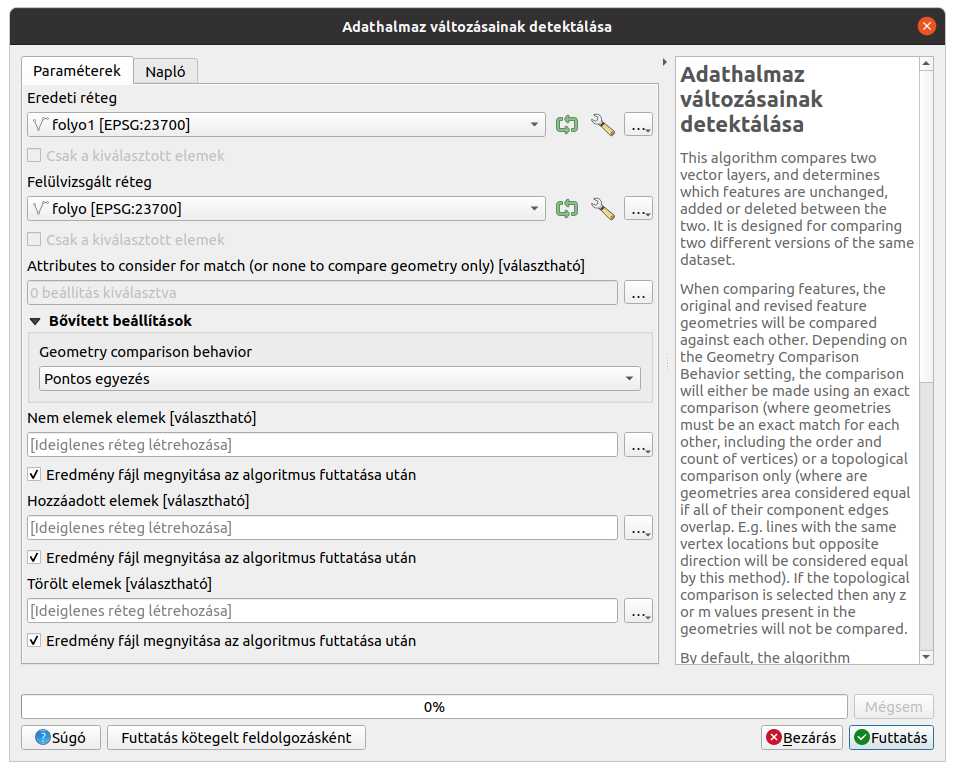
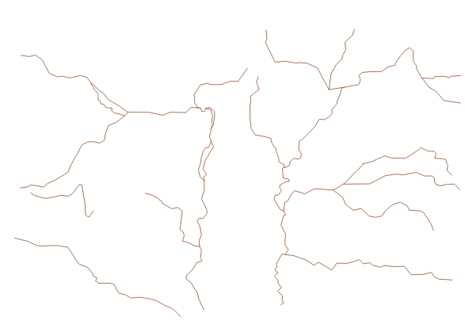
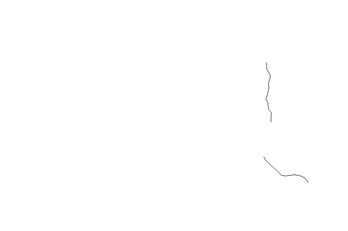
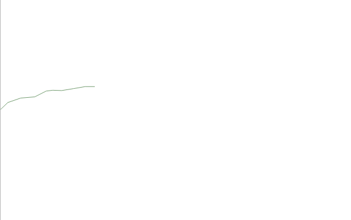

Réteg különböző verzióinak összehasonlítása
===========================================

**QGIS 3.4+**

**Összeállította: Siki Zoltán**

Gyakran előfordulhat, hogy nem sikerül jól szervezni az egyes rétegek 
karbantartását, aktualizálását. A réteg két másolatán egymástól függetlenül 
szerkesztenek. Amikor ezzel a helyzettel szembesülünk szeretnénk megtudni, hogy hol vannak eltérések a két változt között, illetve elkezdhetünk gondolkozni,
hogy PostGIS adatbázist használhatnánk.

A Feldolgozás eszköztár *Vektor általános* csoportja tartalmaz egy 
*Adathalmaz változásainak detektálása* elemet, melyet az eltérések kimutatására 
használhatunk.

Az eredeti és a felülvizsgált réteg kiválasztása után az összehasonlítandó
attribútumokat állítsuk be a három pontra kattintva (alapértelmezésben az 
összes attribútumot beállítja az eljárás). Ha csak a geometriákat akarjuk
összehasonlítani, akkor ne válasszon ki egyetlen attribútumot sem.

Az összehasonlítás viselkedés lehet pontos egyezés vagy toleráns topológiai 
egyezés, ebben az esetben például a töréspontok sorrendje lehet fordított.

Három eredmény fájlt hoz létre az algoritmus. Az első a nem változott elemeket,
a második a új elemeket, a harmadik a törölt elemeket tartalmazza.

Nézzünk egy egyszerű példát a folyó réteg két verziójának összehasonlítására.

Az eredeti réteg:

|layer_comp1_png|

A módosult réteg:

|layer_com2_png|

A beállítások:

|layer_comp3_png|

Nem változott elemek:

|layer_comp4_png|

Hozzáadott elemek:

|layer_comp5_png|

Törölt elemek:

|layer_comp6_png|

