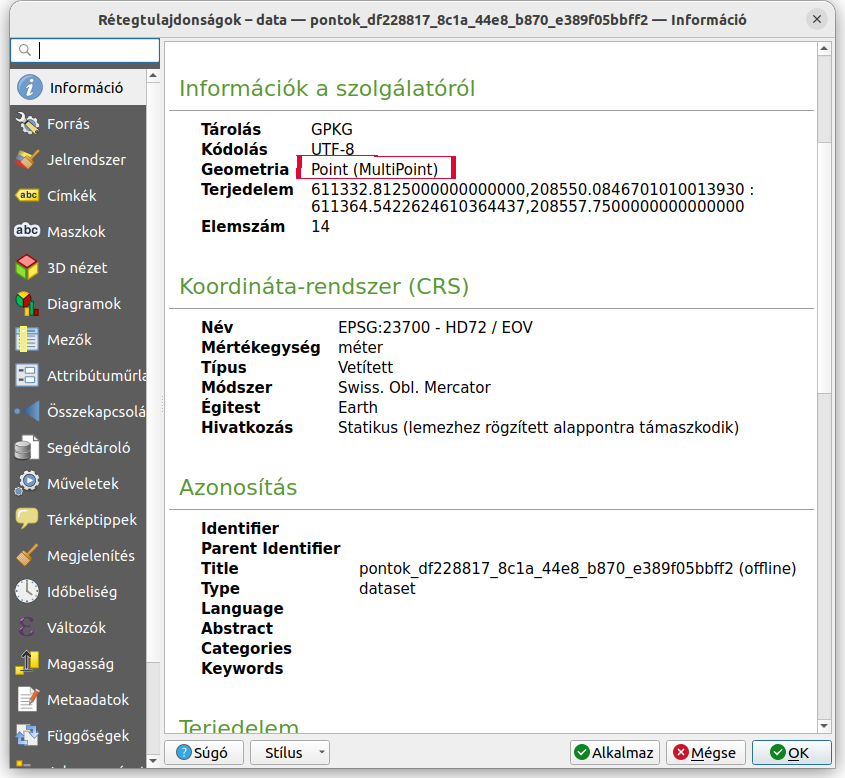
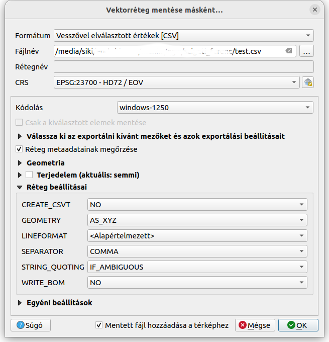

Pont koordináták kinyerése egy szövegfájlba
===========================================

QGIS 3.4+ verzió

**Összeállította: dr. Siki Zoltán**

Ebben az anyagban a koordináták kinyerését mutatjuk be egy pont rétegből egy 
szöveges fájlba.

Először győződjünk meg róla, hogy egyszerű (nem többrészű) rétegről van szó,
a réteg tulajdonságok ablakban (jobb egérgomb a réteg nevén és Tulajdonságok 
a megjelenő menüből).

|coord_list1_png|

Többrészű elemeket tartalmazó réteg esetén alakítsuk át egyrészűvé, a
**Vektor/Geometriai eszközök/Többrészűből egyrészűekbe**  menüponttal.

A pontokat tartalmazó réteget exportáljuk CSV fájlba. A réteg nevére kattintson
jobb egérgombbal és a megjelenő menüből válassza az **Exportálás/Elemek mentése
másként** menüpontot. A megjelenő párbeszédablakban a *Formátumot* állítsa 
*Vesszővel elválaszott értékek [CSV]*-re. Jelölje ki a mentendő fájl helyét és
nevét a *Fájlnév* mezőben. A *Réteg beállításai* között válassza ki a
*GEOMETRY* mezőben az *AS_XY* vagy 3D-s esetben az *AS_XYZ* opciót.

|coord_list2_png|

Az OK gomb megnyomása után létjövő CSV fájlban a réteg attribútumai is
belekerülnek. Az első sorba az oszlopok neve kerül.

.. code:: txt

    X,Y,Z,fid,id
    611335.669663198,208552.051985392,0,"55",
    611337.653519143,208555.493107475,0,"57",
    611343.113216245,208556.793035356,0,"60",
    611337.653519143,208555.493107475,0,"61",
    611364.542262461,208550.084670101,0,"69",

