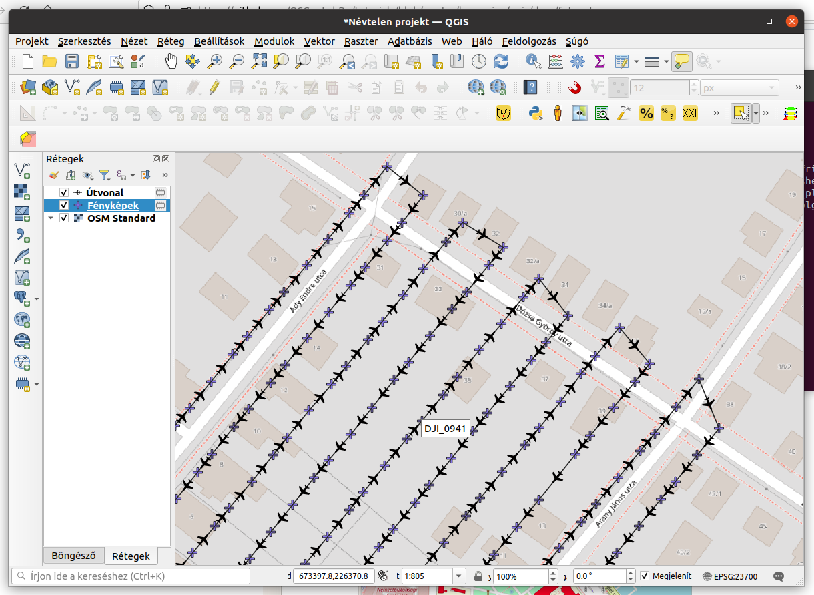

Geotag-gel rendelkező képek kezelése
====================================

QGIS 3.x
--------

A mobiltelefonunkkal és UAV-vel (drónnal) is készíthetünk geotag-gel 
ellátott képeket. A geotag a JPG képekben tárolt EXIF (Exchangeable Image File)
információban található pozíciót jelenti. Ez alapján a kép készítés helyét a
térképen megjeleníthetjük. Amennyiben a kamerában további szenzorok is
rendelkezésre állnak, akkor akár a fényképezés irányát is kiolvashatjuk
az EXIF információkból.

A QGIS Feldolgozás eszköztárban található *Geolokalizált fotó import* 
segítségével egy könyvtárban találató minden képet betölthetünk.

|uav1_png|

A megjelenő párbeszédablakban elegendő az *input mappa* megadása és a
**futtatás** gomb megnyomása.

|uav2_png|

A *fényképek* rétegre kerülnek a fénykép készítés pozíciói, mint pontok.

Amennyiben az egymásutáni képeket szeretné összekötni, akkor használja
a Feldolgozás eszköztárból a *Pontok útvonallá algoritmust*.

|uav3_png|

Egyszerű esetben a fényképek réteg meadása elegendő a pontok összekötéséhez.

|uav4_png|

A fényképek réteg attribútum táblájában a koordináták mellett megtalálhatók a
képek elérési útjai is. A képek megjelenítéséhez nézze meg a 
`Fényképek megjelenítése a térképi elemekhez <https://github.com/OSGeoLabBp/tutorials/blob/master/hungarian/qgis/docs/foto.rst>`_ tananyagot.

|uav5_png|

.. |uav1_png| image:: images/uav1.png
    :width: 5.0cm
    :height: 3.0cm

