QGIS domborzat modellezés
=========================

3.4+ verzió

Összeállította: dr. Siki Zoltán

A QGIS számos funkciót kínál domborzat modellek létrehozására, elemzésére és
megjelenítésére. Alapvetően szabályos négyzetrácsban elrendezett modellek

A munka során egy egyszerű ki állománnyal dolgozunk, mely szórt pontokat
(points réteg) és idomvonalak (break_lines réteg) tartalmaz, a rétegek a 
`topo.gpkg <data/topo.gpkg>`_ Geopackage állományban találhatók. A két réteget
adja hozzá egy 
üres QGIS projekthez. Az idomvonlak (break_lines réteg) vannak völgyvonalak és
hátvonalak, a hátvonalak megjelenítését állítsa szaggatott vonalra.

Rács alapú domborzatmodell létrehozása
--------------------------------------

A domborzat felmérések eredménye általában nem szabályos négyzetrácsba 
elrendezve áll rendelkezésünkre. Szabálytalan elrendezésű pontokból, törés és
idomvonalakból indulhatunk ki. A QGIS Feldolgozás modulban több algoritmust
találhatunk erre a célra a QGIS, a GRASS és a SAGA csoportban. Itt most csak 

Inverz távolság interpláció
~~~~~~~~~~~~~~~~~~~~~~~~~~~

Az inverz távolság súlyozás (IDW) eljárás egy pont magasságát a környezetében
található pontok magasságából egy súlyozott átlaggal számítja ki. A súly a
távolsággal hatványával fordítottan arányos. Általában a második hatványt
használják (távolság négyzet reciproka).

Hozzuk létre az első DTM-t. Az IDW interpoláció ablakban állítsuk be a
következőket:

|dtm1_png|

A **Futtatás** gomb megnyomása után egy új ideiglenes réteget kapunk a QGIS
projektünkben. Az egysávos álszínes megjelenítés eredménye az alábbi ábrán
látható.

|dtm2.png|

Vegyük észre, hogy egye pontok körök alakultak ki, ez jellemző az IDW
interpolációra, ha a támpontok sűrűségéhez képest jóval sűrűbb rácsot
vezetünk le, illetve akkor, ha a támpontok sűrűsége nagyon változatos a
területen.

A TIN interpoláció
~~~~~~~~~~~~~~~~~~

A TIN interpoláció algoritmus párbeszédablakába a következőket állítsa be:

|dtm3_png|

A TIN interpoláció egy szabálytalam háromszögrács hálózatban (TIN) interpolál
lineárisan vagy harmadfokúan. Az eredményben kevésbé jelennek meg az IDW-nél 
látható. A háromszögrács létrehozásánál külön kényszerként figyelembevette az
algoritmus az idomvonalakat, azaz a rács interpolálásnál egy idomvonal két
oldaláról nem használ fel pontokat. A TIN interpolációnál beállíthatja, hogy 
külön rétegbe mentse el a háromszögeket (háromszögelés [választható]).

|dtm4_png|

A TIN interpoláció kedvezőbb eredményt ad, ha idomvonalakat kell figyelembe
venni, illetve, ha a támpontok sűrűsége nagyon egyenetlen.
Az IDW és TIN interpoláció eredménye a terjedelmében is különbözik. Az IDW
extrapolál és a megadott tartomány teljes területére interpolál/extrapolál, a
TIN a létrehozott háromszögeken kívül nem extrapolál, oda *nincs adat* értéket 
tesz be (ez általában -9999, a rétegtulajdonságok információ fülén találhatja
meg a *nincs adat* konkrét értékét).

Ha későbbi felhasználás érdekében célszerű a létrehozott DEM-et elmenteni.
Ennek elsődleges formája a TIF formátum, de tucatnál több formátumba
exportálhatja a rácsot.

Szintvonalak generálása
-----------------------

A QGIS a szintvonalakat a GDAL modul segítségével generálja. A 
rétegtulajdonságok információ fülén megtalálhatjuk, hogy a magasságok
85 és 115 méter között változnak. A Feldolgozás eszköztárban egy 
*Szintvonal* és egy *Szintvonalak* algoritmus is található. A *Szintvonal*
vonalas elemek generál az azonos magasságú pontokból, míg a 
*Szintvonalak* terület elemeket generál. Használjuk a vonalakat generáló
algoritmust 2.5 méteres szintvonalközzel:

|dtm5_png|

A generált szintvonalak kicsit szögletesek a szabadkézzel rajzoltakhoz
képest. Manapság, ha digitálisan dolgozunk a domborzattal, akkor nincs 
szükség szintvonalakra.

|dtm6_png|

Metszet készítés
----------------

A metszet készítésre egy külső modul használható a QGIS-ben.
A **Modulok/Modulok kezelése és telepítése** menüpont segítségével telepítse
a *Profile Tool* modult. Válassza ki az eszközsorban megjelenő zöld színű,
metszetet ábrázoló ikont. A térkép alatt egy új panel jelenik meg. Az
aktív réteg legyen a TIN interpolációval létrehozott domborzatmodell. Az 
**Add layer** gombbal adjunk egy új réteget a jobb oldali listához. A 
*Selection* listából az ideiglenes törtvonalat válasszuk (*Temporary 
polyline*). Ezután az egérrel kattintva kijelölhetjük a metszetet több
törésponttal. A pontok megadását dupla kattintással fejezheti be. A
metszet a panel ablakban jelenik meg, melyet PNG, SVG és DXF formátumban is
elmenthetünk. A metszetben a magasság mellett a lejtőszöget vagy a 
lejtő százalék értéket is megjeleníthetjük.

|dtm7_png|

Lejtőkategória és kitettség
---------------------------

A DEM-ből letőkategória térképet generálhatunk a Feldolgozás eszköztár
*Lejtőszög* algoritmusával. Az algoritmushoz tartozó párbeszédablkaban
csak a DEM réteg nevét kell kiválasztanunk. 

|dtm8_png|

Az eredmény rétegben a cellákhoz a lejtőszög értékét írja be a program fokokban.

A kitettség a lejtő irányának az északi iránnyal bezárt szögét állítja elő. A
*Kitettség* algoritmust a Feldolgozás eszköztárban találhatjuk meg szintén.
A párbeszédablakban itt is csak a DEM réteg nevét kell megadnunk. Az eredmény
rétegbe itt is fokokba kerül be a szög.
A lejtőszög és a kitettség segítségével könnyen megtalálhatjuk a szőlő 
termesztéshez ideális területeket, ahol a lejtőszög 5-10 fok között van és
közel déli lejtésű a terület (kitettség 135-225 fok között). A fenti 
feltételeket a **Raszter kalkulátorban** adhatjuk meg.

|dtm9_png|

Az eredmény raszter rétegbe 1 érték kerül a feltételeket kielégítő 
rácspontokba és 0 a nem megfelelőekbe.

|dtm10_png|

Térfogatszámítás
----------------

A DEM és egy alapszínt közötti térfogatot számíthatjuk ki a Feldolgozás
eszköztárban található *Raszter térfogat* algoritmus segítségével.
Számítsuk ki a DEM alatti 80 méter feletti térfogatot.

|dtm11_png|

A számítás eredményét a *Napló* fülön találjuk meg: 1571890 m3.

Két domborzatmodell közötti térfogatot is meghatározhatjuk, ha azok kiterjedése
azonos és a felbontást is célszerű azonosra felvenni. Az azonos kiterjedést egy maszk réteg létrehozásával és a **Raszter/Kivonat/Raszter vágás maszk réteggel**
menüpont alkalmazásával érhetjük el. A két azonos kiterjedésű domborzat modell 
közötti különbséget képezzük a **Raszter/Raszter kalkulátor** menüponttal.
A különbség modellt szintén megjeleníthetjük és megjelenítve azt láthatóvá
tehetjük a töltés, véltozatlan és bevágás területeket, ha a negatív, a nulla
közeli és a pozitív értékeket eltérő színekkel jelenítjük meg.
A bevágások és töltések térfogatát a különbség modellből a nulla szint felettei
és alatti térfogatok külön-külön kiszámításával kaphatjuk meg (Raszter
térfogat a Feldolgozás eszköztárból).

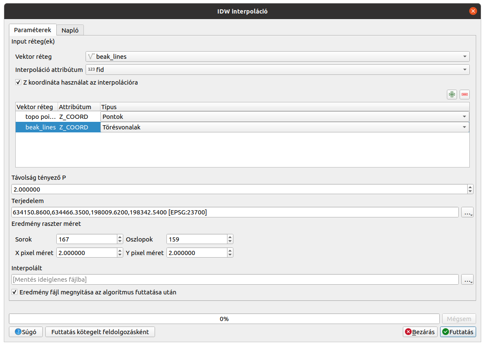

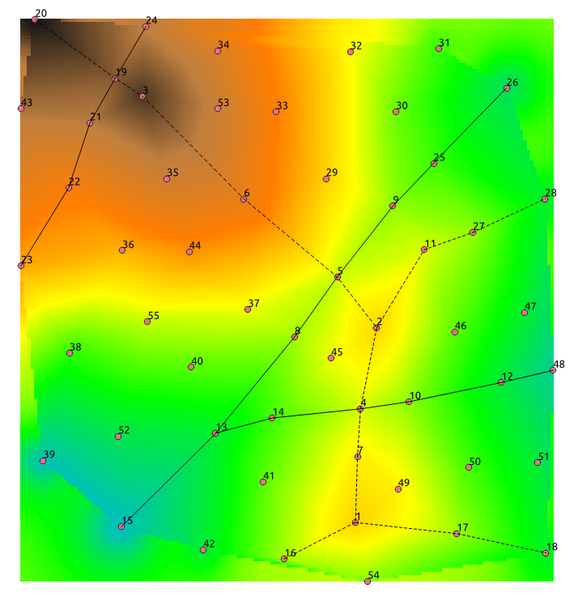

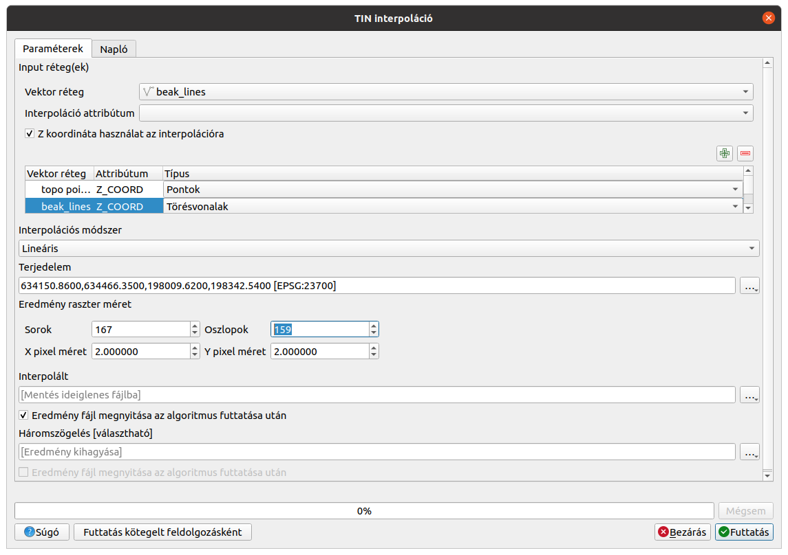

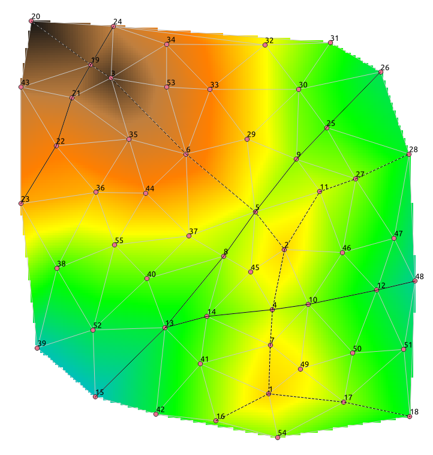

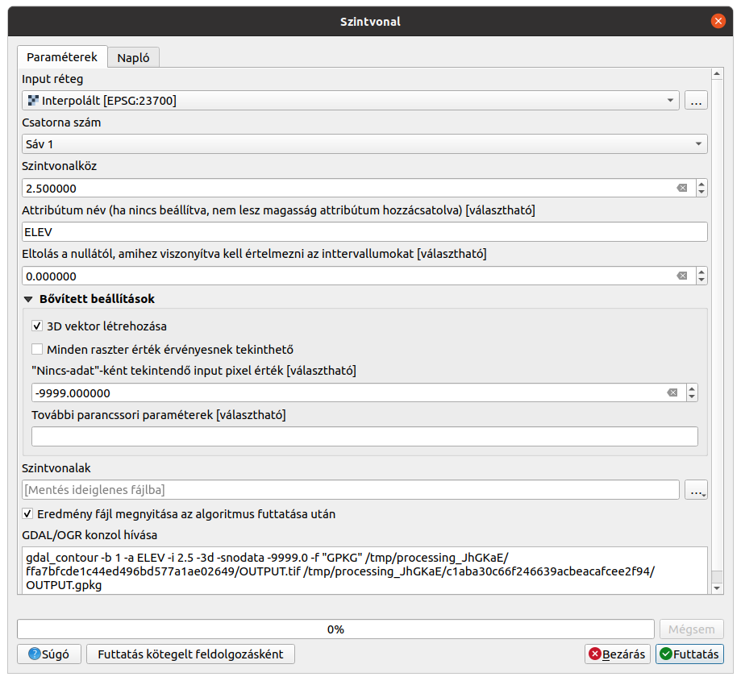

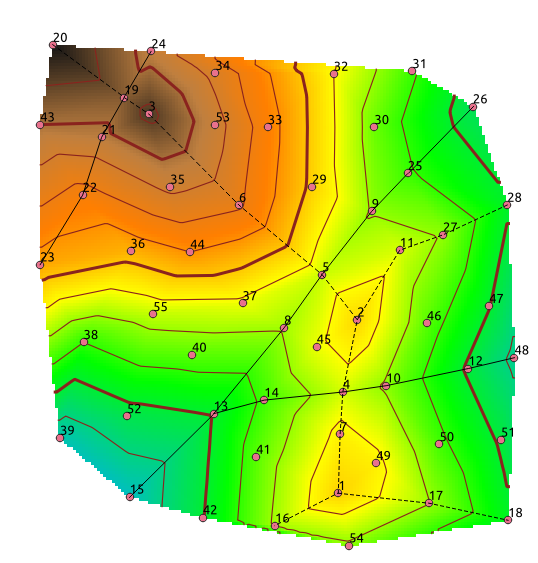

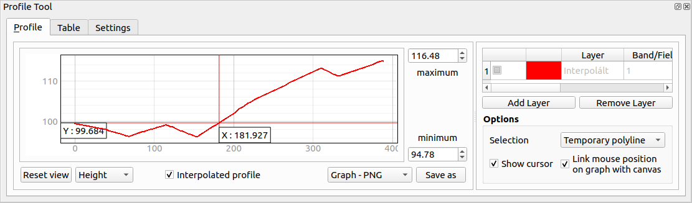

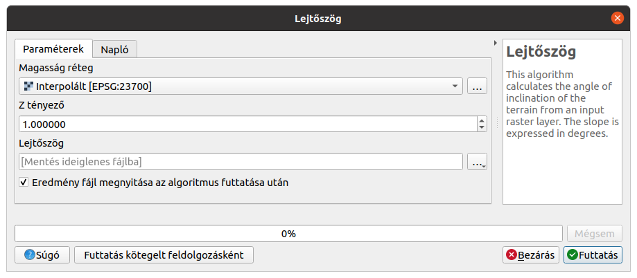

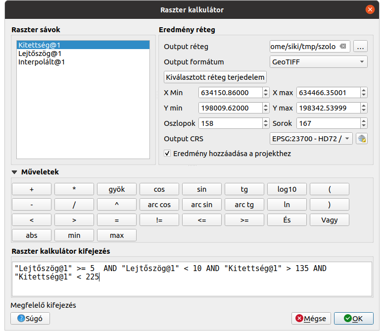

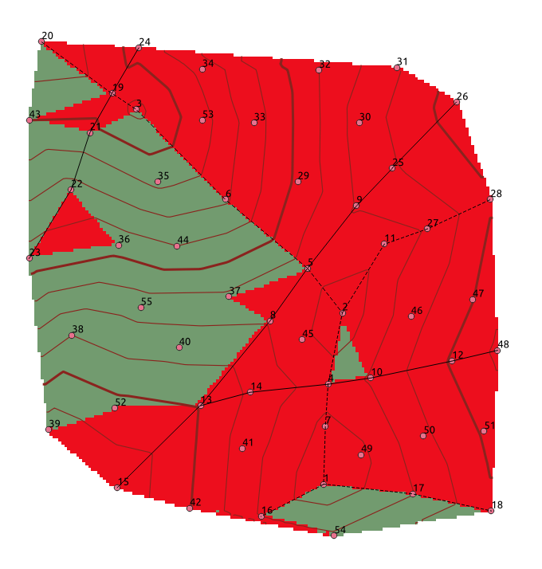

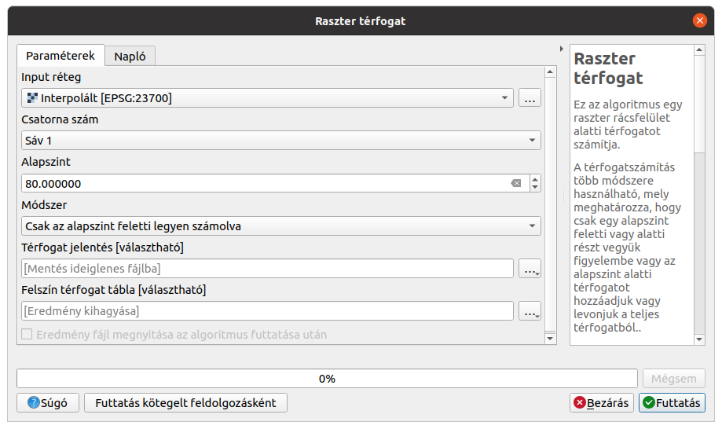
