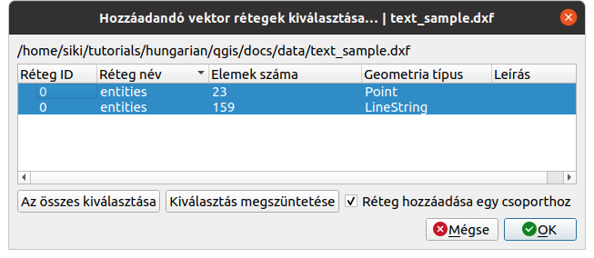

Szövegek importálása DXF állományból
====================================

QGIS 3.x

Összeállította: Siki Zoltán

A GIS és CAD állományok eltérő logikájából következően a CAD állományban lévő 
feliratok átvétele problémát jelenthet.
A QGIS többféle megoldást kínál a DXF állományok beolvasására, melyek különböző
megoldásokat kínálnak a szövegek betöltésére.

A következőkben egy minta fájl betöltésén keresztül mutatjuk be a különböző
lehetőségek előnyeit, hátrányait.

Az eredeti állomány CAD programban:

|dxf_text1_png|

Az állományban a következő rétegek illetve rajzi elemek találhatók:

+----------------+----------+---+
| Réteg          | Elemtípus|Db.|
+----------------+----------+---+
|GAZDASAGI_EPULET|LWPOLYLINE|  3|
+----------------+----------+---+
|HAZSZAM         |MTEXT     | 18|
+----------------+----------+---+
|LAKOEPULET      |LWPOLYLINE| 46|
+----------------+----------+---+
|TELEK           |LWPOLYLINE|108|
+----------------+----------+---+
|TERASZ          |LWPOLYLINE|  2|
+----------------+----------+---+
|TERASZ          |MTEXT     |  1|
+----------------+----------+---+
|UTCANEV         |MTEXT     |  4|
+----------------+----------+---+

DXF fájl megnyitása a rétegkezelőből
------------------------------------

Az adatforrás kezelőből a DXF vektor réteg hozzáadása egy párbeszédablakot 
jeleni meg, melyben rajzi elem típusa alapján választhatunk a betölthető elemek
közül. A minta állomány esetén *23 pont* és *159 törtvonal* betöltését
választhatjuk. A betöltés során a szövegekből pontok lesznek.

|dxf_text2_png|

A szövegek a pontokat tartalmazó réteg *Text* nevű oszlopába kerülnek.
Ezeket címkeként jeleníthetjük meg a QGIS-ben. Mivel a betöltés során a
szövegek elforgatási szöge nem kerül be az attribútum táblába, az összes 
szöveget azonos irányba tudjuk megjeleníteni.

|dxf_text3_png|

DXF fájl megnyitása projekt importból
-------------------------------------

A **Projekt** menüben az **Import/Export** csoportban találhatjuk a 
**Rétegek importálása DWG/DXF formátumból...** menüpontot. Segítségével a
CAD fájl rétegszerkezetét megőrizve egy GeoPackage (.gpkg) állomány hozhatunk
létre. A megjelenő párbeszédablakban megkell adnunk a cél geocsomag útvonalát,
ez általában egy új fájl megadását jelenti. Mivel a DXF állomány nem tartalmaz
a vetületre vonatkozó információt, ezért azt itt be kell állítanunk.
A forrásrajz megadása után a rétegek listáját kitölti a program, ezek közül
választhatunk a jelölőnégyzetekkel. Az **OK** gomb csak akkor válik aktívvá,
ha a csoport nevet is kitöltjük.

|dxf_text4_png|

Ebben az esetben már elfordított szövegeket kapunk, melyek mérete az eredeti
rajznak felel meg. A projektet el kell mentenünk, hogy a stílus beállításokat
megőrizzük. A rétegeket megvizsgálva észrevehetjük, hogy a betöltött rétegek
az előzőleg bemutatott megoldásnak fele meg, de az attribútum táblába
jóval több oszlopot találunk, melyek között a szövegek forgatási szöge is
megtalálható.

|dxf_text5_png|

Vegyük észre, hogy az "ő" betű nem jelenik meg helyesen. Ez a DXF és a
gpkg fájl kódlap beállításának függvényében alakul.

DXF fájl átalakítása szövegfájlba
---------------------------------

Egy egyszerű programot is használhatunk csak a szövegek átvételére, melyet
a *gawk* programozható szövegfeldolgozó segédprogrammal együtt használhatjuk
(részletesebb leírás: https://github.com/zsiki/dxf_utils).
A *gawk* telepítése és a *dxf_txt2csv.awk* letöltése után az alábbi paranncsal
egy szövegfájlba vihetjük át a szövegeket, melyet tagolt szövegfájlként
tölthetünk be a QGIS-be.

.. code:: bash

    gawk -f dxf_txt2csv.awk text_sample.dxf > dxf_text.csv

A csv fájlba bekerül a szöveg beillesztési pontja, a CAD réteg neve, a
szöveg iránya és mérete valamint a felirat maga.

.. code:: 

    EAST;NORTH;LAYER;DIRECTION;SIZE;TEXT
    28857.93;43344.78;UTCANEV;-13.39315;914.40;Óhegy utca
    31958.99;23484.30;UTCANEV;-17.73295;914.40;Kemence utca
    14646.16;26410.89;UTCANEV;70.37975;914.40;Alkér utca

A csv fájl betöltése után címke feliratként jeleníthetjük meg a szöveget,
az elfogatás szögét állítsuk be a *DIRECTION* attribútum értékére.

|dxf_text6_png|

AnotherDXFImporter modul használata
------------------------------------

Ez a külön telepíthető QGIS modul a projekt importáládhoz hasonlóan számos
adatot átvesz az attribútum táblába a DXF fájlból és ennek megfelelően
a megjelenítési stílusokat is beállítja. A stílusok megőrzéséhez a projektet
kell menteni.

|dxf_text7_png|

A modulban a DXF fájlban használt kódlapot is be tudjuk állítani.

|dxf_text8_png|

Budapest, 2021. október 8.

