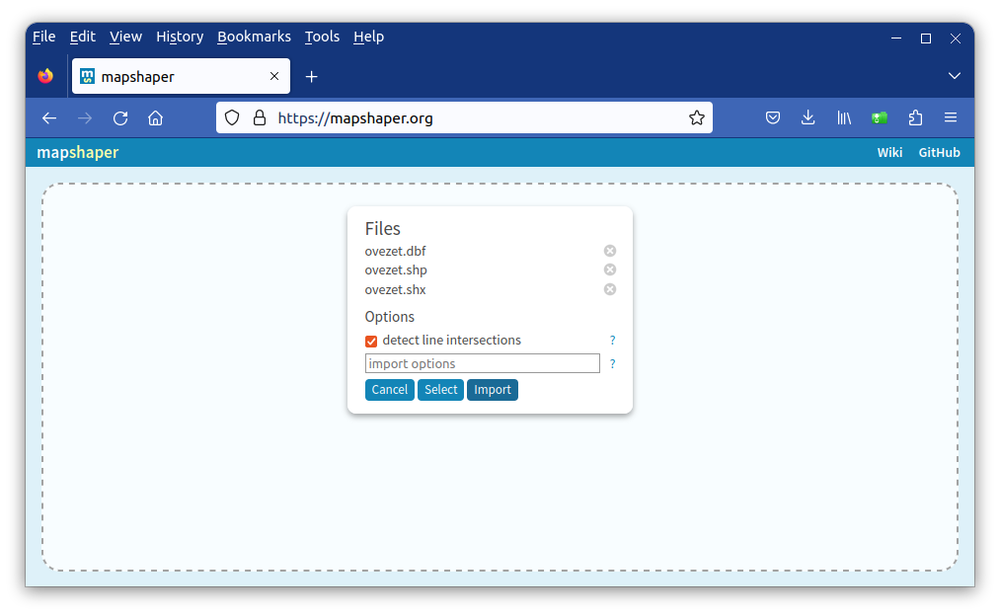

Topológiai hibák feltárása és javítása
======================================
QGIS 3.28 verzió

Összeállította: Siki Zoltán

.. note:: 

    Az összeállítás elkészítése során a következő angol nyelvű
    videót használtam fel: https://www.youtube.com/watch?v=iyDj8AvX3H0,
    melynek szerzője Ujaval Ghandi.

A QGIS képes a hibás geometriát tartalmazó elemek megjelenítésére, de
az elemzési műveletek többségét csak érvényes (hibátlan) geometriai
elemek esetén tudjuk elvégezni.
A QGIS, mint a GIS programok általában a Simple Feature for SQL (SFS) definíciót
veszi alapul a geometria érvényességének eldöntésére.
Például egy hibátlan felület geometria
nem tartalmazhat duplikált pontot, a határa nem metszheti önmagát, stb.

A topológiailag helyes geometria még további feltételeket támaszt az állománnyal 
szemben. Például egy felületeket tartalmazó réteg esetén, nem lehetnek 
duplikált elemek, átfedés vagy hézag a felületek között.

A következőkben bemutatjuk egy felületeket tartalmazó réteg hibáinak 
(érvénytelen elemek és topológiai hibák) kimutatását és a hibák automatizált
kijavítását.

Egy több mint 1500 elemből álló rétegen mutatom be a feldolgozást, mely
egy szabályozási terv övezeti fellület elemeit tartalmazza.

A munka megkezdése előtt töltsük be a vizsgálni kívánt felületeket 
tartalmazó réteget.

Hibás geometriai elemek kimutatása
----------------------------------

A menüből válasszuk a a **Feldolgozás/Eszköztár** menüpontot. A megjelenő
eszköztárban keressük meg az *Érvényesség ellenőrzése* algoritmust (a QGIS
vektor:geometria csoportban vagy a keresés mező segítségével).

Válasszuk ki a vizsgálandó réteget a a *Bementi réteg* mezőben. A többi
paraméternél elfogadhatjuk az alapértelmezett értéket.
A **Futtatás** gomb megnyomásával indul el a hibák keresése.
A feldolgozás eredményeképpen három új ideiglenes réteg jön létre, ha nem
módosít a beállításokon.

#. *Érvénytelen kimenet* - hibás elemek a vizsgált rétegből, a réteg attribútum táblázata kibővül a hiba típusát megadó oszloppal
#. *Érvényes kimenet* - hibátlan elemek a vizsgált rétegből
#. *Hibás kimenet* - hibahelyek pontokkal megjelölve, a réteg attribútum táblázata kibővül a hiba típusát megadó oszloppal

A feldolgozás eredményéről a *Naplő* fülön kapunk információt. Esetemben a
következőt:

.. code::

    'Érvényesség ellenőrzése' algoritmus indul…
    Bemeneti paraméterek:
    { 'ERROR_OUTPUT' : 'TEMPORARY_OUTPUT', 'IGNORE_RING_SELF_INTERSECTION' : False, 'INPUT_LAYER' : '/home/siki/tmp/ovezet.shp', 'INVALID_OUTPUT' : 'TEMPORARY_OUTPUT', 'METHOD' : 2, 'VALID_OUTPUT' : 'TEMPORARY_OUTPUT' }

    Execution completed in 0.17 másodperc
    Eredmények:
    {'ERROR_COUNT': 17,
    'ERROR_OUTPUT': 'Hibás_kimenet_8cd53d1d_bbdd_43ec_be55_d84feb3a1dc4',
    'INVALID_COUNT': 17,
    'INVALID_OUTPUT': 'Érvénytelen_kimenet_dc5dd7d8_a6ea_4369_8e58_104674f61409',
    'VALID_COUNT': 1399,
    'VALID_OUTPUT': 'Érvényes_kimenet_a1d5ff7e_2330_4022_aebb_1e089af6a74c'}

17 hibás felület elemet tartalmaz a réteg. Az alábbi ábrán a hibás elemek
és a hibahelyeket jelölő pontok láthatók.

Topológiai hibák kimutatása
---------------------------

Egy a QGIS-szel együtt a gépünkre kerülő *Topológiai ellenőrző* modul
segítségével mutathatjuk ki a topológiai hibákat, melyek az elemek
közötti hibákat jelentenek (pl. átfedés két elem között).
Kapcsolja be a **Modulok/Modulok kezelése és telepítése** menüpontban
a *Topológiai ellenőrző* modult.

A modul elindítása után egy új panel jelenik meg, három eszközből álló
eszközsorral. A csavakulcs eszközzel (a harmadik) állíthatjuk be a futtatandó
ellenőrzések típusát. Az aktuális feladatnál nincs szükség az összes
ellenőrzési lehetőség használatára.

Egy új szabály hozzáadásához egy réteget kell kiválasztani az első
legördülő listából, majd egy szabályt a második listából. A kiválasztott
szabálytól függően egy másik réteg megadására is szükség lehet a harmadik
listában. A  zöld "+" gomb megnyomásával adja hozzá a szabályt az
*Aktuális szabályok* listához. Állítsuk be az alábbi három szabályt.

A szabályok beállítása után az **OK** gombbal zárjuk le a szabályok beállítását.
Majd az *Topológiai ellenőrző panelen* az első ikon kiválasztásával indíthatjuk
el a teljes réteg ellenőrzését.

A panelen megjelennek a hibák listája,
a térképen kiemelten jelennek meg a hibás elemek.

A hibák kijavítása
------------------

A kimutatott hibákat egyenként kijavíthatjuk a QGIS szerkesztő eszközeivel,
de ez egyrészt sok hiba esetén időigényes, másrészt a manuális javítás során
újabb hibákat vihetünk a réteg geometriai elemeibe.

.. note::

    A *Geometria ellenőrző* modul szintén alkalmas a geometriai helyesség
    ellenőrzésére, sőt a hibák egyenként történő automatizált kijavítására is.
    Most ennél hatékonyabb megoldást mutatunk be.

A geometriai és topológiai hibák automatizált kijavítására a MapShaper
nyílt forráskódú program böngészőben futtatható változatát fogjuk használni
(https://mapshaper.org/). Az adatállományok feldolgozása a saját gépünkön
történik, nem kerülnek át egy távoli szerverre.

A honlap megnyitása után egy egyszerű felhasználói felület jelenik meg.

A MapShaper Shape, GeoJSON, TopoJSON és CSV fájlok fogadására képes.
Húzzuk rá a feldolgozandó fájlt/fájlokat a böngésző ablakra.
Shape fájl esetén a .shp, .shx és .dbf fájl együtt kell rádobni a
böngészőre vagy egy zip fájlt, mely a három fájlt tartalmazza. 
A megjelenő párbeszédablakban kattinson az **Import** gombra.

A böngésző ablak jobb felső részén megjelenő menüből válassza a **Console**-t.
böngésző ablak bal oldalán megjelenik egy parancssori rész, ahol beviheti
a parancsait a *$* jel után.
Írja be a *clean* parancsot, mely a geometriai és topológiai hibákat is
kijavítja.

.. code::

    $ clean
    [clean] Removed 54 / 54 slivers using 98+ sqm variable threshold
    [clean] Retained 1,415 of 1,416 features
    $ 

.. note::

    A *help* parancs beírásával megkapja az összes parancs nevét és rövid
    leírását. A *help clean* pranccsal a *clean* parancs részletes leírását
    kaphatjuk meg. Bizonyos esetekben szükség lehet a paraméterek 
    alapértelmezett értékeinek módosítására.

A javított állományt exportálnunk kell, hogy QGIS-ben folytathasuk vele a
munkát. Válassza az **Export** menüpontot.
A megjelenő ablakba írja be az állomány nevét (kiterjesztés nélkül) 
és válassza ki a formátumot, majd nyomja meg az **Export** gombot.

Shape fájl esetén egy tömörített fájlt kapunk, mely tartalmazza a .shp, .shx és
.dbf fájlt. Nem szükséges kitömöríteni a zip fájlt, mert a QGIS a zip-ből
is meg tudja nyitni a réteget.

Végül ismételjük meg a leírás elején elvégzett ellenőrzést, hogy kiderüljön
sikerült-e minden hibát megszüntetnünk. Ha maradtak volna még hibák, akkor
a *MapShaper* *clean* parancsának a paramétereit módosítanunk kell az
újrafutttásnál vagy kézzel kell kijavítanunk azokat.

.. note:: Kiegészítés

    Az előzőekben felvázolt megoldás mellett a GRASS GIS *v.clean* és v.build* parancsok
    illetve a PostGIS *st_makevalid* és *ValidateTopology* függvények is használhatók a
    geometriai és topológiai hibák kijavítására.
    A GRASS GIS és a PostGIS emellett a topológia kezelésére is képes.

2023. augusztus 10.
