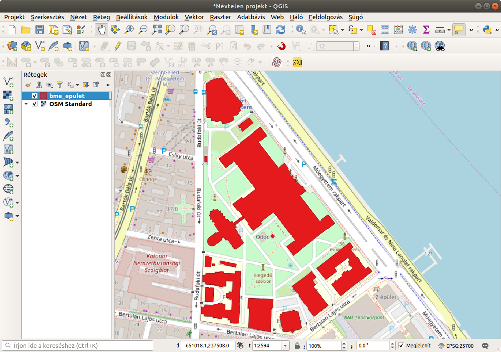
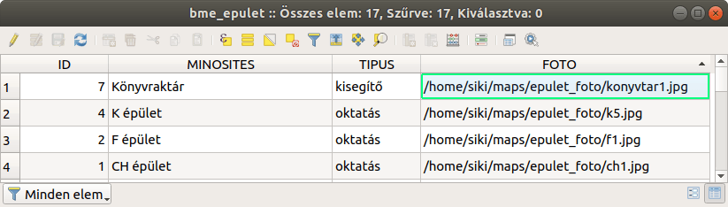
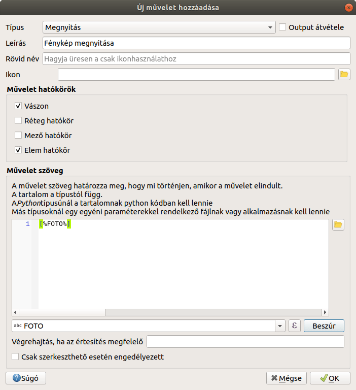
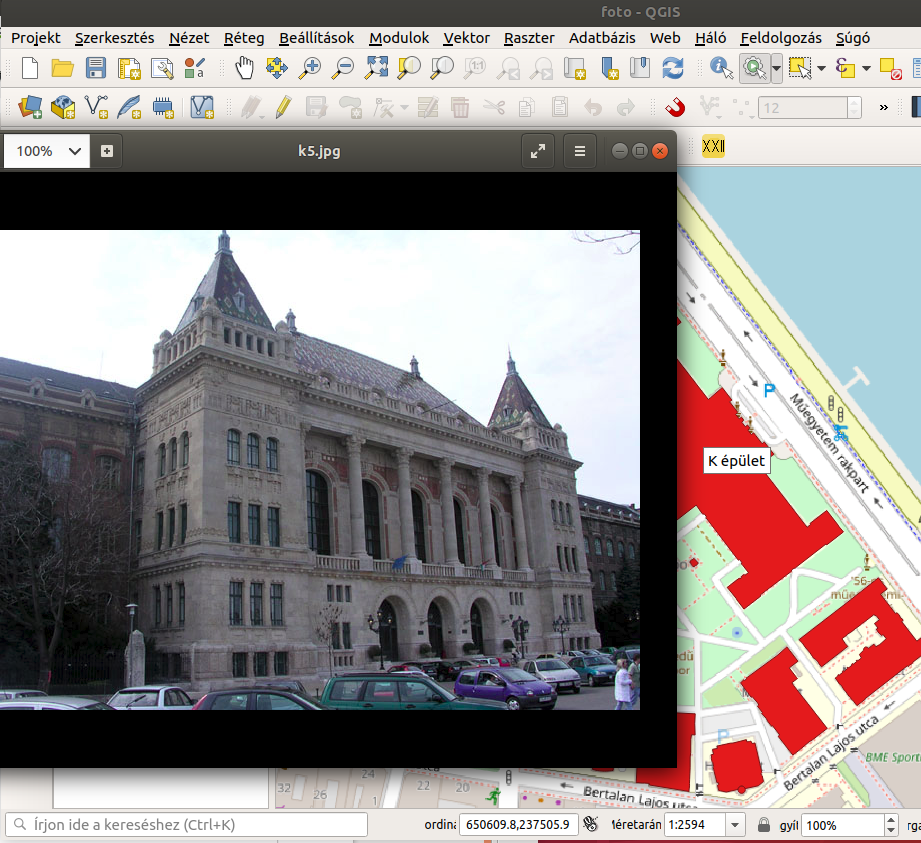
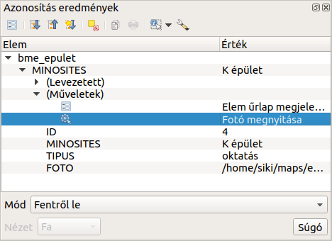
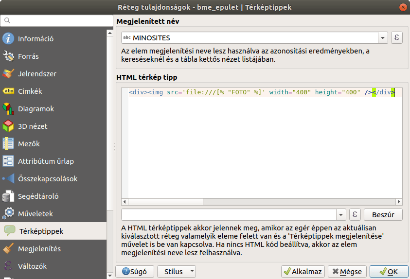
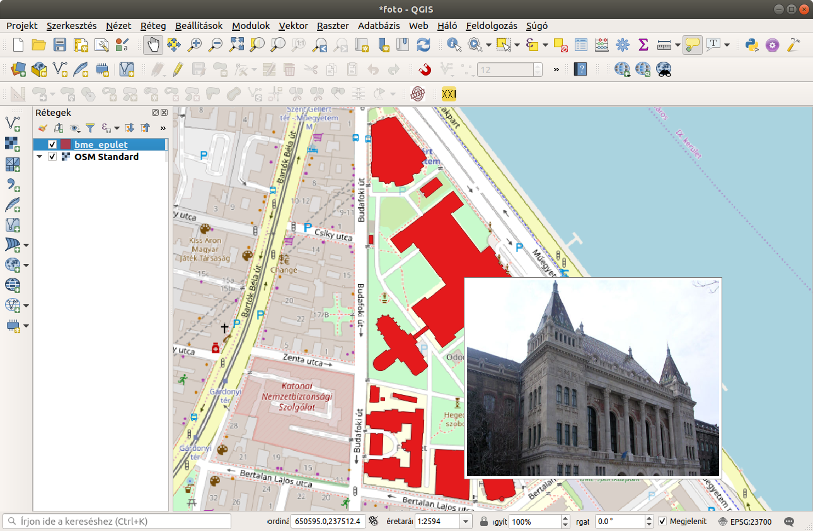

Fényképek megjelenítése a térképi elemekhez
===========================================

**QGIS 3.x**

**Összeállította: dr. Siki Zoltán**

Képek megjelenítése az elemekhez rendelt művelettel
---------------------------------------------------

A QGIS program speciális műveleteit alkalmazva az egyes térképi elemekhez a
számítógépünkön vagy az interneten
tárolt dokumentumokat rendelhetünk hozzá. Ez a dokumentum lehet egy szöveges
dokumentum (pl. pdf, odt), egy
kép (jpg, png, stb.) vagy bármilyen olyan fájltípus melynek megnyitására
alkalmas program van a számítógépünkön. Ebben a kis anyagban fényképeket fogunk
hozzárendelni az épületekhez és azok megjelenítésére a QGIS fogjuk használni.
A megoldáshoz műveletet fogunk rendelni a réteghez a réteg
tulajdonságok ablakban. A következőábrán látható Műegyetem térkép épület
rétegéhez rendelünk hozzá fotókat.

|foto1_png|

Az egyes épületekhez tartozó attribútumokat a következő táblázat mutatja:

|foto2_png|

A **FOTO** oszlopban szerepel egy az épületet ábrázoló képfájl elérési útja.
Ezt szeretnénk megjeleníteni majd. Nyissuk meg az **epulet**
réteg tulajdonságok ablakát és menjünk a **Műveletek**
fülre. Állítsuk be a következőket a művelet fülön:

|foto3_png|

A művelet ablakot zárjuk le. A réteg listában legyen az *epulet*
réteg az aktív, az eszközök közül válasszuk ki a fogaskereket
|foto4_png|
és kattintsunk az egyik épületre .
Az operációs rendszerünk a jpg fájlok megnyitására regisztrált programmal
megnyitja az adattábla *FOTO* oszlopában megadott fájlt. Az azonosítás
|foto5_png|
ikon használata esetén az azonosítás eredményében megjelenik a fogaskerék ikon.

.. note:: Megjegyzés

	a megnyitás művelet nem csak kép fájlokhoz használható. Használjhatjuk PDF, HTML, DOCX, stb. fájlokhoz is, ha a
	gépünkre telepítettünk az adott típusú fájl megnyitásához szükséges programot.

|foto6_png|

|foto7_png|

A **Megnyitás** típusú műveletek mellett
operációs rendszer függő (Unix, Windows, Mac) illetve Python kódot tartalmazó műveletet is létrehozhatunk.

.. note::

	Az újabb QGIS verziókban már nem található meg a **open** művelet, ebben az esetben az URL megnyitása művelet 
használható a követkoző URL-el: file:///[%FOT%]

Képek megjelenítése térkép tippel
---------------------------------

Az egyes térképi elemekhez térkép tippként alapesetben az attribútum tábla egy oszlopát vagy egy kifejezést rendeleünk. Ezeket a tippeket a QGIS az aktuális réteg elemeire jeleníti meg, ha az egér mutatót pár másodpercig mozdulatlanul tartjuk a térképi elem felett. Bonyolultabb hatást is elérhetünk a HTML típusú térkép tippekkel.

Nyissuk meg a bme_epulet réteg tulajdonságainak ablakát (dupla kattintás a réteg nevére a réteglistában) és válasszuk a **Térképtippek** fület. A
**HTML térkép tipp** mezőbe írjuk be a
kép megjelenítéshez szükséges HTML tegeket.

|foto8_png|

A HTML kódban a [%”FOTO”%] kód helyére a tábla FOTO oszlopában szereplő értéket
helyettesíti a QGIS. Az oszlop beszúrására használhatjuk a HTML mező alatti listát. Válasszuk ki a beszúrandó attribútumot a listából és nyomjuk meg a
**Beszúr**
gombot. Végül az OK gombbal zárjuk le a tulajdonságok ablakot.

A kipróbáláshoz az aktív réteg legyen a **bme_epulet**
réteg. Mozgassa a K épület fölé az egérmutatót és ne mozgassa. A térképtipp felbukkanó ablakban megjelenik a fénykép.
A HTML kódban szöveges részek is megjelenhetnek. Például az épület nevével kiegészített HTML kód:

.. code:: html

	
[% "MINOSITES" %]

	

|foto9_png|

**Kiegészítés**

A fenti példákban a *FOTO* mezőben a fénykép abszolút elérési útját adtuk meg. Ennél rugalmasabb megoldás lehet, ha a projekt fájl könyvtárához képest relatív útvonallal adjuk meg 
a képék elérérési útját. A külső fénykép megjelenítő alkalmazás a relatívútvonallal nem találja meg a képeinket, mivel fogalma sincs a projekt könyvtárunk elérési útjáról.
Ezért nem elég a relatív útvonalat tartalmazó oszlop megadása, azt ki kell egészíteni a projekt könyvtárral, [% @project_folder %][%FOTO%] a mi példánkban. 
A projekt könyvtár csak a projekt első mentése
után kapja meg az értékét, tartalmát a **Projekt/Tulajdonságok** menüpont kiválasztása után a *Változók* fülön nézhetjük meg. Erre azért lehet szükség, hogy elkerüljük a
könyvtár elválasztó katakterek (előre és vissza törtvonal) vegyes használatát.

Budapest, 2020. január 30.

