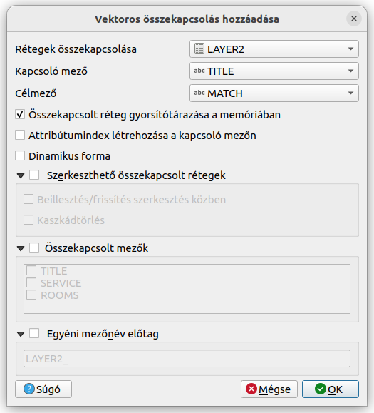

QGIS táblák összekapcsolása a mezőértékek részleges egyezése alapján
====================================================================

**QGIS 3.8+**

**Összeállította: dr. Siki Zoltán**

Lásd még https://github.com/OSGeoLabBp/tutorials/blob/master/hungarian/qgis/docs/aggregator.rst

Sokszor bosszúságot okozhatnak az elírások, ha két adatbázis táblát szöveget
tartalmazó oszlop alapján akarunk összekapcsolni. A réteg tulajdonságai 
között található **Összekapcsolások** fül csak a mezőtartalom teljes egyezése
esetén tudja a két táblázat egy-egy sorának az összekapcsolását megoldani.
Használata esetén előzetesen egy adattisztítást kell végrehajtanunk a gépelési 
hibák kiküszöbölésére, mely időigényes lehet.

Az úgynevezet Fuzzy összehasonlítás esetén a közelítően azonos értékek alapján
is dolgozhatunk. A QGIS mező kalkulátor tartalmaz néhány olyan függvényt,
melyek segítségével a részleges egyezés esetén is meg lehet oldani az
összekapcsolást. Ezek közül a *levershtein* függvényt használjuk, mely két
karakterlánc szerkesztési távolságát határozza meg (a karakter beszúrások,
törlések és helyettesítések számát, hogy az egyik szövegláncot a másik 
szöveglánccá alakítsuk át). Minél nagyobb a függvény által visszaadott érték,
annál nagyobb a különbség a két összehasonlított szöveg között.

A megoldás során az aggregátor függvényeket is használjuk, melyekről a fentebb
megadott linken olvashat.

A megoldás lépései:

#. Az első összekapcsolandó táblában létrehozunk egy virtuális oszlopot a második táblában található legjobban egyező, az összekapcsoláshoz használt mező tartalmával
#. A két tábla összekapcsolását virtuális mező segítségével oldjuk meg

Virtuális mező létrehozása
--------------------------

A virtuális mezők tartalmát az attribútum táblázat minden megnyitásakor 
automatikusan újraszámítja. Egy állandó oszlopot is generálhatnánk a
táblába, de annak a tartalmát a forrás mezők módosítása esetén újra kellene
generálni, amiről könnyen elfeledkezhetünk.
A virtuális mezőt abban a rétegben/táblázatban hozzuk létre, melyhez a
másik tábla adatait szeretnénk kapcsolni. A virtuális mezőbe a
*levershtein* távolságban legközelebbi mezőtartalmat másoljuk át a másik
táblából.
A példában a **LAYER1** réteg **name** oszlopát kapcsoljuk össze a
**LAYER2** réteg **TITLE** oszlopával.

*LAYER1 attribútum táblája*

*LAYER2 attribútum táblája*

Adjuk hozzá a **LAYER1** és **LAYER2** rétegeket a projektünkhöz.
Nyissuk meg a **LAYER1** réteg attribútum tábláját és nyissuk meg a
*Mezőkalkulátor* párbeszédablakot.

A Kifejezés ablakba a következőt írjuk be:

.. code::

    array_first(aggregate(
        layer:= 'LAYER2',
        aggregate:='array_agg',
        expression:=name,
        filter:=levenshtein(TITLE, attribute(@parent, 'name')) <= 10,
        order_by:=levenshtein(TITLE, attribute(@parent, 'name'))
    ))

*Virtuális mező létrehozása a mező kalkulátorban*

*Virtuális mező tartalma*

Látható, hogy nem sikerült minden névhez párt találni a második táblából.
Megpróbálhatjuk a *filter* feltéttelben lévő 10 értékét növelni (ami azt
jelenti, hogy tíznél nem több szerkesztési művelet különbség van a két 
karakterlánc között). Ez együtt jár annak a kockázatával, hogy hamis 
illeszkedést találunk. Először prőbálkozzunk kisebb, 2-5 közötti értékkel.

Táblák összkapcsolása a virtuális mező segítségével
---------------------------------------------------

Most már csak a **LAYER1** attribútum tábláját kell összekapcsolni a
**MATCH** virtuális oszlopon keresztül a **LAYER2** **TITLE** oszlopával.

*Tábla összekapcsolás*

*Az összekapcsolt táblák*

2023. április 7.
