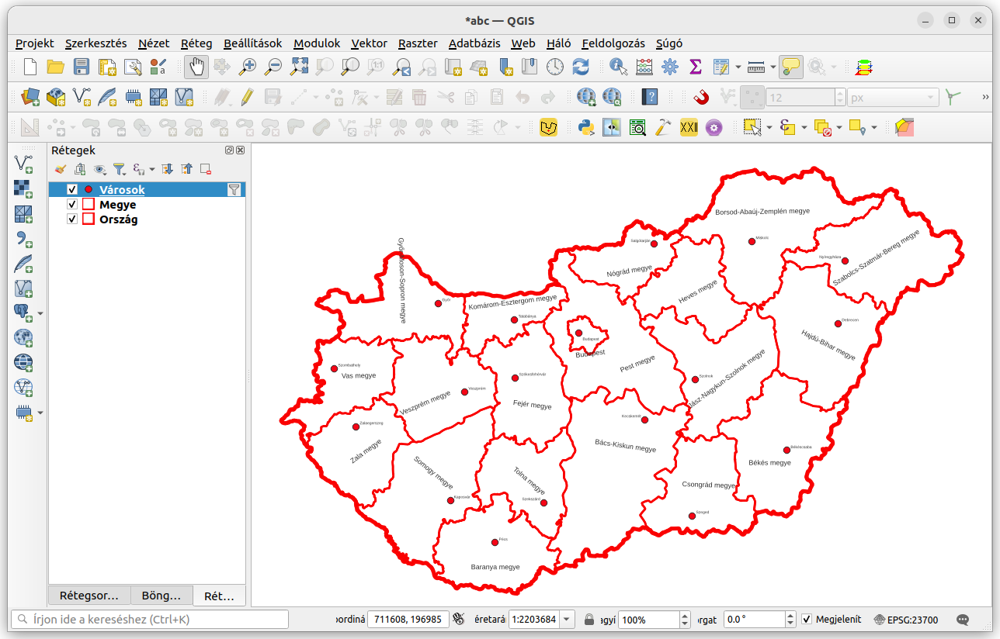
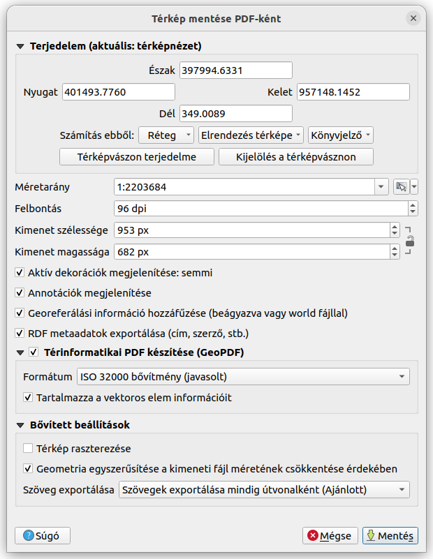
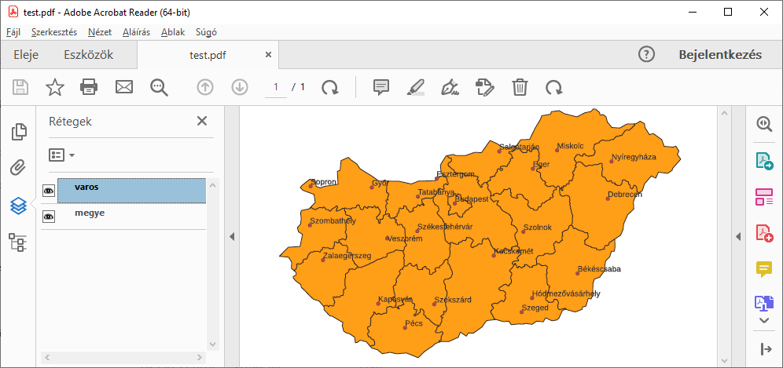

GeoPDF állomány létrehozása
===========================
3.16+ verzió

A GeoPDF fájlok egy raszter réteget és több vektor réteget tartalmazhatnak.
A raszter réteg kötelező része, de ez lehet egyszínű háttér réteg is. 
Jelenleg két szabványos GeoPDF létezik az **ISO 3200 Extension** és az **OGC
Best Practice**. A QGIS mindkét formátum létrehozását és megjelenítését is 
támogatja.

A GeoPDF tartalmának megfelelő QGIS projektet először létre kell hoznunk,
a rétegek megjelenítési stílusát, a címke feliratokat be kell állítanunk.

Az alábbi képen az OpenStreetMap adatokból összeállított egyszerű
térképet konvertáljuk GEoPDF-be.

A **Projekt** menüben találhatjuk meg az **Import/Export** menüpontot és azon 
belül a **Térkép exportálása PDF Formátumba...** opciót. A megjelenő
párbeszédablakban a PDF állomány számos paraméterét beállíthatjuk.

A felső részen a térkép terjedelmét állíthatjuk be, számos módszerrel

* a koordináták beírásával
* egy kiválasztott réteg terjedelmével
* egy nyomtatási elrendezés térképe alapján
* egy térbeli könyvjelző alapján
* a térképvászonon egérrel kijelölve

A méretarány, a felbontás és a pixelben megadott méret a raszteres adatokra 
vonatkozik. A párbeszéablak felső része megegyezik a projekt képként
exportálása során megjelenővel.

Az aktív dekorációk közé tartozik az észak nyíl, a lépték vonalzó, stb. 
Az annotációk az annotáció eszközökkel a térképhez adott egyedi feliratokat
jelentik, ezek is bekerülhetnek az eredmény fájlba. 
A georeferálási információk hozzáfűzése beállítás csak a képként exportálás
esetén releváns. A metadatok tárolása csak az arra alkalmas formátumok 
esetén történik meg.

GeoPDF készítés beállításakor kétféle formátum közül választhatunk, javasolt
az ISO formátum alkalmazása. A Tartalmazza a vektoros elem információk
bejelölése esetén a GeoPDF állomány tartalmazni fogja a vektoros rétegek
attribútumait is.

A bővített beállítások közül a Térkép raszterizálását nem célszerű GeoPDF
esetén alkalmazni. A geometria egyszerűsítése esetén a beállítás felbontás 
függvényében töréspontok kihagyásával egyszerűsíti a program a geometriát.
Nem kapcsolja be, ha az eredeti geometria beállítása a cél. A szöveg
exportálás két beállítása közül csak akkor válasszuk a szöveg objektumként
történő exportot, ha külső alkalmazással szerkeszteni kivánnánk azokat.

A **Mentés** gomb megnyomása után adhatjuk meg az output fájl nevét.

Abobe PDF nézegetőben a GeoPDF megjelenítése:

.. note::
    Megjegyzés
    A QGIS a GeoPDF fájlok megjelenítésére is alkalmas.
