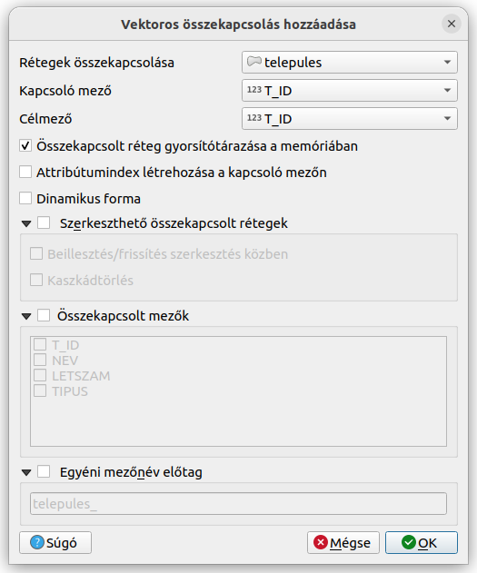

QGIS táblakapcsolatok
=====================

QGIS 3.x

Összeállította: Siki Zoltán

Tábla összekapcsolások és táblakapcsolatok
------------------------------------------

Az aktuális projekt adatbázis táblái között a mezők tartalma alapján
kapcsolatot teremthetünk. Ehhez kétféle lehetőséget biztosít a QGIS. 
A réteg tulajdonságok között található
összekapcsolás segítségével 1:1 vagy n:1 kapcsolatokat hozhatunk létre.
Azaz az alap tábla egy sorához nulla vagy egy sort rendelhetünk hozzá 
a másik táblából (SQL fogalmat használva külső összekapcsolást hozhatunk
létre).

A táblakapcsolat esetén 1:n vagy n:m kapcsolatot is kialakíthatunk.
Ezt a lehetőséget a projekt tulajdonságai között találhatjuk meg a 
*Kapcsolatok* fülön.

Mind a tábla összekapcsolás, mind a táblakapcsolat létrehozásához szükség
van a táblák sorait egyértelműen azonosító mezőre, az adatbázis fogalmak 
szerint kulcsra, melyre a másik tábla mint külső kulcsra hivatkozik.

Nézzünk egy egyszerű példát, legyen egy táblánk a településekről, egy másik
pedig az egyes településeken található turista látványosságokról.
Egy településnek nulla vagy több látványossága lehet.
Azaz, ha a látványosságokon 
keresztül szeretnénk megkapni a település adatait, akkor n:1 kapcsolatról
beszélhetünk és a tábla összekapcsolással létrehozhatjuk a két tábla közötti
kapcsolatot, a látványosságok táblájához kapcsoljuk a települések táblát.
Viszont, ha a településből kiindulva szeretnénk megkapni az összes 
a településhöz kapcsolódó látványosságot, akkor 1:n kapcsolatról van szó,
amit a táblakapcsolatként tudunk megvalósítani a QGIS-ben.

Mintaadatok
~~~~~~~~~~~

Település tábla

+------+----------+---------+------------+
| T_ID | NEV      | LETSZAM | TIPUS      |
+------+----------+---------+------------+
| 321  | Pákozd   | 2800    | nagyközség |
+------+----------+---------+------------+
| 413  | Nadap    | 460     | község     |
+------+----------+---------+------------+
| 132  | Velence  | 7100    | város      |
+------+----------+---------+------------+
| 111  | Sukoró   | 1900    | község     |
+------+----------+---------+------------+

Látványosság tábla

+------+--------------------------+------+
| L_ID | MEGNEVEZES               | T_ID |
+------+--------------------------+------+
| 1    | Meszleny-Wenckheim kúria | 132  |
+------+--------------------------+------+
| 2    | Bence hegyi kilátó       | 132  |
+------+--------------------------+------+
| 3    | Katonai Emlék Park       | 321  |
+------+--------------------------+------+
| 4    | Pákozdi csata emlékmű    | 321  |
+------+--------------------------+------+
| 5    | Pákozd-Sukorói Arborétum | 321  |
+------+--------------------------+------+
| 6    | Don-kanyar Emlékkápolna  | 321  |
+------+--------------------------+------+
| 7    | Szintezési ősjegy        | 413  |
+------+--------------------------+------+

.. note:: Megjegyzés

    Mindkét táblában egy-egy egész számot használtunk kulcsként. A
    település táblában a *NEV* oszlop is lehetne kulcs.

Tábla összekapcsolás
--------------------

Az adatbázisunkban az egyes látványosságok egy településhez kapcsolódhatnak,
azaz a *latvanyossag* táblát összekapcsolhatjuk a *telepules* táblával (n:1
típusú kapcsolat). Minden látványosság egy településhez kapcsolódik.

A *latvanyossag* réteg tulajdonságai ablakban válasszuk az *Összekapcsolás* 
fület. Alul a zöld plusz jelre kattintva egy új tábla összekapcsolást hozhatunk
létre.

Ezután, ha megnyitjuk a *latvanyossag* réteg attribútum tábláját, akkor a
látványosságok sorai kibővülnek a megfelelő település adataival.

.. image:: images/join_relate3.png
   :align: center

Az *Elemek azonosítása* eszközzel a *latvanyossag* réteg egy elemére kattintva,
az azonosítás eredményei között az összekapcsolt tábla adatai is megjelennek.

Az összekapcsolást a projektbe tudjuk elmenteni. Az attribútum tábla 
eredeti állapota a projektben az összekapcsolás megszüntetésével állítható
vissza.

.. note:: Megjegyzés

    Egy táblához több összekapcsolás hozható létre, sőt az összekapcsolások 
    láncolhatók is.

Táblakapcsolat
--------------

Amennyiben a településekből indulva szeretnénk az összes látványosságot 
megtalálni, akkor a táblakapcsolat segítségével valósíthatjuk meg ezt.
Ennek beállítási lehetőségét a projekt tulajdonságok párbeszédablak
*Kapcsolatok* fülön találhatjuk meg.

A táblakapcsolat eredményeképpen kapcsolódó sorok az attribútum tábla
táblázat nézetében nem jelennek meg. Amennyiben a réteg tulajdonságok között az
*Attribútuműrlap* fülön az *Automatikus generálás* opciót választjuk vagy a 
saját testreszabott űrlapunkban szerepelnek a táblakapcsolat mezői, akkor 
a táblázatos nézetet űrlap nézetre módosítva láthatjuk a kapcsolt sorokat.

A táblakapcsolat alapján kapcsolt táblázatsorok az *Elemek azonosítása* 
eszköz használata esetén is megjelennek, de egy külön csoportban.

Budapest, 2023.09.25.

