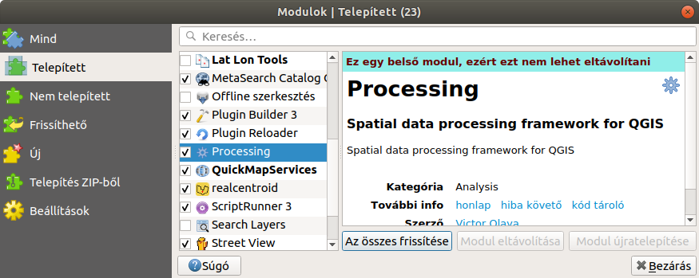
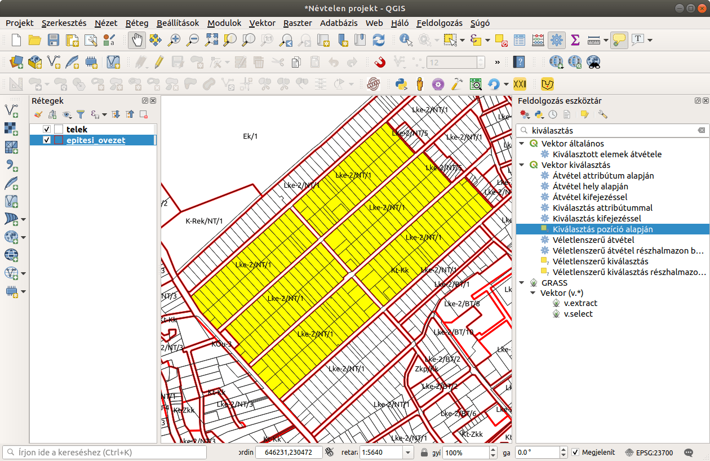
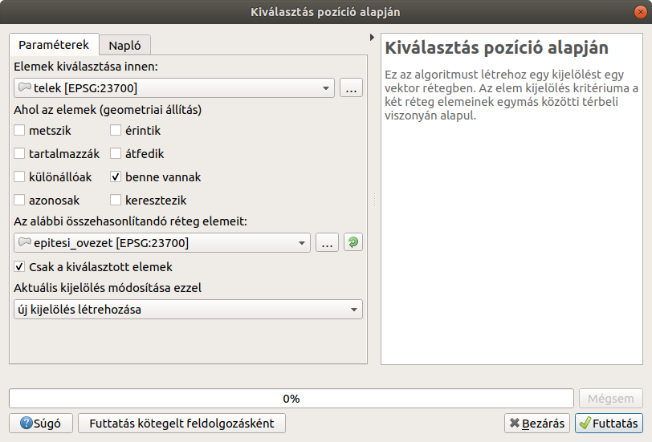
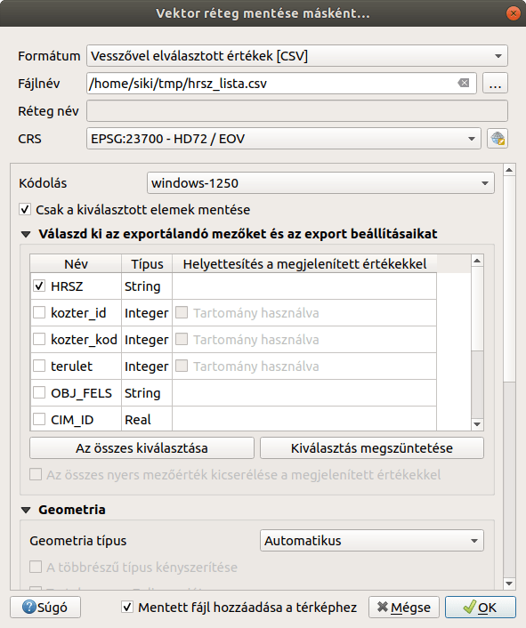
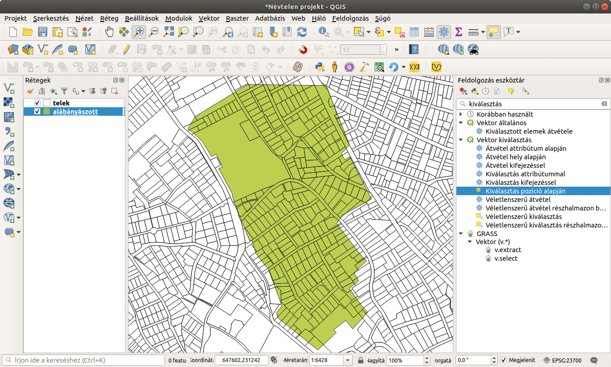
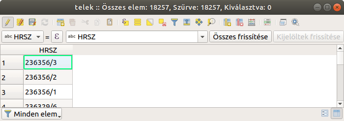
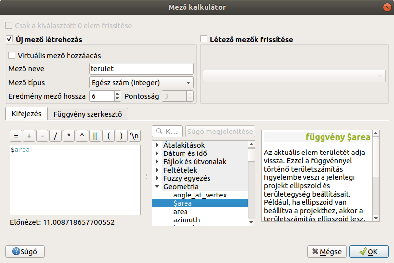
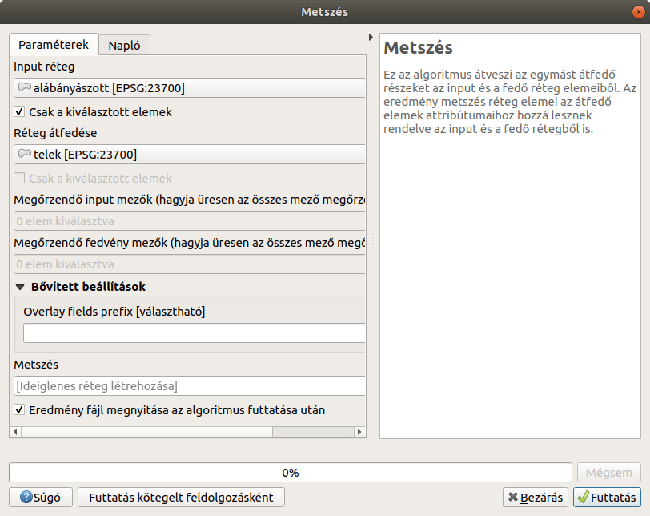
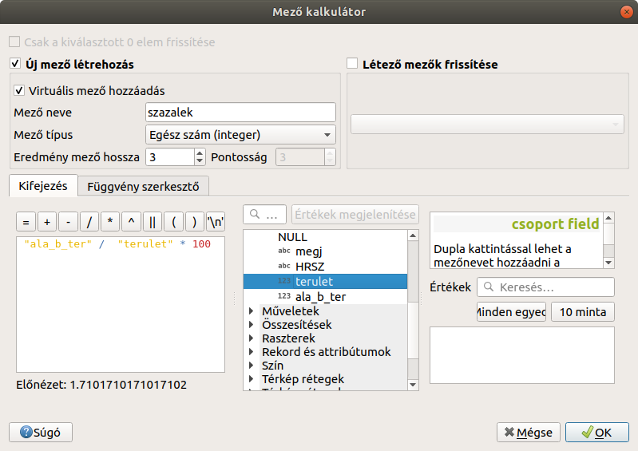
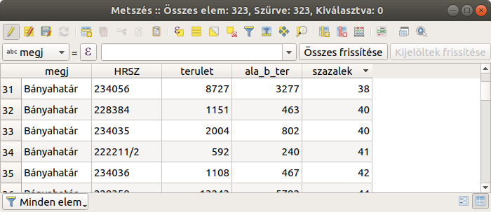

Egyik réteg felületeibe eső elemek szelektálása egy másik rétegből
==================================================================

**QGIS 3.x**

**Összeállította: Siki Zoltán**

A címben megfogalmazott feladat különböző megoldásait járjuk körül.
A munka során a *Feldolgozás* (*Processing*) modult használjuk. Ha a menüben nem jelenne meg a
**Feldolgozás** menüpont, akkor a **Modulok/Modulok kezelése és telepítése**
menüpont segítségével kapcsoljuk be a *Feldolgozás* (*Processing*) modult (1. ábra).

|kivalaszt1_png|
*1. ábra Feldolgozás modul bekapcsolása*

I. eset
-------

Mindkét réteg felület típusú és hierarchikus kapcsolat van köztük, az egyik réteg elemei teljesen tartalmazzák a másik réteg elemeit. Például
ilyenek a településhatárok és a megyehatárok.
A példában építési övezeteket és földrészleteket használunk (a használt adatállományban nincs telken belüli övezethatár, különben a II. esetet kell alkalmazni). Egy helyrajzi szám lista előállítása a cél.

#.  Szelektáljuk azokat az építési övezeteket, melyekbe eső telkeket szeretnénk kiválasztani. A QGIS bármelyik szelektálási módszerét használjuk,
a 2. ábrán manuálisan választottunk ki hat övezet felületet.

#.  A feldolgozás eszköztárból keressük ki a *Kiválasztás pozíció alapján*
    algoritmust
    és kattintsunk rá duplán az egérrel. A megjelenő párbeszédablakban (3. ábra) állítsuk be a telkeket tartalmazó réteget, ahonnan elemeket választunk ki, az elemek geometriai kapcsolata legyen a
    *benne vannak*, az összehasonlítandó réteg legyen az építési övezeteket tartalmazó és jelöljük be a
    *csak a kiválasztott elemek* jelölőnégyzetet. Végül nyomjuk meg a
    **Futtatás** gombot. Az eredmény egy szelekció a telek rétegeben.

#.  A telkek réteg kiválasztott elemeit exportáljuk CSV fájlba, melyet más
    nem térinformatikai programokban (pl. Libre Office Calc, Excel)
    is használhatunk. A telek rétegere kattintsunk jobb egérgombbal a
	réteglistában és a felbukkanó menüből válasszuk az
    **Export/Elemek mentése másként…**
    menüpontot. A megjelenő párbeszédablakban (4. ábra) állítsuk be a formátumot
    *Vesszővel elválasztott értékek [CSV]*-re, a fájl elérési útját, ahová
	mentjük az adatokat.  Jelöljük be a
    *Csak a kiválasztott elemek mentése*
    opciót. Az exportálandó mezők közül csak a HRSZ-t jelöljük meg, ha a többire
	nincs szükség. A további beállításoknál elfogadhatjuk az alapértelmezetteket.

|kivalaszt2_png|
*2. ábra Szelekció és a feldolgozás eszköztár*

|kivalaszt3_png|
*3. ábra Az algoritmus paraméterezése*

|kivalaszt4_png|
*4. ábra Export paraméterezése*

II. eset
--------

Mindkét réteg felület típusú és nincs közöttük hierarchikus kapcsolat,
a két felület réteg határai metszhetik egymást.

A példában egy alábányászott területtel érintett telkeket listázzuk, telkenként
az érintett terület százalékos arányát is kiszámítjuk.

|kivalaszt5_png|
*5. ábra Kiinduló helyzet*

#.  A telek rétegben hozzunk létre egy *terulet*
    nevű oszlopot, mely négyzetméter élességgel tartalmazza az elemek területét.
    Ehhez tegyük szerkeszthetővé a telek réteget. Nyissuk meg a réteg
	attribútum tábláját és az eszközsorból válasszuk ki az abakusz ikont
    |kivalaszt51_png|
    (6. ábra). A megjelenő párbeszédablakban a 7. ábrán látható beállításokat végezzük el.

#.  Esetünkben az alábányázott réteg több felület elemet tartalmaz, ezért először szelektáljuk az alábányászott területet.

#.  A feldolgozás eszköztárból keressük ki a *Vektor átfedés* csoportban a
    *Metszés*-t és duplán kattintsunk rá. A megjelenő párbeszédablakban állítsuk be a két réteget,
    az alábányázott rétegről csak a kiválasztott elemeket. Az eredménybe (
    *Metszés*
    nevű réteg) a telek réteg elemeinek az alábányázott területtel elvágott része kerül, az elemek a műveletbe bevont rétegek attribútumait öröklik. A 8. ábrán látható beállítások csak a memóriában őrzik meg a metszet réteget, ha szeretnénk ezt
    későbbiekre megőrizni, akkor adjunk meg egy eredmény réteget vagy később exportáljuk a memória réteget.

#.  Nyissuk meg a *Metszés*
    réteg attribútum tábláját. Számítsuk ki a kivágott telkek területét az
    *ala_b_ter* oszlopba, a telkekre elvégzett számításhoz hasonlóan
    (itt is elegendő egész szám erre, így négyzetméterre kerekített területet kapunk).

#.  Számítsuk ki az *ala_b_ter* és *terulet*
    oszlopok százalékos arányát egy virtuális oszlopba
    (*szazalek*) az abakusz eszközzel (9. ábra).
    A virtuális oszlop tartalma nem kerül be a háttértáron őrzött rétegadatok közé, az attribútum tábla minden megnyitásakor a program automatikusan kiszámítja az értékeket a beállított képlet alapján.

|kivalaszt6_png|
*6. ábra*

|kivalaszt7_png|
*7. ábra Területszámítás a telkekre*

|kivalaszt8_png|
*8. ábra Rétegek metszete*

|kivalaszt9_png|
*9. ábra Százalékszámítás*

|kivalaszt10_png|
*10. ábra Eredmény tábla*

Budapest, 2020. február 8.

