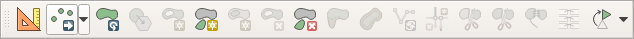

Pontok bevitele koordináták alapján
===================================

QGIS 3.x

Összeállította: dr. Siki Zoltán

A QGIS-ben új elemek bevitele során legegyszerűbben az egérrel kattintva adhatjuk meg a pontokat, ez azonban nem megfelelő, ha valamilyen forrásból rendelkezésünkre állnak pontos koordináták. Ebben a dokumentumban a pontos koordináta beviteli lehetőségeket járjuk körbe.

I.  Adatbevitel pontos koordinátákkal a Bővített digitalizálás eszköztárral
---------------------------------------------------------------------------

1.  Kapcsoljuk be a Bővített digitalizálás eszköztárat (jobb gomb kattintás egy üres helyen az eszköztárak vagy a menü sorában és a felugró menüből kiválasztani).

|koordinata_bevitel1_png|

2.    Tegyük szerkeszthetővé egy pontok tárolására alkalmas réteget vagy hozzunk létre egy újat.

|koordinata_bevitel2_png|

3.  Válasszuk ki a pont elem hozzáadása eszközt
    a digitalizálás eszköztárból

4.  A Bővített digitalizálás eszköztárban kapcsoljuk be az első vonalzót mutató ikont (Bővített digitalizálás eszközök engedélyezése). Ennek hatására megjelenik a bal oldalon egy új panel (Bővített digitalizálás)

5.  Kézzel írjuk be az ismert koordinátákat az x mezőbe és nyomjuk meg a mező melletti lakatot (vigyázat, ne húzza az egeret a térkép ablakba, mert akkor az egér aktuális koordinátájára vált az x mező tartalma, h még nem nyomta meg a lakatot). Majd vigye be az y koordinátát és nyomja meg a mellette lévő lakatot. A térképvásznon két segédvonal jelenik meg. A segédvonalak metszésének közelébe kattintva pontosan a megadott koordinátára kerül a pont.

|koordinata_bevitel3_png|

II. Már bevitt pontok koordinátájának pontosítása kézzel bevitt koordinátákkal
------------------------------------------------------------------------------

1.  Tegyük szerkeszthetővé a módosítandó rétegünket.

2.  Válassza ki a *Töréspont eszközt* a Digitalizálás eszköztárból

|koordinata_bevitel4_png|

3.  Jobb egérgombbal kattintsunk a módosítandó pontra a térképvásznon. A bal oldalon a Töréspont szerkesztő panelen megjelennek a koordináták, melyeket módosítani tudunk. Duplán kell kattintani a koordináta mezőbe a tartalom módoításához.

III. Pontok tömeges bevitele szövegfájlból
------------------------------------------

Egy szöveges fájlba soronként szerepelnek a pontok koordinátái és attribútumai és ebből készítünk egy pont réteget.

#.  Válasszuk az adatforrás kezelőből a *Tagolt szöveg*
    fület és a párbeszédablakban adjuk meg a fájlt, a kódlapot (várhatóan a windows-1250 jó lesz), az elválasztó karaktert, a vetületet, …

|koordinata_bevitel5_png|

    Nyomjuk meg a hozzáad gombot.

IV.  Geometria mező módosítása a mezőkalkulátorral
--------------------------------------------------

Lásd a leírást:
`http://www.agt.bme.hu/gis/qgis/geometry_calc.pdf <http://www.agt.bme.hu/gis/qgis/geometry_calc.pdf>`_

Budapest, 2020.  március 1.

.. |koordinata_bevitel5_png| image:: images/koordinata_bevitel5.png
    :width: 16.365cm
    :height: 11.255cm

