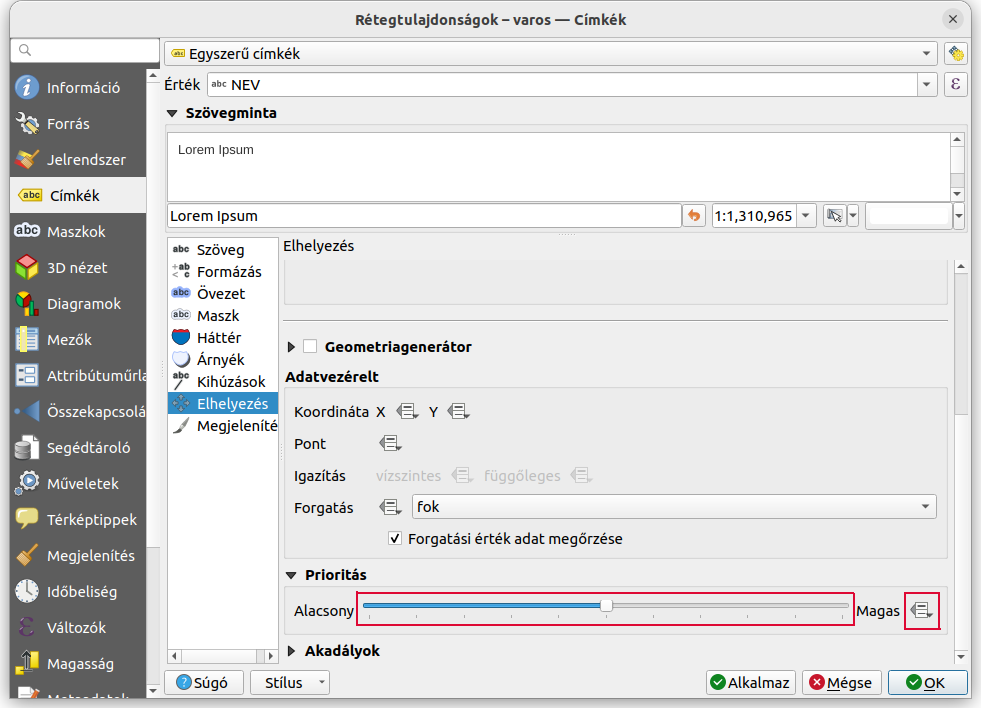
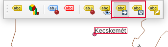
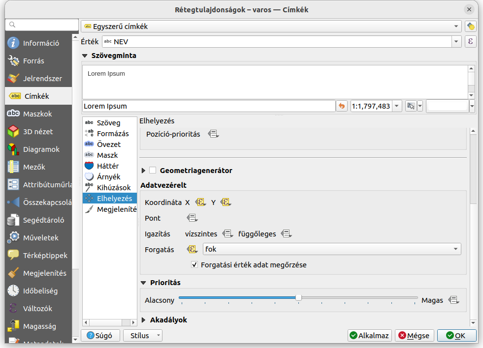
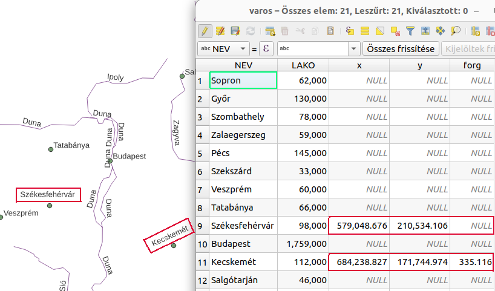

Címkék egyedi elhelyezése
=========================

QGIS 3.34+ verzió

Összeállította: Siki Zoltán

A QGIS automatikus címke elhelyezése nem mindig megfelelő, az egymást takaró címkék
közül az alacsonyabb prioritásút nem fogja megjeleníteni.

A címkék prioritását rétegenként tudjuk állítani, a rétegtulajdonságok Címkék/Elhelyezés 
fülén.

Az adatvezérelt beállításnál (a Magas melletti ikon) egy oszlopot adhatunk meg a réteg
attribútum táblájából és így egyenként szabályozhatjuk a prioritást. Azonban ez sem
ad megfelelő eredményt számunkra. Ilyenkor a címkék egyedi elhelyezését választhatjuk.

A címkék egyedi elhelyezésére (eltolás és elforgatás) kétféle módszer közül választhatunk:

* Az egyedi címke elhelyezések tárolása a projekt fájlban
* Egyedi címke elhelyezések tárolása a réteg attribútum táblájában

Mindkét esetben célszerű a manuálisan elhelyezendő címkék rétegénél a Címkék/Megjelenítés
fülön az Átfedő címkék csoportnál a Mód mezőt az "Átfedések engedélyezése büntetés
nélkül" értékre állítani. Emellett be kell kapcsolnunk a Címkézés eszköztárat.

Egyedi címke elhelyezések tárolása a projektben fájlban
-------------------------------------------------------

Ne legyen szerkeszthető az a réteg, melyen a címkék elhelyezését módosítani szeretnénk.
Emellett a rétegnek egy kulcs oszloppal is rendelkeznie kell, ha nincs ilyen akkor a
egyszerűen létrehozhatunk egy egész értékeket tartalmazó oszlopot a *@row_number*
változóval feltöltve a Mezőklkulátorban.
Válasszuk ki a címke mozgatás vagy forgatás ikont a Címkézés eszköztárból, majd
mozgassuk az egeret a módosítandó címkére. A címke körül piros keret jelenik meg.

Kattintson a címkére, majd mozgassa az egeret és kattintson ismét, ha megfelelő a pozíció
vagy a szög.

Az így elmozgatott vagy elforgatott címkék módosított helyzetét a projekt fájlba őrzi
a QGIS és speciális adatvezérelt címke pozíciót és szöget állít be a címkékre.

Egyedi címke elhelyezések tárolása a réteg attribútum táblájában
----------------------------------------------------------------

Tegyük szerkeszthetővé a réteget, melyen a címkék helyzetét módosítani szeretnénk.
Bővítsük három új oszloppal az egyedi címke pozíció (x, y) és elforgatás (forg)
tárolásához. A rétegtulajdonságok Címkék/Elhelyezés fülön állítsuk be a
*Koordináta* és *Forgatás* értékeket a létrehozott oszlopokra. 

Ahol ebben a három oszlopban *NULL* érték van ott az automatikus címkézés
szerint jelenik meg. A címke mozgatás és elforgatás ikonokat használva a QGIS
az attribútum táblában módosítja a címke elhelyezés adatokat.

2024. április 7.
