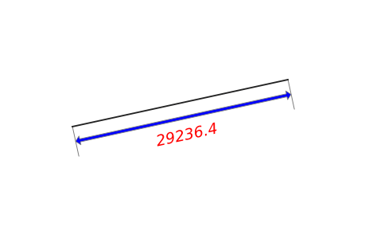
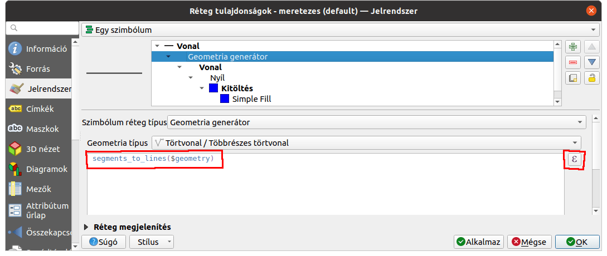
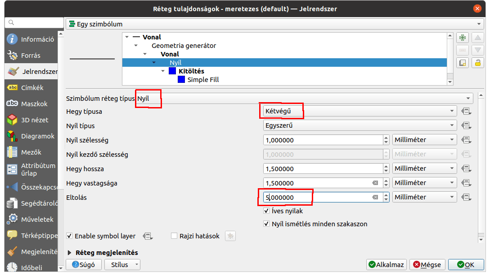
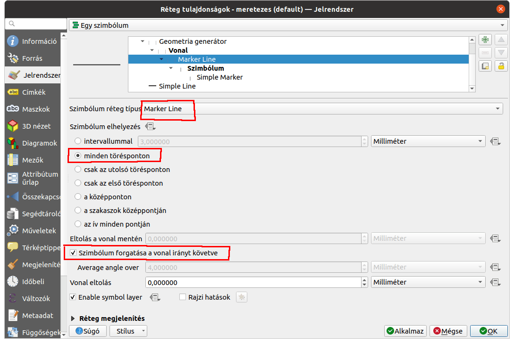
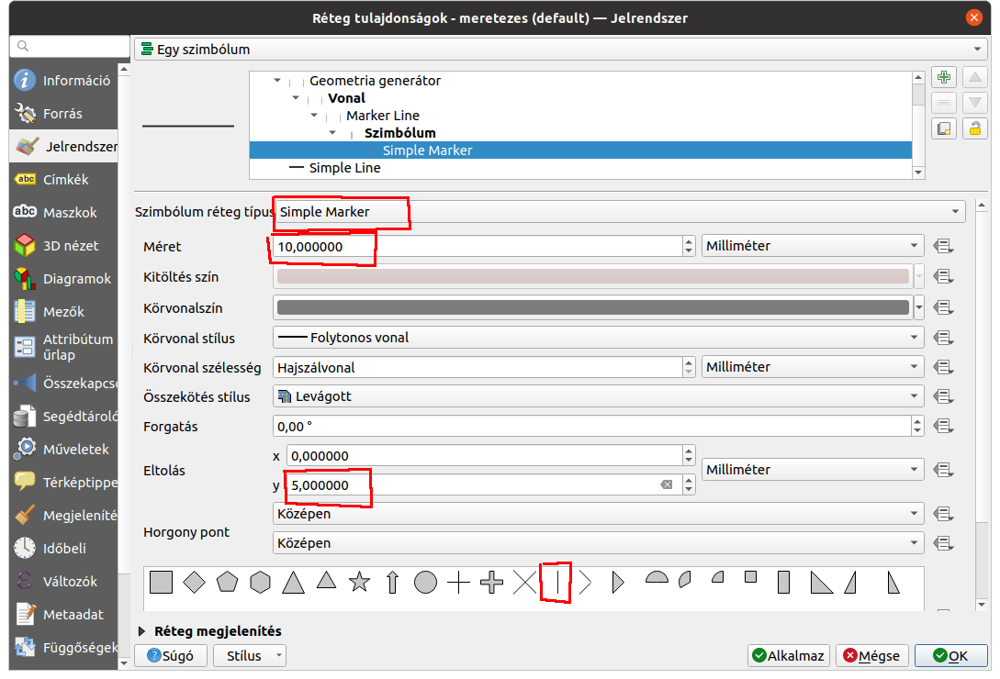
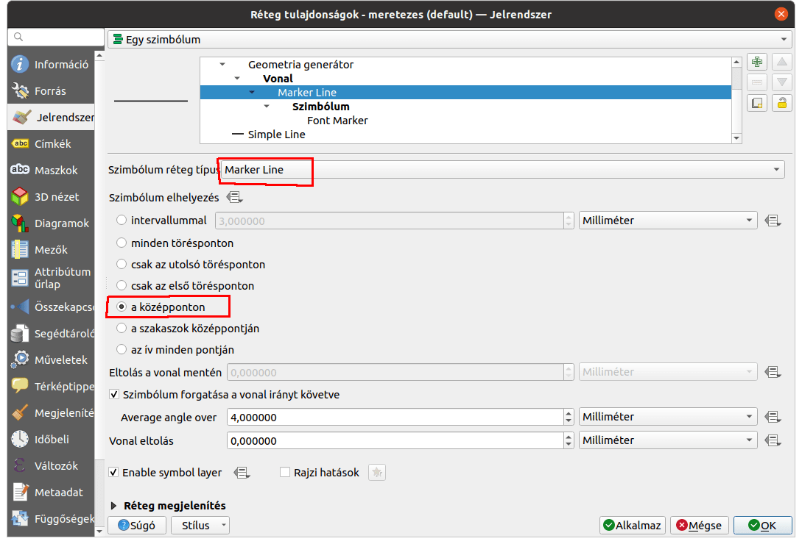
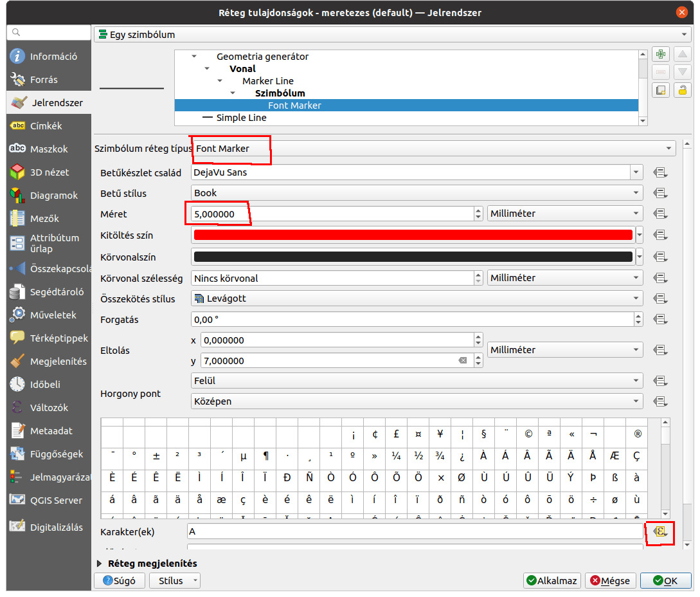
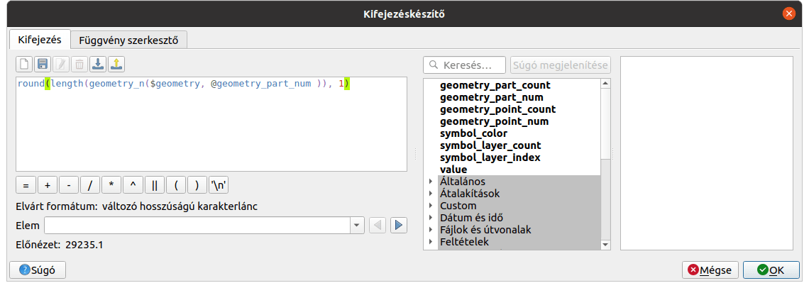

Dinamikus méretezés készítése törtvonalakhoz
============================================

**QGIS 3.x**

**Összeállította: dr. Siki Zoltán**

A CAD szoftverekben beépített funkció a rajzi elemek méretezése. A GIS szoftverekben
ez nem feltétlenül ilyen egyszerű. A QGIS esetén a geometria generátor a kulcs a
megoldásban. A geometria generátort a rajzi elemek stílusának beálltásánál
használhatjuk és segítségével újabb geometria elemeket adhatunk a megjelenítéshez az
adott rajzi elem felhasználásával. 

A méretezés létrehozásánál az eredeti vonalon túl három további további elemet
adunk a megjelenítéshez (1. ábra).

|meretezes1_png|

#. az eredeti vonallal párhuzmos egyenes, az elején és végén nyilakkal (kék)
#. az eredeti vonalra merőleges rövid szakaszok a méret végeinek jelölésére (szürke)
#. a méret felirat (piros)

Hozzunk létre egy új törtvonak típusú réteget vagy nyissunk meg egyet.
Nyissuk meg a réteg tulajdonságok ablakát és válasszuk ki a *Jelrendszer* fület.

Kezdjük az eredeti törtvonallal párhuzamos méretvonalakkal.
Jobb oldalon felül található zöld "+" gombbal adjunk egy új szimbólum réteget.
Az új szimbólum réteg típusát módosítsuk *geometria generátorra*, a geometria típusa
legyen *Törtvonal*. Az eredeti törtvonal szakaszaival párhuzamos vonalat szeretnénk
húzni. Ezért az eredeti geometriát vonalszakaszokra kell szétbontanunk a
párhuzamos eltolás előtt. Ezt a *segments_to_lines($geometry)* kifejezéssel tudjuk
elérni. A kifejezést közvetlenül beírhatjuk a Geometria típus alatti mezőbe vagy a jobb
oldali "E" ikonra kattintva a kifejezés szerkesztő segítségével. A geometria 
generátorhoz tartozó vonal típusát módosítsuk *Nyíl* típusúra, mindkét végén legyen 
nyílhegy és az *Eltolás* értékét módosítsuk.

|meretezes2_png|

|meretezes3_png|

Ezzel az első pontot kipipálhatjuk.

A méretvonal végét jelző rövid merőleges szakaszokat adjuk hozzá ezután. Ehhez szintén
egy *geometria generátor* szimbólum réteget hozzunk létre és megint bontsuk fel 
vonalszakaszokra az eredeti geometriát a *segments_to_lines($geometry)* kifejezéssel.
Az új geometria generátor szimbólum rétegünkhoz tartozó vonal stílusa legyen 
*Marker line*. A markert minden töréspontba helyezzük el eltolva.

|meretezes4_png|

|meretezes5_png|

Végül adjuk hozzá az egyes vonalszakaszok hossza feliratot. Ezt is egy geometria
generátor szimbólum réteggel oldjuk meg. A kifejezésben adjuk meg a korábban is
használt *segments_to_lines($geometry)*-t. Ismét *Marker line* legyen a rétegtípus.
Viszont most a *Font marker* típust válasszuk. A vonalhossz felirat értékét alul a
*Karakter(ek)* melletti "E" ikonra kattintva, a *Szerkesztés* adjuk meg a kifejezéss
kiértékelőben. Itt egy kicsit bonyolultabb kifejezést kell beírnunk, hogy az
aktuális szakasz hosszát kapjuk meg:

.. code::

    round(length(geometry_n($geometry, @geometry_part_num )), 1)

|meretezes6_png|

|meretezes7_png|

|meretezes8_png|

Egy ilyen stílust összerakni elég bonyolult, célszerű egy .qml fájlba elmenteni.
Ezt a réteg felbukkanó menüjének az Export menüpontjában találhatjuk.

`Az elkészített qml file <data/meretezes.qml>`_

