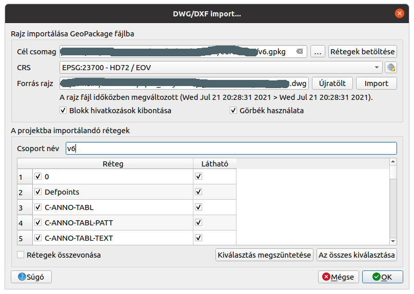

DWG állomány megnyitása
=======================

QGIS 3.x verzió

A DWG fájlok több réteget, rétegenként többféle geometriai elemeket
tartalmazhat. Ez közvetlenül nem illeszthető a QGIS által kezelt
rétegek logikájába. Ezért erre egy külön menüpont hoztak létre:
**Projekt->Importálás/Exportálás->Rétegek importálása DWG/DXF formátumból...**

A menüpont kiválasztása után megjelenő párbeszéd ablakban több beállítást 
kell végrehajtanunk. Az importálás eredménye egy GeoPackage adatbázisba 
kerül (a QGIS 3.0 verziótól a Shape fájl helyett a GeoPackage adatbázis
az alapértelmezett adatformátum).

|dwg1_png|

A *Cél csomag* mezőbe a jobb szélen található **...** gomb megnyomása után
válasszuk ki az új GeoPackage állomány könyvtárát és adjuk meg a nevét.

A *CRS* mezőbe állítsuk be az input rajzi állomány vetületi rendszerét.

A *Forrás rajz* mező kitöltéséhez nyomja meg a jobb oldali **Import** 
gombot és a megjelenő fájl kiválasztó párbeszédablakban keresse ki a
betöltendő DWG állományt.

A *Blokk hivatkozások kibontása* jelölő négyet bekapcsolása esetén a rajzban
szereplő blokk beillesztésekből nem csak egy pont elem keletkezik, hanem
a blokkban szereplő rajzi elemek is megjelennek.

A *Gorbék használata* elölő négyet bekapcsolása esetén a DWG-ben szereplő görbék
a QGIS-ben is görbeként jelennek meg. Ellenkező esetben csak lineáris közelítést
kapunk.

A *Csoport név* mezőben a QGIS réteg fájában megjelenő csoport nevét adhatjuk
meg. Kötelező a kitöltése.

A DWG állomány kiválasztása után a réteglistát automatikusan kitölti a program.
A rétegnév előtti jelölő négyzet kikapcsolásával az adott réteg importálása
nem történik meg. A *Látható* oszlopban található jelölő négyzetekkel a
rétegek importálás utáni láthatóságáról dönthetünk.

A *Rétegek összevonása* jelölő négyzet segítségével a rajzi elem típusának
megfelelő rétegekre (points, lines, polylines, texts, hatches) kerülnek a rajzi
elemek. Általábn nem célszerű bekapcsolni.

Az **Ok** gomb megnyomása után kezdődik el az import. A rajzi fájl méretétől
függően az import hosszabb időt vehet igénybe. A QGIS automatikusan
beállítja az importált rétegek stílusát, hogy azok megjelenése a lehető
legjobban hasonlítson a DWG állományhoz. Azok a DWG rétegek, melyeken
egyetlen rajzi elem sincs nem jelennek meg a QGIS réteglistájában. 
FIGYELEM ezek a stílus beállítások a projekt mentésével őrizhetők meg!

2021. július 21.

