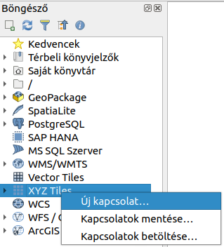
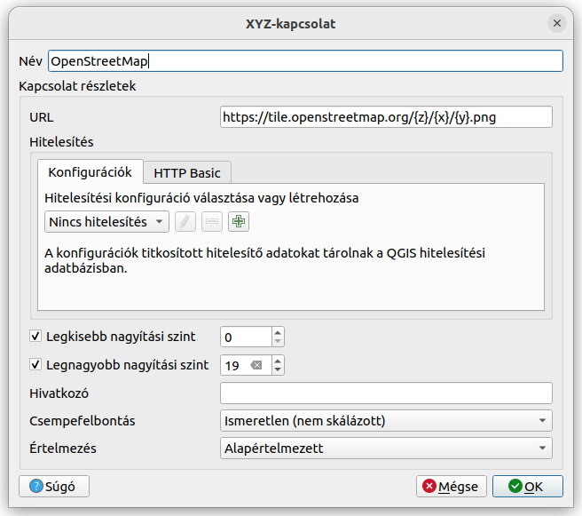
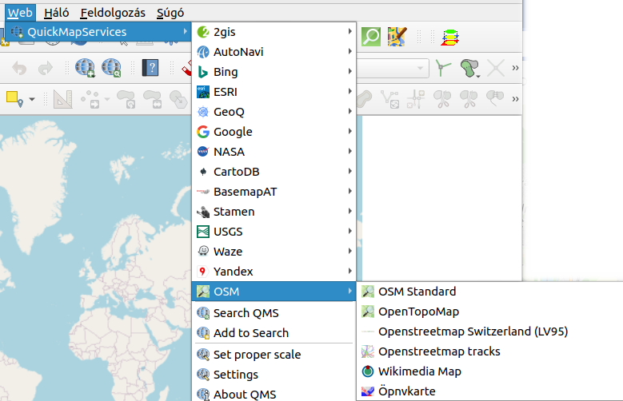
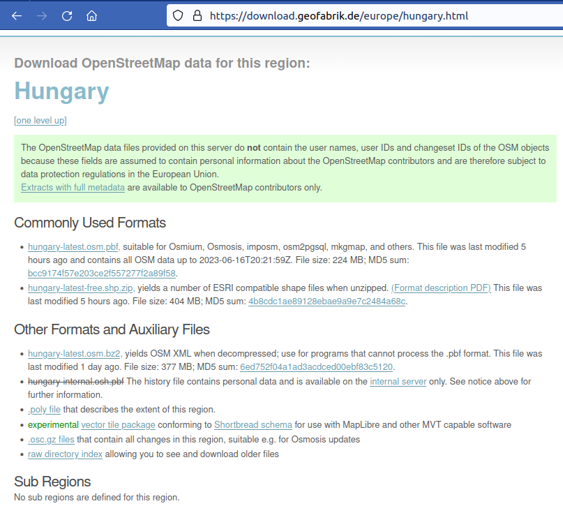
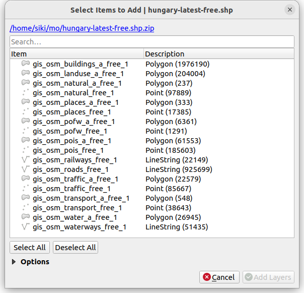
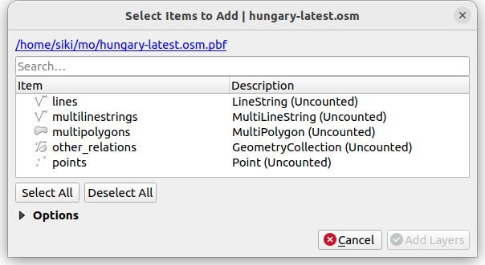
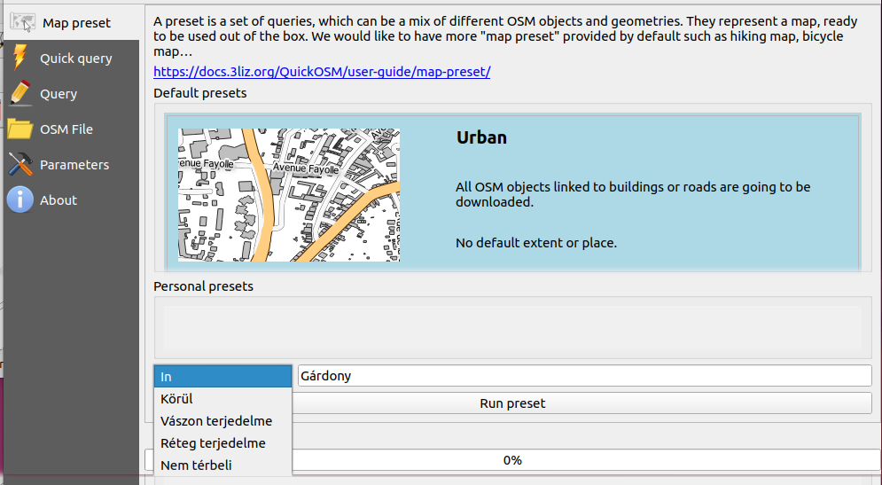
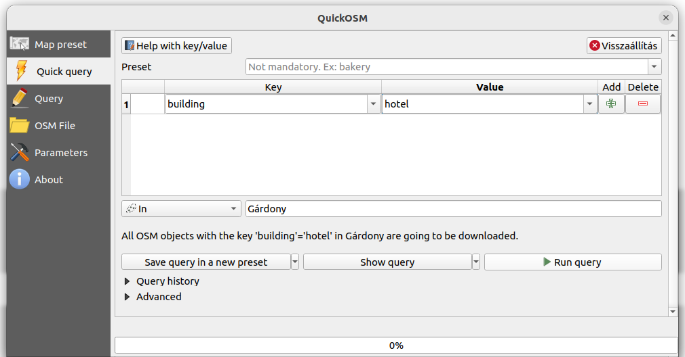
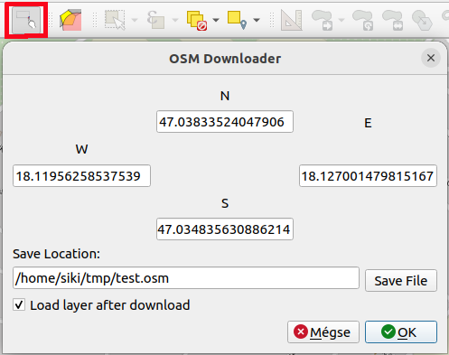
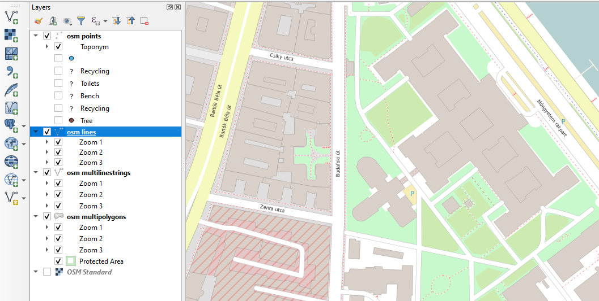

OSM adatok használata a QGIS-ben
================================

QGIS 3.0+

Az OpenStreetMap térkép hazánk területére egyre bővebb és teljesebb tartalmat
biztosít a térinformatika alkalmazóinak. Ez a hazai OSM aktivistáknak, 
szerkesztőknek köszönhető.

Az OpenStreetMap licencezése lehetővé teszi, hogy szabadon másoljuk,
terjesztjük és adaptáljuk az adatokat, mindaddig amíg az OpenStreetMap-et és
a közreműködőit megnevezzük. Ha megváltoztatja az OSM adatokat vagy azokra épít,
az eredményt csak ugyanezzel a licenccel terjesztheti.
Bövebben: https://www.openstreetmap.org/copyright

OSM csempék megjelenítése
-------------------------

AZ OpenStreetMap közösség az egész Földre kiterjedő térképi tartalmat szolgáltat
a szabványos WMTS (WebMapTileService) szolgáltatással. Ez a megoldás egy 
szépen stilizált háttértérképet biztosít, a térképi elemek megjelenését nem
tudjuk módosítani és a kapcsolódó adatokat sem tudjuk lekérdezni.

Csatlakozás a WMTS szerverhez
~~~~~~~~~~~~~~~~~~~~~~~~~~~~~

A WMTS szerverhez a QGIS böngészőből csatlakozhatunk egy új *XYZ Tiles*
létrehozásával. Nyissuk meg a *Böngésző* panelt és keressük meg az *XYZ Tiles*
csoportot. Jobb egérgombbal a csoport nevére kattintva, a megjelenő menüből
válasszuk ki az *Új kapcsolat...* opciót.

A megjelenő párbeszédablakban a *Név* és az *URL* mezőket kell kitöltenünk. A
*Név* egy szabadon választható név például *OpenStreetMap*. Az URL:

.. code::

    https://tile.openstreetmap.org/{z}/{x}/{y}.png

Az adatok megadása és az *OK* gomb megnyomása után az *YXZ Tile* csoportot 
szétnyitja és abban megjelenik a megadott név. Ezt a *Rétegek* panelba vagy a
térkép vászonra áthúzva adhatjuk hozzá az OSM csempéket az aktuális QGIS
projektünkhöz.
A megjelenő térkép megfelel az *osm.org* oldalon megjelenő *Standard* térképnek.

Csatlakozás a QMS modullal
~~~~~~~~~~~~~~~~~~~~~~~~~~

A QuickMapServices modul több más csempeszerver mellett az OSM csempe 
szolgáltatáshoz is képes csatlakozni. Ehhez telepítenie kell a QMS modult a
*Modulok/Modulok kezelése és telepítése* menüponttal. Ezután megjelenik a 
a *Web* menüpont, melyben megtaláljuk a *QuickMapServices* menüpontot, melynek
almenüjében többféle OSM megjelenítés közül választhatunk. A *Standard*
megegyezik az előző *XYZ Tiles* használatánál megjelenő réteggel.

OSM vektoros adatok letöltése
-----------------------------

Azok akik az OSM adatokat egyéni stílussal szeretnék megjeleníteni, egy
részét be szeretnék építeni a térképükbe vagy az elekhez rendelt címkéket
is használni szeretnék le kell tölteniük a vektoros adatokat. A Földre
kiterjedő OSM adatokat a nagy méretük miatt (több mint 69 GB tömörített PBF
formátumban). Több lehetőséget mutatunk be az OSM adatok egy részének 
letöltésére.

Magyarországra leválogatott adatok
~~~~~~~~~~~~~~~~~~~~~~~~~~~~~~~~~~

A geofabrik.de oldalon kontinensekre, országokra és kisebb egységekre is 
letölthetjük az OSM adatokat ESRI Shape, pbf vagy osm formátumban. A QGIS
mindhárom formátumot be tudja tölteni. Magyarországra nincsenek kisebb egységek,
csak a teljes ország adatai tölthetők le egyben. Az adatokat naponta frissülnek.

A hungary-latest-free.shp.zip fájl kb. 420 MB és 18 réteget tartalmaz. Minden
térképi elemhez tartozik *osm_id*, *code*, *fclass*, *name* attribútum, melyet
továbbiak egészítenek ki egyes rétegeknél.

A hungary-latest.osm.pbf fájl kb. 230 MB. Betöltésénél a QGIS a geometriai
elem típusa alapján bontja rétegekre az állományt. Betöltése jóval időigényesebb
az shp fájlokhoz képest, de tartalmazza az OSM címkék (tag-ek) szélesebb
körét. Néhány kiemelt cimkét önálló oszlopban találunk a QGIS attribútum
táblában. A többieket pedig szövegként tartalmazza az *other_tags* oszlop.

QuickOSM modul
~~~~~~~~~~~~~~

A QuickOSM modul telepítése után egy új eszközsort ad a QGIS felhasználói
felületéhez és a *Vektor* menüben is megtalálható. A modul segítségével 
lekérdezést készíthetünk és az Overpass API segítségével illetve OSM fájlokat
is megnyithatunk.

A modul elindítása után egy párbeszédablak jelenik meg, mely több fület
tartalmaz. A *Map preset* fülön az *Urban* alapértelmezett kiválasztásával
nem csak az adatokat, hanem a megjelenítéshez tartozó stílusokat is le tudjuk
tölteni az utak és épületek megjelenítéséhez.

Az *Urban* téma kiválasztása után alul meg tudjuk adni a terjedelmet. Az *in*
esetén egy település nevét adhatjuk meg, de választhatjuk a település
környezetét is egy távolság megadádával vagy az aktuális térkép (vászon) 
területét vagy egy réteg terjedelmét (vagy a rétegen szelektált elemek
terjedelmét). 

A lekérdezés futtatása (*Run preset*) után két új memória réteget kapunk a
projektünkben. Az épület (*building*) és út (*road*) réteget, az út réteg,
melyhez egy szabályvezérelt tematikus megjelenítés járul, hogy a méretaránynak
megfelelő ábrázolást kapjunk.

A *Quick query* (gyors lekérdezés) fülön a teljes OSM tartalomhoz hozzáférhetünk
és nem csak térbeli szűrést adhatunk meg,
hanem opcionálisan tartalom szerinti szűrést is az OSM cimkék alapján.
A lekérdezés eredménye több réteget ad a projektünkhöz a geometriai elemek
típusa (pont, törtvonal, felület) alapján.
Ebben az esetben az OSM cimkék teljes körét (több száz oszlop) megkapjuk az
attribútum táblában.
A lekérdezés eredménye ebben az esetben is memória rétegekbe kerül, az elemek
stílusa a QGIS alapértelmezett stílusa lesz.

A cimkék szerinti lekérdezéshez a *Key* (kulcs), *Value* (érték) táblázatot
bővíthetjük. A *Preset* listából témát választva is feltölthetjük a *Key*,
*Value* táblázatot. A lekérdezés térbeli kiterjedését a *Quick query* fülhöz
hasonlóan adhatjuk meg.
A lekérdezést a *Run query* gombbal indíthatjuk el.

Az alábbi ábrán a Gárdonyi hotelek lekérdezését láthatjuk.

A *Show query* gomb segítségével megkaphatjuk az Overpass lekérdezést, ilyet
írhatunk be közvetlenül a *Query* fülön. A *Save query in a new preset* gomb
segítségével az aktuális lekérdezés bekerül a *Map preset* fül *Personal preset*
listájába.

OSMDownloader modul
~~~~~~~~~~~~~~~~~~~

Az OSMDownloader modul segítségével egy téglalap alakú területre kérdezhetjük le
az OSM adatokat egy helyi fájlba.
A modul telepítése/bekapcsolása uzán egy új OSMDownloadar eszköztár 
jelenik meg, mely egyetlen gombot tartalmaz. Az eszköz kiválasztása után egy
téglapot adhatunk meg a térképen.

A lekérdezett elemek geometria tipusának megfelelő számú réteget kapunk,
melyek stílusát is beállítja a modul. A méretaránytól függően itt is más
stílussal jelennek meg az elemek.
Az attribútum tábla az OSM cimkéket
az *other_tags* mezőben ömlesztve találjuk meg.

**Megjegyzés**

    A QGIS 3.16 verzió után módosult a QGIS stílus fájlok szerkezete, ezért
    nem jelennek meg megfelelően a rétegek.
