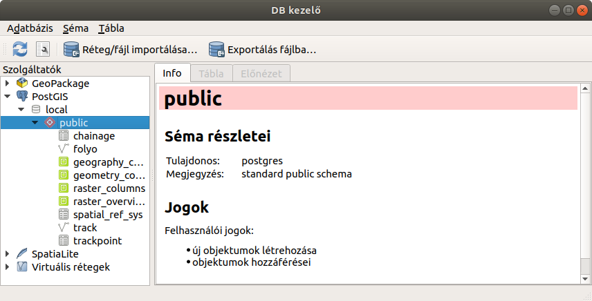
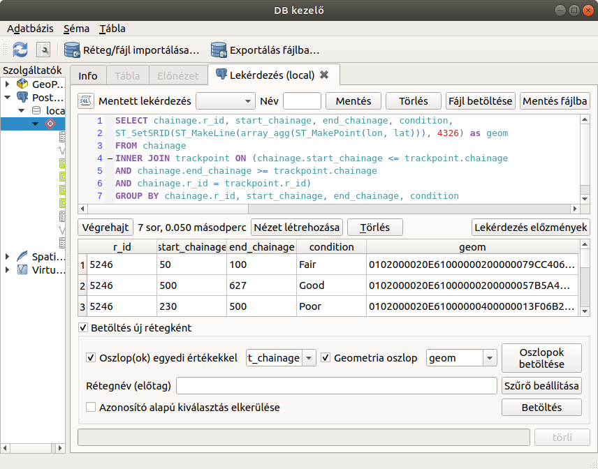
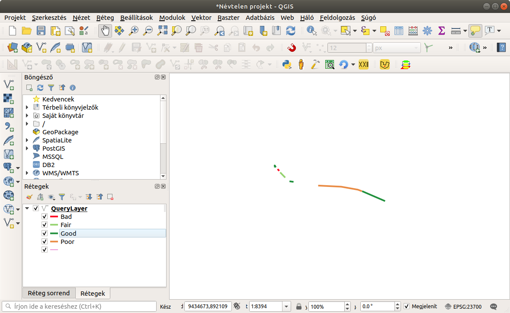

PostGIS-ben tárolt pontok összeláncolása törtvonalakká
======================================================

PostGIS 2.4, PosgreSQL 10.12, QGIS 3.12

Összeállította: Siki Zoltán

Egy navigációs GPS eszközzel adatokat gyűjtöttünk, melyek szövegfájlokban állnak
rendelkezésre. Egy fájlban a pontok pozíciót találjuk egy mérés azonosítóval és 
egy pont azonosítóval valamint a földrajzi koordinátákkal (WGS84).
Emellett egy másik fájlban szerepelnek adatok a pontok szakaszokká
összekapcsolásáról és a szakaszokhoz tartozó attribútumokkal. A célunk, hogy
az adatokból vonalláncokat készítsünk és azokat a GIS-ben megjelenítsük.
Az adatokat egy a gis.stackexchange oldalon megjelenő kérdésből vettem át.

Az adataink csv fájlokban állnak rendelkezésre. A trackpoint.csv fájl tartalma:

.. code:: text

	5246,0,12.251324,105.984187
	5246,5,12.251354,105.984224
	5246,6,12.251357,105.984219
	5246,8,12.25137,105.984231
	5246,9,12.251374,105.984222
	5246,10,12.251373,105.984217
	5246,17,12.251307,105.984206
	5246,38,12.251117,105.984186
	5246,42,12.251082,105.984184
	5246,60,12.250926,105.984155
	5246,88,12.250668,105.98414
	5246,125,12.250338,105.984167
	5246,129,12.250311,105.984186
	5246,133,12.250278,105.984209
	5246,138,12.250246,105.984233
	5246,189,12.249824,105.984432
	5246,275,12.249232,105.984933
	5246,389,12.248444,105.985601
	5246,475,12.247789,105.986025
	5246,493,12.247635,105.986089
	5246,503,12.247557,105.986123
	5246,622,12.246541,105.986484

A szakaszokat leíró adatok a chainage.csv fájlban:

.. code:: text

	5246,0,30,'Good'
	5246,30,50,'Bad'
	5246,50,100,'Fair'
	5246,100,140,'Good'
	5246,140,230,'Bad'
	5246,230,500,'Poor'
	5246,500,627,'Good'

Adatok betöltés PosgreSQL adatbázis táblákba
--------------------------------------------

A megoldás során a PostGIS/PostgreSQL téradatbázis funkcionalitását fogjuk 
felhasználni. Első lépésben hozzuk létre az adataink tárolásához szükséges 
táblákat.

.. code:: sql

	CREATE TABLE trackpoint (
		r_id int NOT NULL,
		chainage int NOT NULL,
		lat double precision NOT NULL,
		lon double precision NOT NULL,
		PRIMARY KEY (r_id, chainage)
	);

	CREATE TABLE chainage (
		r_id int NOT NULL,
		start_chainage int NOT NULL,
		end_chainage int NOT NULL,
		condition varchar(10) NOT NULL,
		PRIMARY KEY (r_id, start_chainage),
		CHECK (start_chainage < end_chainage)
	);

A fenti SQL parancsokat hajtsuk végre *psql* prancssori vagy a *pgAdmin* 
grafikus felhasználói felülettel rendelkező programban.

Az adatok betöltését a fenti SQL utasításokkal létrehozott adatbázis táblákba a
COPY paranccsal végezhetjük el. A COPY parancs használatához adatbázis 
rendszergazda jogokkal kell rendelkeznünk! Ha ez nem megoldható, akkor a csv
fájlokat átalakíthatjuk SQL szriptekké vagy a *psql* \\copy parancsával
probálkozhatunk. Az anyag végén megtalálható a teljes SQL szkript a táblák 
létrehozásával és az adatok betöltésével.

.. code:: sql

	copy chainage(r_id, start_chainage, end_chainage, condition)
		from 'chainage.csv' DELIMITER ',';
	copy trackpoint(r_id, chainage, lat, lon)
		from 'trackpoint.csv' DELIMITER ',';

A fájlnevek elé az elérési utat is meg kell adnunk, ha nem a aktuális könyvtárban találhatók.

Adatok megjelenítése QGIS-ben
-----------------------------

A QGIS **DB kezelő** modulját fogjuk használni a lekérdezéshez és röptében
fogunk geometriai elemeket létrehozni az adatokból. A **DB kezelő**-ben 
olyan adatbázisokhoz tudunk kapcsolódni, melyekhez megelőzően létrehoztunk 
egy kapcsolatot az **Adatforrás kezelő** ablak **PostgreSQL** fülén.

A **DB kezelő** ablakában a bal oldalon válasszuk ki a PostGIS adatbázisok közül
azt a kapcsolatot, mely az adatbázisunkra vonatkozik (esetemben ez a *local* 
nevű). Nyissuk szét a megfelelő sémát, hogy a táblák megjelenjenek (esetemben
ez a *public* séma).

	DB kezelő ablaka

A **DB kezelő**-ben válasszuk ki az **SQL ablak** ikont (balról a második az
eszközsorban) és írjuk be a következő lekérdezést:

.. code:: sql

	SELECT chainage.r_id, start_chainage, end_chainage, condition,
	ST_SetSRID(ST_MakeLine(array_agg(ST_MakePoint(lon, lat))), 4326) as geom
	FROM chainage
	INNER JOIN trackpoint ON (chainage.start_chainage <= trackpoint.chainage
	AND chainage.end_chainage >= trackpoint.chainage
	AND chainage.r_id = trackpoint.r_id)
	GROUP BY chainage.r_id, start_chainage, end_chainage, condition;

	Lekérdezés a DB kezelő ablakában

Elemezzük egy kicsit a fenti lekérdezést. Először a *FROM* és *INNER JOIN* részt
nézzük meg. Ez a rész hozza létre a kapcsolatot a két tábla között. A *chainage*
megfelelő sorát a *trackpoint* tábla sorai mellé másoljuk. Leegyszerűsítve a 
lekérdezést:

.. code:: sql

	SELECT *
    FROM chainage
    INNER JOIN trackpoint ON (chainage.start_chainage <= trackpoint.chainage
    AND chainage.end_chainage >= trackpoint.chainage
    AND chainage.r_id = trackpoint.r_id);

A fenti lekérdezés eredmény táblájának néhány sora:

+------+----+-----+------+------+----+-----------+------------+
| 5246 |  0 |  30 | Good | 5246 |   0| 12.251324 | 105.984187 |
+------+----+-----+------+------+----+-----------+------------+
| 5246 |  0 |  30 | Good | 5246 |   5| 12.251354 | 105.984224 |
+------+----+-----+------+------+----+-----------+------------+
| 5246 |  0 |  30 | Good | 5246 |   6| 12.251357 | 105.984219 |
+------+----+-----+------+------+----+-----------+------------+
| ...  |    |     |      |      |    |           |            |
+------+----+-----+------+------+----+-----------+------------+
| 5246 | 30 |  50 | Bad  | 5246 |  38| 12.251117 | 105.984186 |
+------+----+-----+------+------+----+-----------+------------+
| 5246 | 30 |  50 | Bad  | 5246 |  42| 12.251082 | 105.984184 |
+------+----+-----+------+------+----+-----------+------------+
| 5246 | 50 | 100 | Fair | 5246 |  60| 12.250926 | 105.984155 |
+------+----+-----+------+------+----+-----------+------------+
| ...  |    |     |      |      |    |           |            |
+------+----+-----+------+------+----+-----------+------------+
| 5246 | 100| 140 | Good | 5246 | 125| 12.250338 | 105.984167 |
+------+----+-----+------+------+----+-----------+------------+
| ...  |    |     |      |      |    |           |            |
+------+----+-----+------+------+----+-----------+------------+

A következő lényeges rész a *geom* oszlop előállítása:

.. code:: sql

	ST_SetSRID(ST_MakeLine(array_agg(ST_MakePoint(lon, lat))), 4326) as geom

Az "ST\_" kezdetű függvények a PostGIS bővítményben találhatók.
Az *ST_MakePoint* egy 2D-s pontot hoz létre, az *array_agg* a PostgreSQL
aggregáló függvénye a *GROUP BY* klauzulával dolgozik együtt, ez a csoportba
tartozó értékeket egy tömbbe gyűjti össze. A *MakeLine* függvény a tömbben 
összegyűjtött pontokból törtvonalat készít, majd az *ST_SetSRID* beállítja a 
koordináta rendszert.

.. code:: sql

	GROUP BY chainage.r_id, start_chainage, end_chainage, condition;

Az utolsó *GROUP BY* rész fogja meghatározni, hogy a pontok mely 
csoportjaira hozza létre az *array_agg* a tömböket. A *GROUP BY* utáni
oszlopok egyedi értékére jönnek létre a csoportok. Elsőre kicsit soknak tűnik
ez a felsorolás, hiszen az oszlopok egy része (*r_id*, *start_chainage*) is
elegendő lenne a csoportok egyértelmű kialakításához. A többi oszlopot azért
szükséges felsorolni, mert a lekérdezés eredményében szerepelnek. Ha egy 
lekérdezés *GROUP BY* klauzulát tartalmaz, akkor a lekérdezés eredménye
oszlopaiban csak a csoport képző oszlopok (ezeket soroljuk fel a GROUP BY után)
vagy aggregátor függvénnyel előállított érték szerepelhet.

	Megjelenítés a QGIS-ben

SQL szkript
-----------

A PostgreSQL tablák létrehozását és az adatok betöltéséet megvalósító SQL 
skript:

.. code:: sql

	DROP TABLE IF EXISTS trackpoint;
	DROP TABLE IF EXISTS chainage;

	CREATE TABLE trackpoint (
		r_id int NOT NULL,
		chainage int NOT NULL,
		lat double precision NOT NULL,
		lon double precision NOT NULL,
		PRIMARY KEY (r_id, chainage)
	);

	INSERT INTO trackpoint 
	VALUES(5246,0,12.251324,105.984187),
		  (5246,5,12.251354,105.984224),
		  (5246,6,12.251357,105.984219),
		  (5246,8,12.25137,105.984231),
		  (5246,9,12.251374,105.984222),
		  (5246,10,12.251373,105.984217),
		  (5246,17,12.251307,105.984206),
		  (5246,38,12.251117,105.984186),
		  (5246,42,12.251082,105.984184),
		  (5246,60,12.250926,105.984155),
		  (5246,88,12.250668,105.98414),
		  (5246,125,12.250338,105.984167),
		  (5246,129,12.250311,105.984186),
		  (5246,133,12.250278,105.984209),
		  (5246,138,12.250246,105.984233),
		  (5246,189,12.249824,105.984432),
		  (5246,275,12.249232,105.984933),
		  (5246,389,12.248444,105.985601),
		  (5246,475,12.247789,105.986025),
		  (5246,493,12.247635,105.986089),
		  (5246,503,12.247557,105.986123),
		  (5246,622,12.246541,105.986484);

	CREATE TABLE chainage (
		r_id int NOT NULL,
		start_chainage int,
		end_chainage int NOT NULL,
		condition varchar(10) NOT NULL,
		PRIMARY KEY (r_id, start_chainage),
		CHECK (start_chainage < end_chainage)
	);

	INSERT INTO chainage
	VALUES(5246,0,30,'Good'),
		  (5246,30,50,'Bad'),
		  (5246,50,100,'Fair'),
		  (5246,100,140,'Good'),
		  (5246,140,230,'Bad'),
		  (5246,230,500,'Poor'),
		  (5246,500,627,'Good');

2020. április 30.
