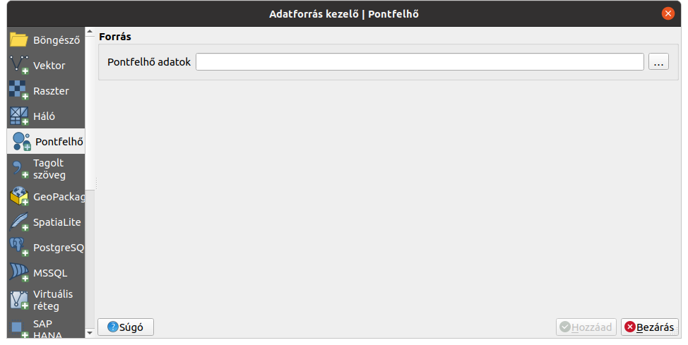
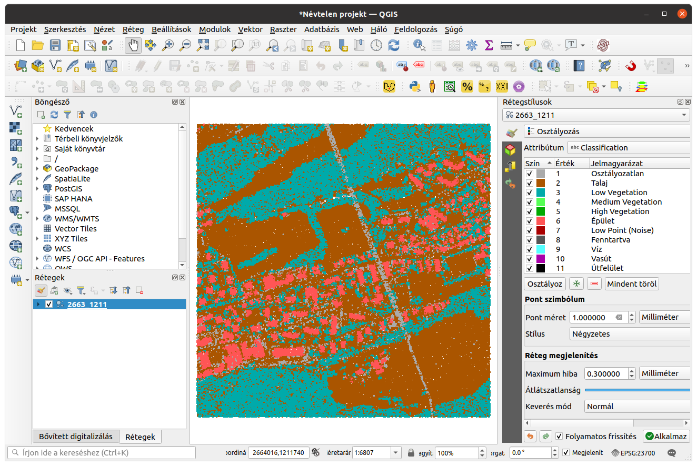
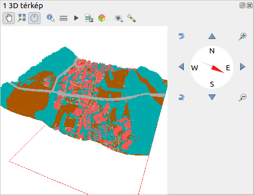
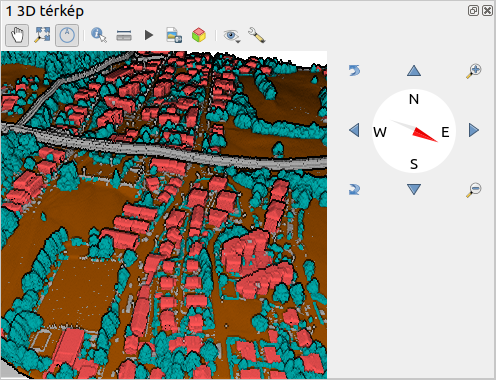

Pontfelhő megjelenítése QGIS-ben
================================

QGIS 3.18

Összeállította: dr. Siki Zoltán, 2021

A QGIS 3.18 verzióban jelent meg a pontfelhő állományok kezelése. LAS/LAZ
fájlokat tölthetünk be. Az **Adatforrás kezelőben** egy új ikon jelent meg a 
bel oldalon a pontfelhők betöltésére. Képeken szereplő pontfelhőt a 
https://www.swisstopo.admin.ch/en/geodata/height/surface3d.html oldalról
töltöttem le.

|pointcloud1_png|

A pontfelhők első megnyitása során a QGIS egy ingyexet épit fel a gyorsabb
megjelenítés érdekében, mely a gép teljesítményétől és a pontfelhő méretétől
függően hosszabb időt vehet igénybe. Az index fájlok az *ept_*-vel kezdődő
a fájl nevét tartalmazó alkönyvtárba kerülnek.
Az index mérete elég nagy lehet, például egy
~400 MB-os LAS fájl esetén az index által foglalt háttértár ~80 MB. Az indexeket
nyugodtan törölhetjük, ha szabad helyre lenne szükségünk a háttértárolón.

A pontfelhők megjelenítése esetén a **Rétegstílusok** panelt célszerű
bekapcsolni. A ponfelhőkre vonatkozóan többféle megjelenítési mód közül 
választhatunk itt:

* Csak a körvonal, piros szaggatot vonallal jelenik meg a befoglaló idom
* Attribútum színezés, a pontfelhő fájlba szereplő attribútum szerinti színátmenetes színezés
* RGB, valódi színek szerinti megjelenítés
* Osztályozás, talaj, épület, stb. osztályok megjelenítése

A fenti megjelenítés típusokhoz szükséges adatokat nem feltétlenül 
tartalmazzák az egyes pontfelhő állományok.

|pointcloud2_png|

A pontfelhő rétegekhez nem lehet attribútum táblát megnyitni, de az 
azonosítás eszközzel lekérdezhetjük az adatokat.

A pontfelhő a 3D nézetben is megjeleníthető. Ahhoz, hogy ne csak 2D-ben
lássuk a 3D nézetben a pontfelhőt, a rétegstílusok panelen egy-két beállítást
el kell végezni. A 3D nézet fülön állítsuk be a 3D nézetben kívánt
megjelenítést (az alapértelmezés az, hogy nem jelenik meg 3D-ben).
Ezek többé-kevésbé egyeznek a 2D megjelenítés beállításival.
Emellett célszerű a 2D-s nézetben csak a körvonl megjelenítését beállítani,
hogy ne jelenjen meg kétszer a pontfelhő a 3D nézetben.

|pointcloud3_png|

A pontfelhő megjelenítését még plasztikusabbá tehetjük a 3D nézet
eszközsorában található csavarkulcs ikonnal lenyitható listából a
**Show Eye Dome Lighting** kiválasztva.

|pointcloud4_png|

A 3D-s nézetben megjelenő szélrózsával és körülötte lévő ikonokkal 
navigálhat, illetve az egeret és Shifti/Ctrl billentyűt használhatja. Minden
mozgatásra több alternatív lehetőség van. Az alábbiakban a legegyszerűbb
egér műveleteket adjuk meg.

* Billentés fel/le  - egérgörgő nyomvatartása és húzás fel/le
* Forgatás jobbra/balra - egérgörgő nyomvatartása és húzás jobbra/balra
* Eltolás - Bal egérgomb nyomvatartása mellett húzás (a tenyér ikon legyen aktív)
* Kamera irány - CTRL és bal egérgomb húzás
* Nagyítás/kicsinyítés - egérgörgő forgatás

