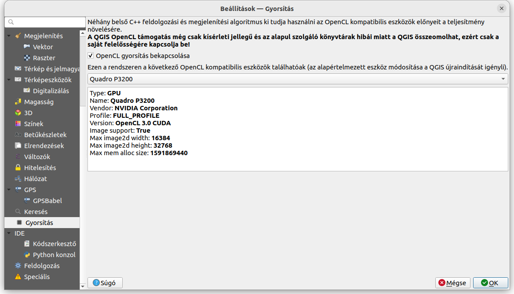
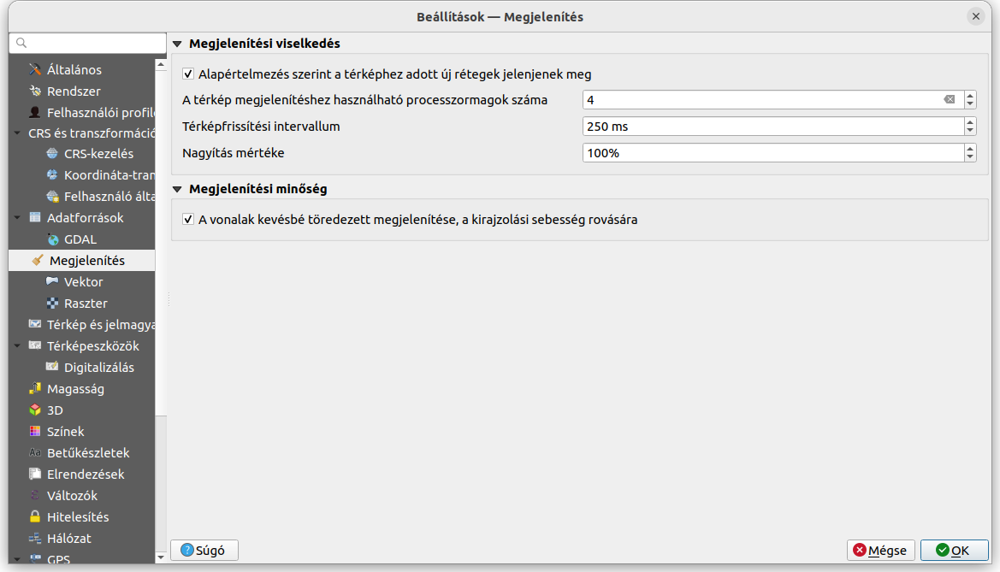

GPU gyorsítás a QGIS-ben
========================
QGIS 3.x verzió

Összeállította: Siki Zoltán

A QGIS az OpenCL könyvtáron keresztül képes a gépünkben található GPU
(grafikus processzor) használatára.

Például Ubuntu/Debian operációs rendszer esetén a

.. code::

    sudo apt update
    sudo apt install ocl-icd-opencl-dev

parancsokkal telepíthetjük. Windows telepítéshez itt egy kiindulási pont:

https://streamhpc.com/blog/2015-03-16/how-to-install-opencl-on-windows/

Az OpenCL telepítése után indítsuk el a QGIS-t és a **Beállítsok/Beállítások**
menüpont kiválasztása után válasszuk a **Gyorsítás** fület és kapcsolja be a
az OpenCL gyorsítást.

Amennyiben nem jelenik meg a pipa az *OpenCL gyorsítás bekapcsolása* jelölő
négyzetben, az arra utal, hogy nincs megfelelő OpenCL a gépén.
Az OpeCL segítségével akár négyszeresére gyorsulhat egyes rétegek megjelenítése.

Egy másik gyorsítási lehetőség a több CPU mag illetve szál hasznáklata a
megjelenítésben. A korábbi QGIS változatok alapértelmezésben egy szálat 
használ csak, viszont
valószínűleg a gépében már több magot illetve szálat tartalmazó CPU van.
Szintén a **Beállítások/Beállítások** menüpont után válassza a 
**Megjelenítés** fület és módosítsa *A térkép megjelenítéshez használt
processzormagok száma* beállítást.

2024. február 23.

