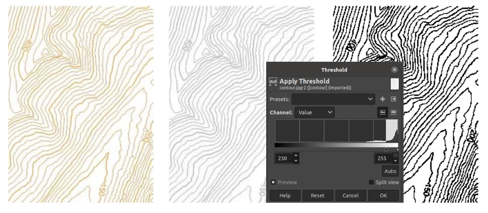
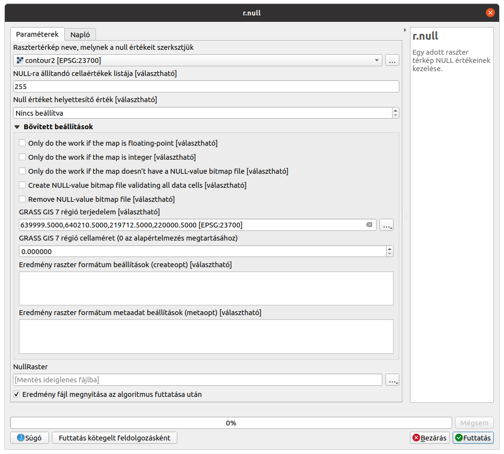
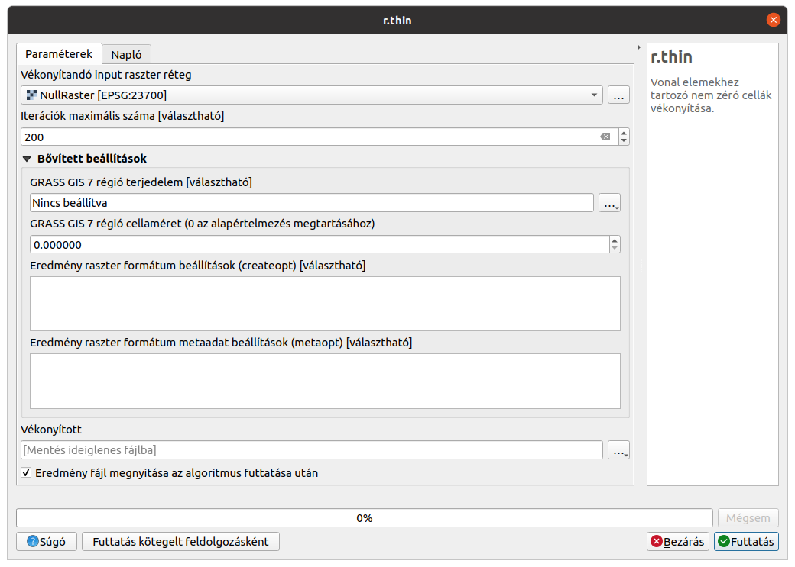
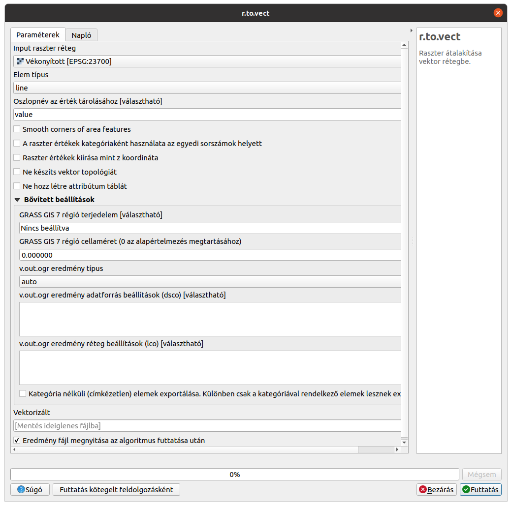
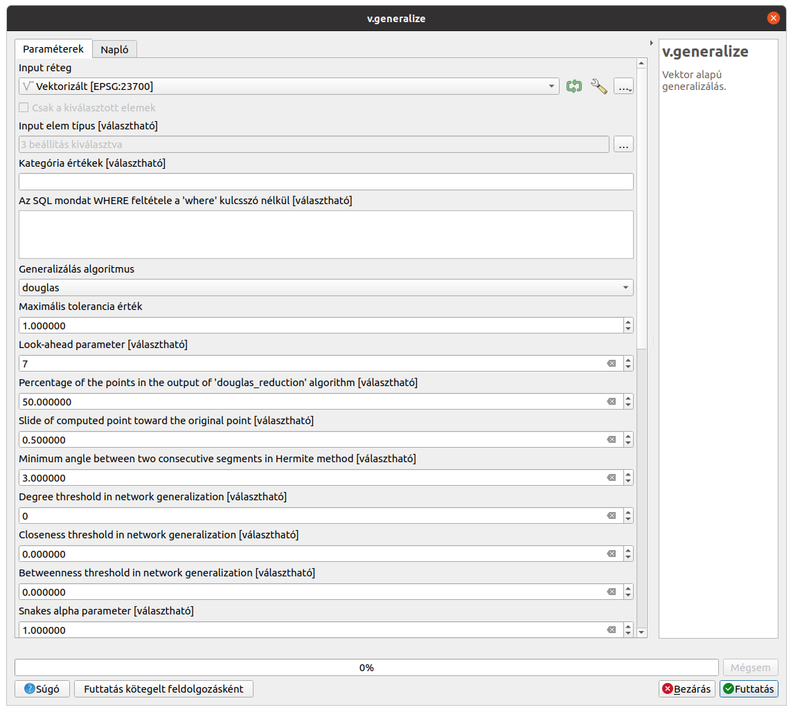
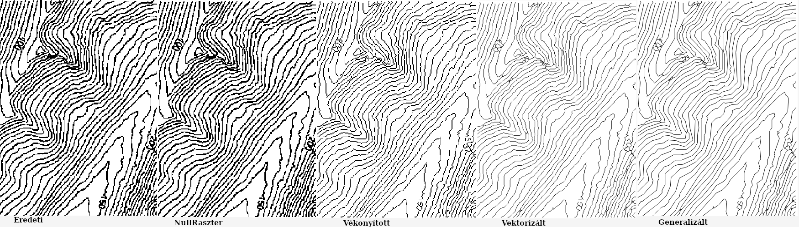

Raszter -> vektor átalakítás
============================

QGIS 3.10/GRASS 7

Összeállította: dr. Siki Zoltán

Egy kis szintvonalas raszter segítségével mutatom be a raszter-vektor átalakítás lépéseit a
GRASS GIS segítségével. A GRASS funkciókat a QGIS processing modul segítségével érjük el.

.. note::

    A GRASS felhasználóknak megadjuk a megfelelő GRASS parancsokat, melyek egy 
    szkriptből használva automatizálható az átalakítás.

Állomány előkészítése
---------------------

A raszter állományunkat a vektorizálás előtt célszerű kétszínű raszterré alakítani (de
legalább szükeárnyalatossá). Erre a célra a GIMP szintén nyílt forráskódú programot 
használtam, de több más nyílt forráskódú megoldás is létezik (pl. imagemagic). Első lépésben az **Image/Mode/Grayscale** menüpont kivlasztásával szürkeárnyalatossá változtattam a képet,
majd **Colors/Threshold** menüpont segítségével a hisztogram segítségével választottam ki a
küszöbértéket (230) a kétszínüvé alakításhoz. Az eredmény PNG formátumba mentettem el.

|r2v1_png|

Raszter-vektor átalakítás
-------------------------

A raszter-vektor átalakítást több lépésben fogjuk kivitelezni. A kétszínű raszterben a háttér
színt *null* értékké alakítjuk. Ezután a GRASS vékonyító (r.thin) eljárásával már egy 
pixel szélessé vékonyíthatjuk a vonalakat. Az így kialakított vékonyított vonalak szomszédos
pixeleinek középpontját összekötve (r.to.vect) már vektorokat kapunk. Az utolsó lépésben 
a sok rövid vonalat simítjuk a Douglas-Peucker algoritmussal (v.generalize).
A lépések felvázolása után kezdjük el a munkát.

Töltsük be a QGIS-be a küszöbértékkel kétszínüvé alakított raszterünket (fehér=255, fekete=0).
Nyissuk meg a feldolgozás eszköztárat, a keresés mezőbe írja be az "r.null"-t, majd dupla 
kattintással válassza ki azt. A megjelenő párbeszédablakban a NULL-ra állítandó mezőbe írjuk 
be a fehér szín kódját (255). A régió terjedelmét állítsuk a réteg terjedelmére. A többi mezőt
nem kell módosítani. A **Futtatás** gombbal indítsuk el a feldolgozást, az eredmény a
NullRaster rétegben jelenik meg (látható különbség nincs az eredeti raszterhez képest.
Viszont, ha az "i" (elem azonosítás) eszközzel a raszterbe kattintunk a szintvonalak közé,
akkor a NullRaster rétegen "nincs adat" a contour2 rétegen "1" értéket kapunk.

|r2v2_png|

Az feldolgozás eszköztárban keressük ki az "r.thin" GRASS modult. A megjelenő párbeszédablakban 
Válasszuk ki a NullRastert a vékonyítandó input raszter rétegnek, mást nem kell változtani.
A futtatás gombbal indítsul el a vékonyítást.

|r2v3_png|

A feldolgozás eszköztárban keresse ki az "r.to.vect" GRASS modult. A megjelenő párbeszédablakban
A vékonyított réteget válasszuk input rétegnek, az elemtípus legyen "line".

|r2v4_png|

Az elkészített vektor réteg nagyon sok töréspontot tartalmaz. Nagyítson bele, hogy ezt lássa.
Simítsuk a vonalainkat a GRASS "r.generalize" modullal, amit szintén a feldolgozás 
eszköztárban találhatunk meg. A modul kiválasztása után egy nagyon sok beállítási lehetőséget
tartalmazó párbeszédablakot kapunk. Próbáljuk ki az alapértelmezett beálltásokat.
Amennyiben az így kapott eredmény nem kielégítő, akkor próbálja a bellításokat módosítani
(célszerű a GRASS GIS dokumentációt is tanulmányozni).

|r2v5_png|

Az egyes lépések eredményeit az alábbi ábra mutatja be.

|r2v6_png|

Végül álljanak itt a GRASS parancsok:

.. code:: bash

    # raszter beolvasása a GRASS adatbázisba
    r.in.gdal -o input=contour2.png output=eredeti
    # actuális számítási terület a raszter terjedelmére
    g.region raster=eredeti
    # fehér színű pixelek NULL értékké alakítása
    r.null map=eredeti setnull=255
    # raszter vonalak vékonyítása egy pixel szélesre
    r.thin input=eredeti output=vekonyitott iterations=200
    # raszter-vektor átalakítás
    r.to.vect input=vekonyitott output=vektorizalt type=line
    # vektor vonalak sikítása
    v.generalize input=vektorizalt output=simitott method=douglas threshold=1

Ha a fenti sorokat egy parancsfájlba bemásoljuk (shell szkript Linuxon vagy
bat fájl Windows-on), akkor egyben végrehejthatjuk  a műveleteket.

.. note::

    GRASS GIS használta esetén egy helyet (location) és egy térképcsoportot
    (mapset) létre kell hozni. Lásd a GRASS oktató anyagokat a 
    http://osgeo.hu oldalon.

