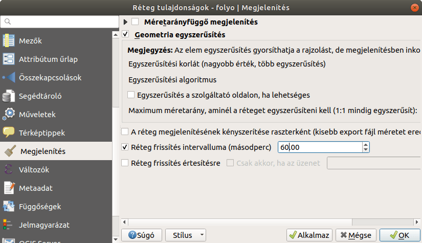

Réteg automatikus frissítése
============================

QGIS 3.x 
Összeállította: dr. Siki Zoltán

A különböző relációs adatbázisokban (pl. PosgreSQL/PostGIS, MS SQL Server, Oracle) tárolt vektoros rétegek esetén előfordulhat, hogy miközben a a QGIS-ben használjuk a réteget egy másik alkalmazás módosítja az adatokat. Ezeket a módosításokat a QGIS nem veszi észre automatikusan.

Az egyik lehetőség, hogy az aktuálisan megjelenített tartalom nagyításával/kicsinyítésével vagy eltolásával kényszerítjük ki a QGIS-ben a rétegek frissítését az adatbázisból.

A másik egy automatikus időintervallumonként történő frissítés.
Ezt a réteg tulajdonságai között a **Megjelenítés**
fülön találjuk meg. A *Réteg frissítés intervalluma*
beállítást kapcsoljuk be és másodpercekben adjuk meg a frissítési intervallumot. Vigyázat nagy táblák gyakori frissítése érezhetően lelassíthatja a munkát!

|reteg_frissites_png|

Egy harmadik lehetőség, hogy az adatbázis-kezelő értesíti a QGIS-t, hogy változás történt. Erre szolgál a
*Réteg frissítése értesítésre*
beállítás. Ilyenkor az adatbázis-kezelő oldalán gondoskodni kell a megfelelő trigger elkészítéséről. Erről bővebben
(PostGIS estére)

itt olvashat:
`https://oslandia.com/en/2017/10/07/refresh-your-maps-from-postgresql <https://oslandia.com/en/2017/10/07/refresh-your-maps-from-postgresql>`_
illetve itt:
`https://kartoza.com/en/blog/using-pgnotify-to-automatically-refresh-layers-in-qgis/ <https://kartoza.com/en/blog/using-pgnotify-to-automatically-refresh-layers-in-qgis/>`_
.

Budapest, 2020. február 26.

