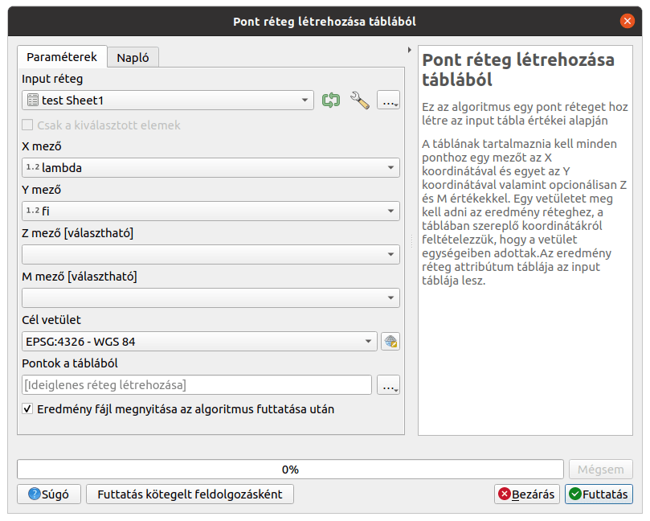
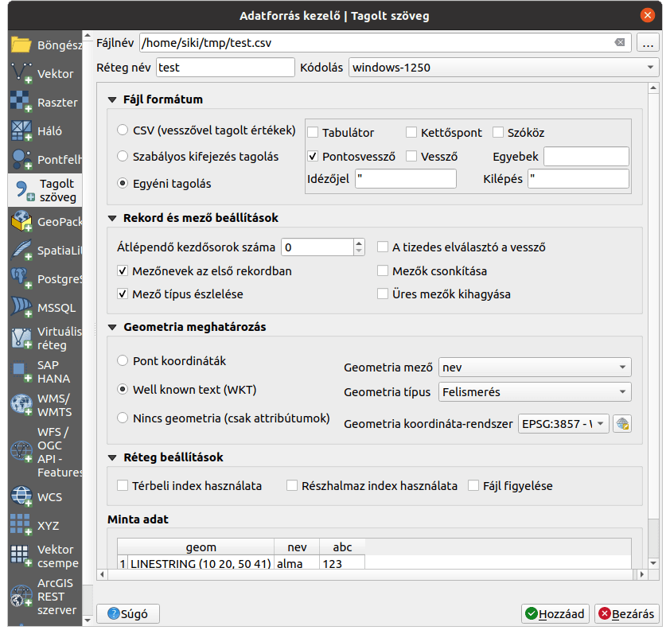

Számolótáblák használata QGIS-ben
=================================

**QGIS 3.0+**

**Összeállította: Siki Zoltán**

A QGIS alkalmas különböző táblázatkezelő szoftverek adatainak fogadására.
Az egyik lehetőség az xls/xlsx (MS Excel), ods (Libre Office Calc) illetve CSV
fájlok közvetlen megnyitása. Ezt meglepő módon a vektoros állományok
megnyitásánál tehetjük meg. A fájl típust állítsuk át "Minden fájl"-ra és
tallózzunk a megnyitandó fájlhoz. Amennyiben a számolótábla (xls/xlsx/ods) több 
munkalapból áll, akkor kiválaszthatunk egyet vagy többet a munkalapoks
listájából. CSV fájl esetén egy párbeszédablak is megjelenik, ahol további
beállításokat végezhetünk.

Így a QGIS-be mint egy táblázat kerülnek be az adatok, térképi 
megjelenítés nem tartozik hozzájuk. Erre az előtte levő ikon is utal a
réteglistában. A fájlkezelőből vagy az asztalról egyszerűen be is húzhatjuk a
fájlt a QGIS-be.

.. note::
    Vigyázat, a munkalapon táblázatban elrendezett adatok legyenek.
    Figyeljünk arra is, hogy az oszlopokban azonos típusú adatok (szám,
    szöveg) legyenek. Különben a QGIS szöveges adatként olvassa be a numerikus
    adatokat is, ha csak egy számként nem értelmezhető mezőtartalom van.
    Az oszlopok megnevezése az első sorban legyen, vegyük figyelembe, hogy a
    QGIS-ben nem szerepelhet minden karakter az oszlopnévben.

Amennyiben a betöltött táblázatban koordináták is szerepelnek (hosszúság,
szélesség vagy Y, X), akkor valószínűleg a térképen is szeretnénk látni az
adatokat. A már betöltött táblázatunkat a **Feldolgozás eszköztárban** 
található *Pont réteg létrehozása táblából* eszközt használhatjuk. 
Figyeljünk a vetületi rendszer helyes beálltására!

|spreadsheet1_png|

CSV fájlból közvetlenül is előállíthatjuk a pontokat tartalmazó QGIS réteget,
a *Tagolt szöveg réteg hozzáadása* eszközzel vagy menüponttal.

.. note::
    A CSV fájlból nem csak pont elemeket, hanem összetettebb geometriát is
    készíthetünk, ha a geometria egy mezőben WKT formátumban adott.

|spreadsheet2_png|

