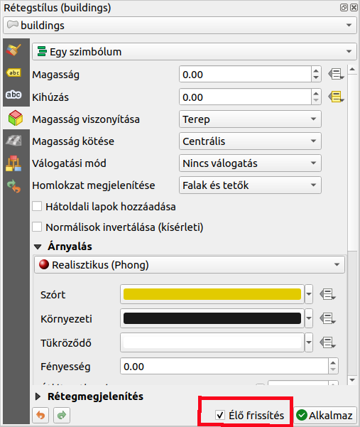
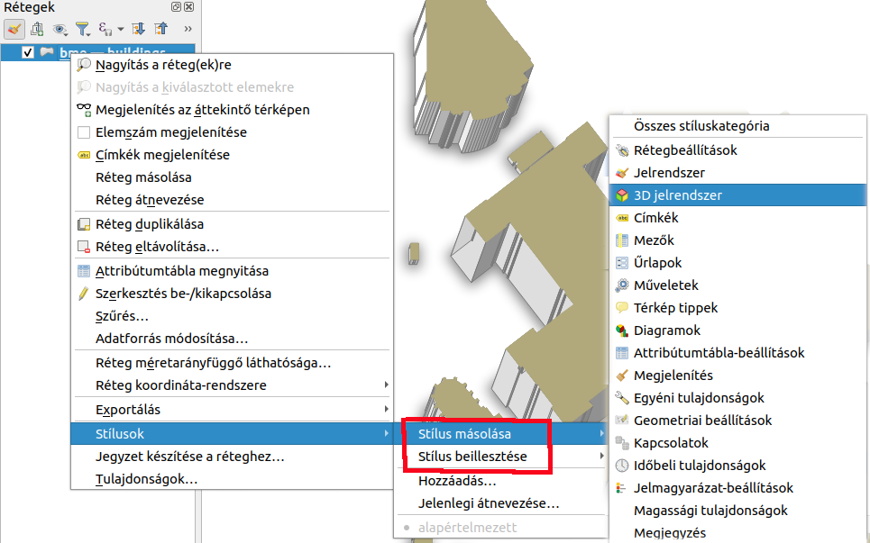
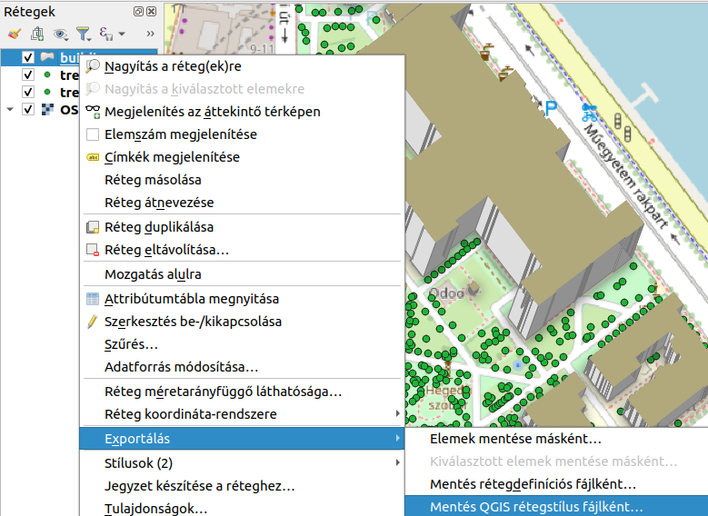
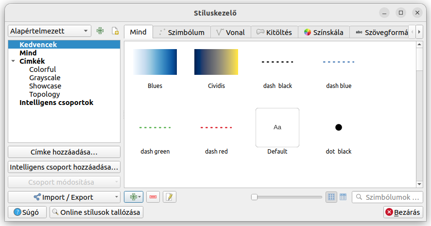

Réteg stílusok kezelése
=======================

QGIS 3.18+

**Összeállította: Siki Zoltán**

Az aktuális projekthez hozzáadott rétegek jelrendszer (megjelenítési
stílusok) beállításait nem csak a projekt mentésével őrizhetjük meg.
Emellett több a réteg beállítások kezelésével kapcsolatos lehetőséget 
mutatunk be.

.. note::

    A rétegstílusok mentésénél használt formátum megváltozott a 3.16
    verziótól, így a korábbi változatokkal nem kompatibilisek az
    elmentett réteg beállítások.

Rétegstílus panel
-----------------

A rétegstílus panel a rétegek megjelenítésének beállítását teszi kényelmesebbé.
A rétegtulajdonságon párbeszédablaktól eltérően nem modális ablak (a panel
nyitvatartása mellett más QGIS műveletek is kezdeményezhetők), az *Élő
frissítés* bekapcsolásával közvetlenül láthatjuk a módosítások eredményét.
Emellett a réteg tulajdonságoknál egyszerűbb felületet biztosít a
vektor, raszter, pontfelhő és háló rétegekhez.

A rétegstílus panelt a réteg lista első ikonjával nyithatjuk meg és 
dokkolhatjuk a QGIS ablak valamelyik oldalához. Alternatívaként a
**Nézet/Panelek** menüből is bekapcsolhatjuk a panelt vagy a Ctrl+3
gyors billentyűkkel.

|style1_png|

Stílusok másolása, mentése, betöltése
-------------------------------------

A rétegek megjelenítési tulajdonságait (stílusukat) több helyen is tárolhatjuk.
A projekt mentése során az egyes rétegek stílusa is bekerül a projekt
fájlba (.qgs vagy .ggz). Amenyiben az egyes rétegek stílus beállításait
másik projekben vagy másik rétegre szeretnénk alkalmazni, akkor többféle 
lehetőségünk van.

Stílusok másolása
~~~~~~~~~~~~~~~~~

Egy projekten belül a rétegek között a stílusokat átmásolhatjuk a
réteg listában jobb egérgombbal kattinsunk a réteg nevére, majd a felbukkanó
menüből válasszuk a **Stílusok/Stílus másolása** opciót, majd válasszuk ki, 
hogy az összes beállítást vagy csak a felsoroltak közül valamelyiket akarjuk
a vágólapra tenni. Ezután a másik rétegen, ahová a stílust át akarjuk vinni 
válasszuk ki a **Stílusok/Stílus beillesztése** opciót.

|style2_png|

.. note::

    A **Stílus beillesztése** csak akkor aktív, ha a vágólapra korábban
    átmásolta egy réteg stílusát.

A másolás és beillesztés között egy másik projektre is átválthatunk, így
projektek közötti másolást is lehetővé teszi ez a módszer, ha közben nem
zárjuk le a QGIS programot.

.. note::

    A stílus másolás és beillesztés a réteg menüben is megtalálható,
    ekkor a művelet az aktuális rétegre vonatkozik és nem választhatunk
    a stílus elemei közül.

Réteg stílusok mentése és betöltése
~~~~~~~~~~~~~~~~~~~~~~~~~~~~~~~~~~~

A stílusok számítógépek közötti átvitelét vagy elektronikus levélben elküldését
a réteg stílus fájlba mentésével oldhatjuk meg (ha nem akarunk egy teljes
projektet átadni másnak). A mentésnél többféle formátum közül választhatunk
(.qml, .sld, .qlr).

QGIS rétegstílus fájl
_____________________

A .qlr rétegstílus fájl a QGIS saját stílusfájlja.

A .qml fájl létrehozására a réteg fekbukkanó menü **Export**
menüpontja ad lehetőséget. A stílus fájlt a rétegtulajdonságok ablakban 
tölthetjük be egy réteghez a **Stílus** gomb segítségével az ablak alján.

|style3_png|

A .qml fájlt bármelyik réteghez hozzáadhatjuk, de például az adatvezérelt
megjelenítés csak akkor lesz helyes, ha a stílusban szereplő attribútum
megtalálható a rétegben.

Amennyiben egy fájl
alapú réteg mellett a réteg nevével egyező .qml fájl is található a
könyvtárban, akkor a QGIS automatikusan betölti a réteg stílus fájlt.

.. note::

    A stílus mentését a réteg tulajdonságok párbeszédablakan alul 
    megjelenő **Stílus** gomb megnyomása után megjelenő menüből
    válassza a **Stílus mentése...** menüpontot.

A rétegstílus fájlt be tölthetjük egy réteghez a rétegtulakdonságok ablak
aéján található **Stílus** gomb megnyomása után megjelenő 
**Stílus betöltése** opcióval.

.. note::

    A stílus fájl csak olyan geometria típusú réteg mellé tölthető be mint 
    a létrehozásánál használt rétegé.

Rétegdefiníciós fájl
____________________

A réteg definíciós fájl (.qlr) nem csak a réteg stílus beállításait, hanem a
réteg adatforrását is tartalmazza. Ez kevésbé rugalmas megoldás mint a
rétegstílusfájl.

A rétegdefiníciós fájlt a **Réteg/Hozzáadás rétegdefiníciós fájlból...**
menüponttal nyithatjuk meg.

.. note::

    A rétegdefiníciós fájlok tökéletesek arra, hogy QGIS-felhasználói számára
    hozzáférést biztosítsanak egy téradatbázisban tárolt adatokhoz 
    (SQL Server, PostGIS stb.) anélkül, hogy minden felhasználónak komplex
    adatbázis-kapcsolatokat kellene beállítania a QGIS-példányában.

Rétegstílus mentése GeoPackage adatbázisba
__________________________________________

Amennyiben az adatainkat GeoPackage adatbázisban tároljuk, akkor célszerű a
stílusokat is az adatbázisban tárolni. Egy GeoPackage adatbázisból betöltött 
réteg esetén a réteg jobb gomb menüjéből az 
**Exportálás/Mentés QGIS rétegstílus fájlként...** menüpontot kiválasztva,
a *Stílus mentése* listában megjelenik az *Adatbázisba (GeoPackage)* 
opció is megjelenik.

.. note::

    A *Stílus mentése* listában látható *Alapértelmezettként a helyi 
    adatbázisban* azt jelenti, hogy az aktuális felhasználói profilhoz tartozó 
    *symbology-style.db* adatbázisba kerül a stílus.

Stílusok kezelése
-----------------

A **Beállítások/Stíluskezelő...** menüpont kiválasztása után megnyíló 
párbeszédablakban egy helyen kezelhetjük az aktuális felhasználói profilhoz
tartozó *symbology-style.db* adatbázisban található (*Alapértelmezett*) és a
projekthez rendelt (*Projektstílusok*) névvel bíró stílusokat.

|style4_png|

2023. július 30.

