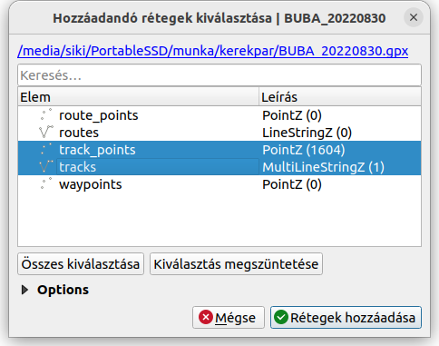
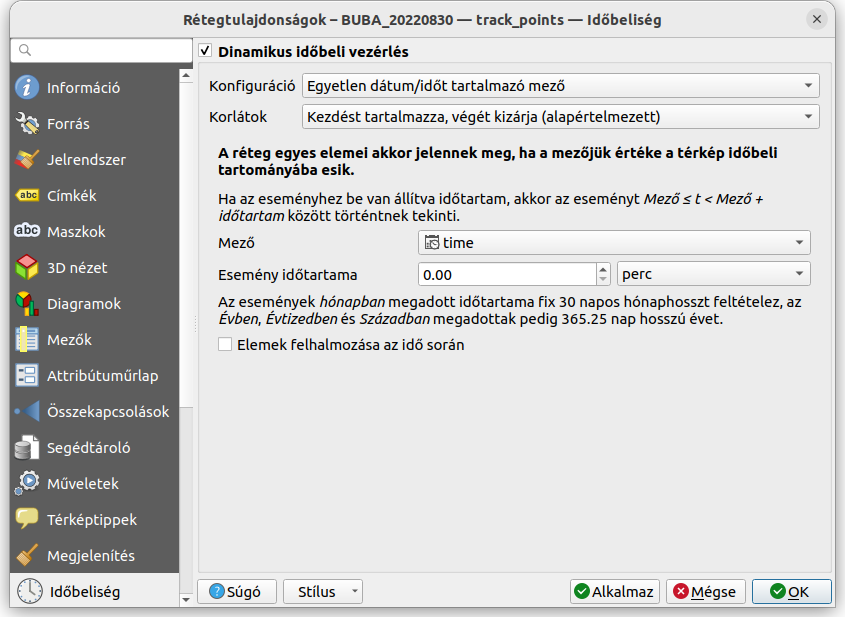
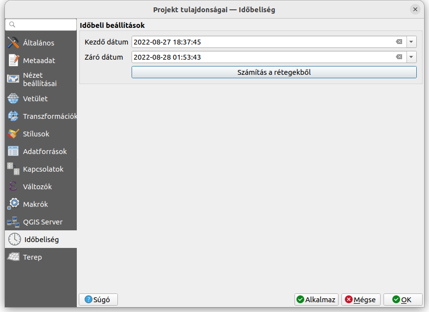
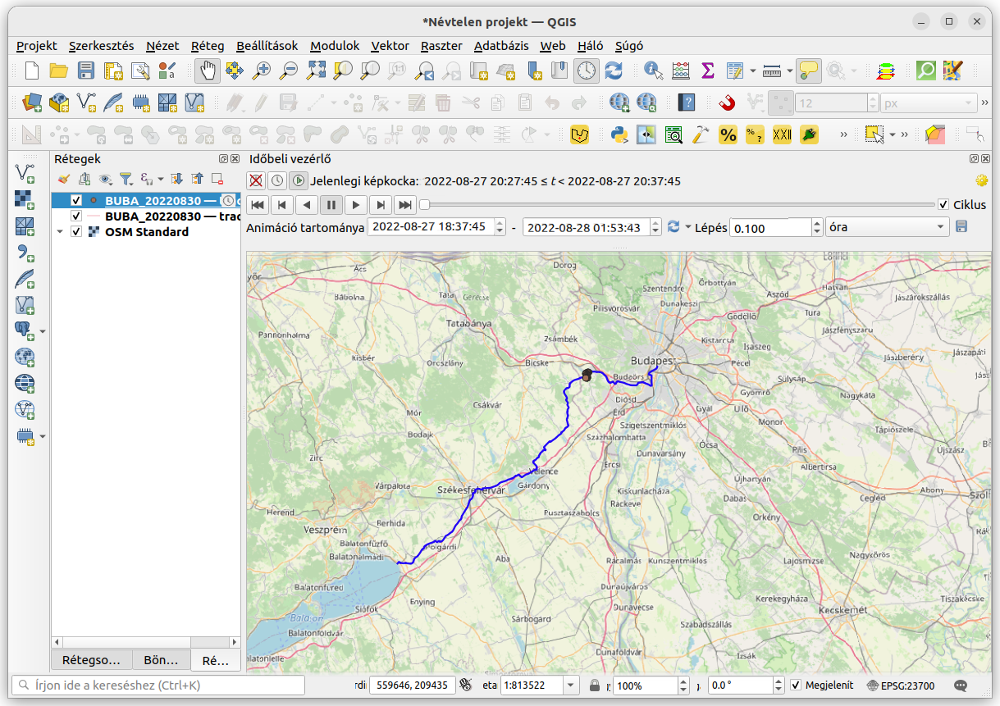

Idóbeli vezérlő használata
==========================

QGIS 3.14+

Összeállította: dr. Siki Zoltán

Az időbeli vezérlőt olyan rétegek megjelenítésénél használhatjuk, melyekben
egy vagy két dátumot vagy időpontot tartalmazó oszlop van. Emellett a rétegek 
egy csoportjára is használhatjuk az időbeli vezérlőt, ha a rétegekhez
hozzárendelünk egy időtartományt amikor megjelenjenek.

A példánkban egy kerékpártúrán rögzített GPS nyomot jelenitünk meg az
időbeli vezérlő segítségével navigálva.

Töltsük le a Budapest - Balaton kerékpárút GPS nyomot tartalmazó fájlját az
Aktív Magyarország honlapjáról:

https://aktivmagyarorszag.hu/gpx/BUBA_20220830.gpx

Adjuk hozzá a projektünkhöz a GPX fájlt, vektor rétegként. A megjelenő rétegek
közül válasszuk a track_points (nyom pontok) és tracks (nyomok) rétegeket.
Nézzük meg a *BUBA_20220830 -- track points* réteg attribútumait. A *time* 
oszlop tartalmazza a ponthoz tartozó időpontot.

A könnyebb tájékozódás érdekében a QMS (Quick Map Services) modul segítségével
adjuk hozzá a projektünkhöz az OSM (OpenStreetMap) standard térképet.

Az időbeli vezérlő használata előtt a réteg tulajdonságok párbeszédablakban
az *Időbeliség* fülön néhány beállítást kell elvégeznünk.

Esetünkben csak egy időpontot tartalmazó mezőnk van. A *Korlátok* mezőnek
akkor van jelentősége, ha két, kezdő és záró időpont mezőnk van.
Az esemény időtartama értéke arra vonatkozik, hogy milyen hosszan jelenik meg
a pont az időbeli animáció során.
Az *Elemek felhalmozása az idő során* beállítása esetén az
aktuális időpont előtti összes elem megjelenítésre kerül. Ilyenkor az esemény
időtartama beállításának nincs szerepe.

A *Dinamikus időbeli vezérlés* bekapcsolása után a réteglistában a réteg neve
mellett a jobb oldalon egy óra szimbólum jelenik meg.

A projekt tulajdonságok között is van egy *Időbeliség* fül. Itt az egész 
projektre vonatkozó idő intervallumot állíthatunk be. A *Számítás a rétegekből*
valamennyi időbeliséget tartalmazó réteg alapján számítja a program a
két mező értékét.

A beállítások után kapcsoljuk be az *Időbeliség vezérlőt*. Ezt az óra ikonnal
vagy a *Nézet* menü *Panelek* csoportjában tehetjük meg.
Az animáció tartományát a frissítés gombbal aktualizálhatjuk a projekt vagy egy
réteg időtartományához. A lépés beállításával adhatjuk meg, hogy mekkora 
időtartamba eső pontok látszanak. A lejátszás elindítása után hat percnyi
időtartam pontjai jelennek meg. A *ciklus* bekapcsolása esetén a lejátszás
folyamatos lesz.

.. note::
   Ne mentse az állományt shape fájlba, mert az időpontokból szöveges mező
   lesz. A geopackage állományt képes megőrizni az időpontokat.

Teljes rétegek megjelenítését is animálhatjuk a időbeli vezérlővel.
Ilyenkor a rétegek egy csoportját használhatjuk, például különböző időpontokban 
készült űrfelvételeket, ortofotókat. A rétegekre egyesével állítsuk be az
*Időbeliség* fülön a rögzített időtartományt.

2023.04.23.
